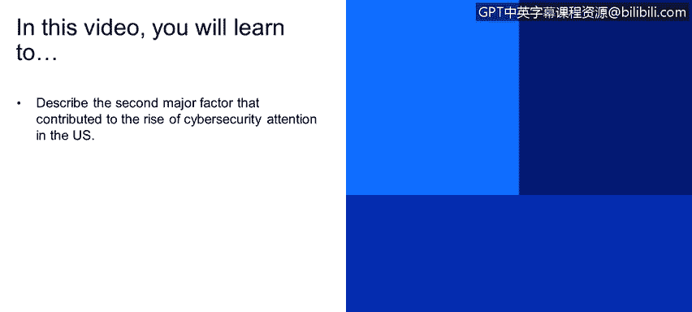
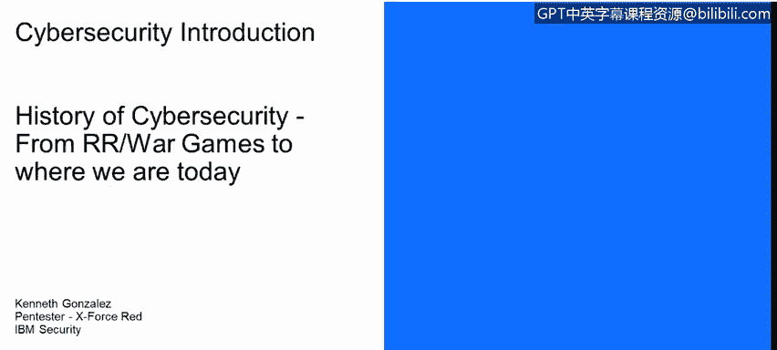
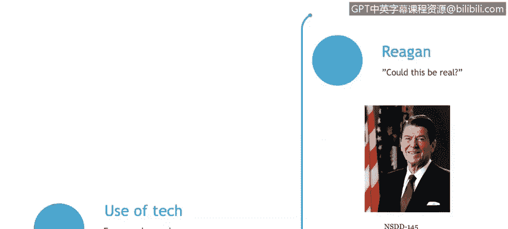
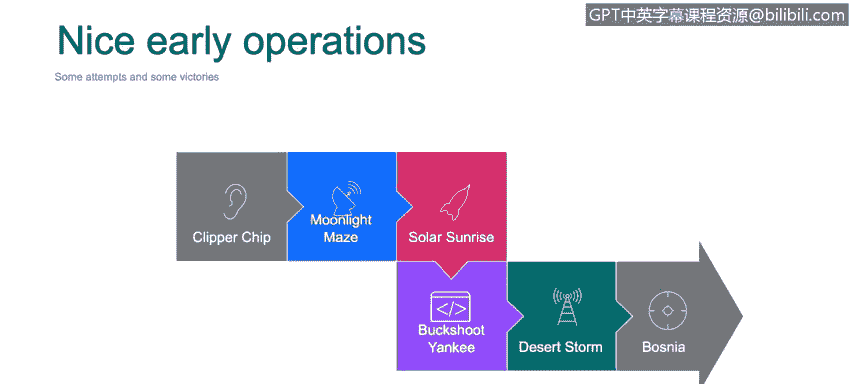

# 课程1：《网络安全工具与网络攻击简介》：9：9·11恐怖袭击对网络安全的影响

在本节课程中，我们将探讨推动美国网络安全关注度上升的第二个主要因素：2001年的9·11恐怖袭击事件。我们将了解该事件如何从根本上改变了人们对网络威胁的认知，并回顾早期一些重要的国家级网络行动。

## 9·11事件与网络安全意识的转变

上一节我们讨论了早期网络威胁的演变，本节中我们来看看一个关键的历史转折点。9·11事件不仅是针对纽约世贸中心双子塔的物理恐怖袭击，它更促使美国政府深入思考一个关键问题：如果类似的协同破坏发生在技术领域，例如针对发电厂、电网或其他关键城市基础设施的网络攻击，后果将如何？

## 技术普及带来的新威胁

一个需要密切关注的重要现状是技术的普及。如今，几乎每个人都拥有手机，可以访问互联网并上传下载数据。这意味着，与过去不同，现在任何人都可能利用家中的电脑或手机发起网络攻击。技术的广泛可及性极大地改变了威胁格局。

## 早期国家级网络行动案例

以下是早期一些涉及国家层面的重要网络安全行动或网络战案例，它们有助于我们理解网络威胁的演变。

**1. 顺风行动**
该行动由美国国家安全局策划，其核心目标是试图在美国大多数家庭的固定电话线路中植入芯片，以监听通信。虽然该计划未获国会批准且并未成功实施，但根据爱德华·斯诺登后来的披露，类似的大规模通信监听项目确实以其他形式存在，监控范围涵盖了电子邮件等多种通信方式。

**2. 月光迷宫行动**
这是网络安全战领域早期的重要事件。大约在2000年，攻击者利用一种名为“洛基2”的工具，从美国国家安全局、国家航空航天局、国防部等多个机构的Unix和Linux服务器上窃取密码。此次攻击的一个特点是攻击者大量使用代理服务器。因此，当美国当局开始监控网络异常时，追踪到的是攻击者所使用的代理服务器，而非攻击者的真实位置。此次攻击普遍被认为由俄罗斯方面发起。

**3. 太阳日出行动**
这是一次针对美国国防部计算机网络的系列攻击，始于1998年2月。攻击流程具有典型性：
*   首先，攻击者探测目标网络中特定操作系统是否存在已知漏洞。
*   若漏洞存在，则利用该漏洞。
*   随后，植入后门或嗅探程序以收集网络数据。
*   最后，攻击者会稍后返回网络，取走已收集的数据。
此次攻击的特别之处在于，其发动者并非恐怖组织或敌对国，而是来自加利福尼亚州和以色列的两名青少年。这充分说明，即使没有国家背景，网络安全漏洞也可能导致严重后果。

**4. 对美军计算机的严重入侵**
2008年，美国国防部长威廉·J·林将其称为美军计算机系统有史以来最严重的入侵事件之一。攻击始于中东美军基地一台被插入受感染U盘的电脑，使用的是一种名为“Agent.BTZ”的木马。该木马在军事网络中潜伏了长达14个月，才被IT安全人员清除。虽然迹象指向中国，但至今未有官方正式指控。

**5. 其他军事冲突中的网络成分**
在90年代初的沙漠风暴行动和波斯尼亚战争中，网络手段已被运用。例如，在沙漠风暴中，美军通过干扰或向伊拉克雷达系统提供虚假信息，成功破坏了其关键军事设施。在波斯尼亚，则广泛使用了向战场部队传播假新闻、假信息等网络心理战手段。

## 总结

本节课中，我们一起学习了9·11事件如何成为美国提升网络安全关注度的关键催化剂，它使人们意识到关键基础设施面临的潜在网络威胁。同时，我们回顾了月光迷宫、太阳日出等早期国家级网络行动，这些案例揭示了网络攻击手段的演变以及威胁来源的多样性，从国家行为体到个人黑客均有可能。理解这段历史，对于构建今天的网络安全防御体系至关重要。