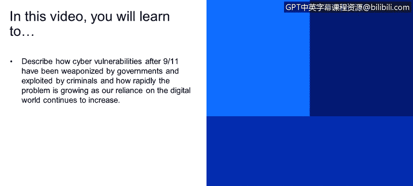
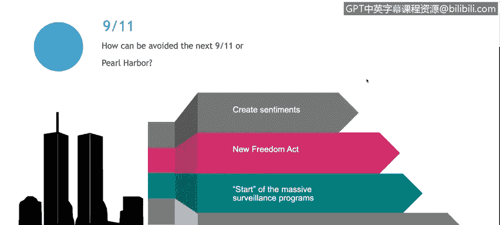
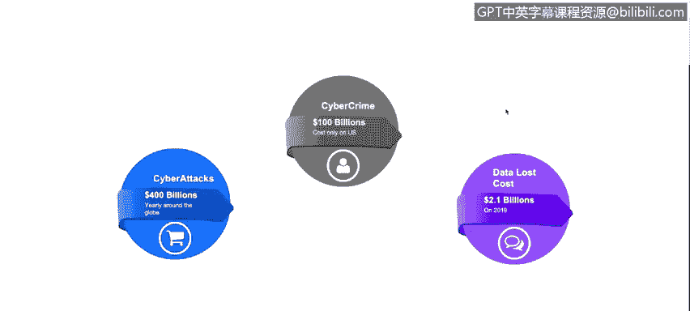
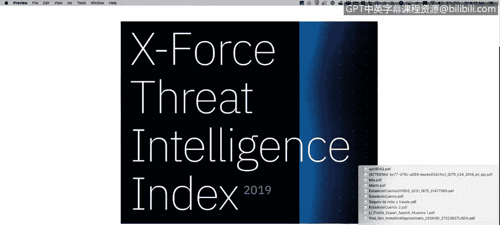
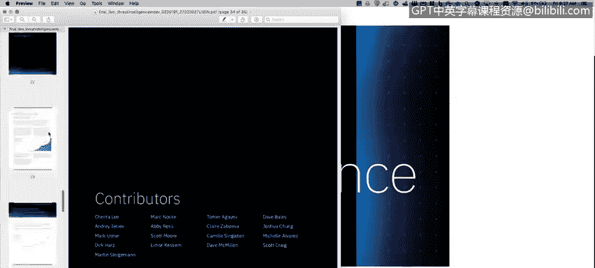
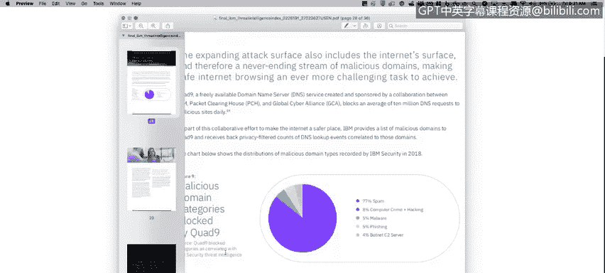

# 课程1：《网络安全工具与网络攻击简介》：10：当今网络安全 🔐

在本节课中，我们将探讨“9·11”事件后网络漏洞如何被政府武器化并被犯罪分子利用，以及随着我们对数字世界依赖的持续加深，网络安全问题如何迅速增长。

## 9·11事件与网络战场的开启 🚨

上一节我们了解了网络安全的宏观背景，本节中我们来看看一个关键的历史转折点。

“9·11”事件后颁布的《爱国者法案》是启动大规模监控计划的关键，这些计划在几年后被斯诺登揭露。这次袭击事件成为了开启新型网络战的基石。

一个著名的例子是“震网”病毒。该病毒被植入伊朗核设施，据信是由美国和以色列通过一项名为“奥运会”的行动所创建。这类事件的发生，源于美国政府不仅希望了解网络世界的动态，更试图通过在网络空间先行行动，来预防和阻止现实世界的战争。

## 网络安全的关键数据 📊

了解了历史背景后，我们来看看反映当前威胁规模的具体数据。以下是基于2017年报告（数据涵盖2016年）的一些重要数字：

*   **软件漏洞数量激增**：我们面临着大量的软件漏洞，例如跨站脚本攻击、SQL注入、本地文件权限提升、远程文件上传等。这些漏洞旨在创建系统后门或非法访问。尽管公司努力修复漏洞，但漏洞数量仍呈指数级增长。
*   **网络攻击造成的损失**：根据《福布斯》2016年的研究，全球每年因网络攻击造成的损失接近4000亿美元。这包括拒绝服务攻击、数据泄露和国家资助的攻击等。网络犯罪已成为一项巨大的生意，仅在美国就涉及上千亿美元。
*   **数据丢失情况**：同年，预计有21亿条数据记录丢失。

## X-Force威胁情报指数报告解读 📈

为了获取更及时的信息，我们可以参考IBM安全部门的X-Force威胁情报指数报告。该报告是了解当前网络安全态势的绝佳资源。

报告链接可供下载最新版本。让我们以某年度报告为例，查看其中的关键发现：

**首先，查看第16页关于2018年最常被攻击的行业：**

*   **金融与保险业**：这是最常被攻击的领域，原因显而易见——那里有大量资金，且并非所有账户和系统都得到了充分保护。
*   **医疗保健业**：占2018年攻击目标的6%，这是一个值得关注的领域。
*   **能源业**：这非常重要，我们稍后会以乌克兰为例进行讨论。黑客使用大量恶意软件和工具来攻击能源行业或基础设施。

**接着，翻到第23页查看2018年更新的漏洞数据：**

漏洞数量出现了大幅增长。这很容易理解：如今我们使用的系统和应用（如Twitter、Instagram、各类Web和移动应用）远比15年前多。每个软件或应用程序都可能携带尚未被发现或已被攻击者知晓的漏洞，这带来了巨大的风险。

**最后，查看第28页关于恶意域名类别的数据：**

该数据显示了被Quad9等服务拦截的恶意URL类别分布。

*   **垃圾邮件**：占比高达77%。
*   **网络犯罪与黑客行为**：占8%。
*   **恶意软件与网络钓鱼**：占5%。
*   **僵尸网络命令与控制服务器**：占4%。

我们将在后续课程中详细讨论这些攻击类型。

## 总结与建议 📝

本节课中，我们一起学习了“9·11”事件如何改变了网络安全的格局，开启了国家层面的网络对抗。我们还通过具体数据看到了软件漏洞的快速增长、网络攻击造成的巨大经济损失，以及当前最受威胁的行业分布。

X-Force威胁情报指数报告包含了大量有价值的信息，强烈建议您下载并阅读这份约35页的报告，以更深入地理解当年的网络安全状况。

在接下来的课程中，我们将逐一深入探讨报告中提到的各种网络攻击类型，如僵尸网络、网络钓鱼和恶意软件等。