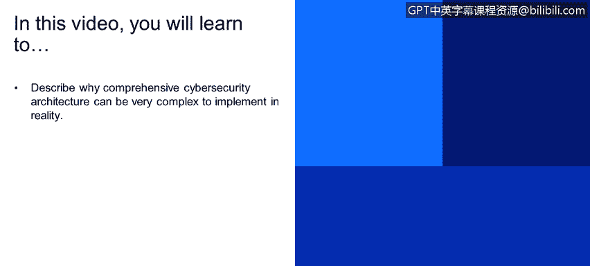
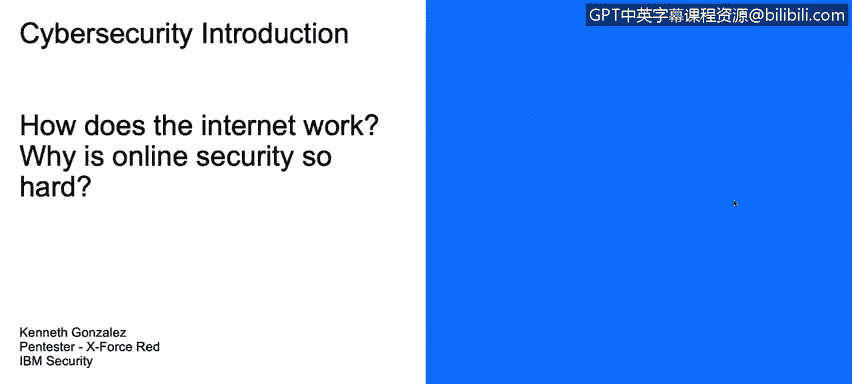
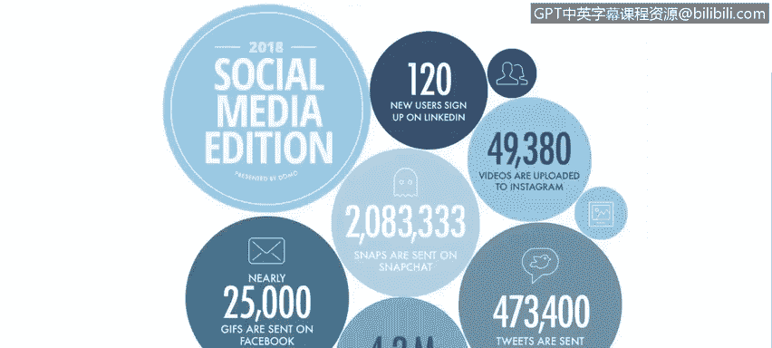
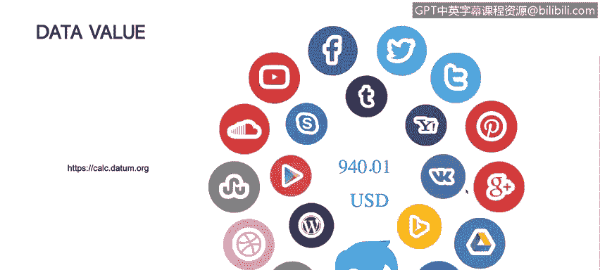
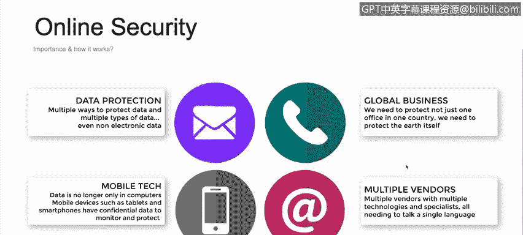

# 课程1：《网络安全工具与网络攻击简介》：11：网络安全简介

在本视频中，你将学习描述为何全面的网络安全架构在现实中实施起来会非常复杂。

接下来，我们将讨论互联网的工作原理，以及为何在线安全如此难以实施和维护。

首先，理解我们当前在线存在的整体图景非常重要。

这实际上是Domo公司在2018年发布的一份报告摘要。

在这里我们可以看到，例如，每分钟在Facebook Messenger上发送近2.5万个GIF动图。每分钟在Twitter上发送约42.3万条推文。每分钟在Snapchat上观看约420万个视频。

这些数字之所以重要，是因为它们代表了每一个拥有智能手机或电脑、连接互联网的人，都在发送和接收信息，这些信息不仅来自网络服务器，也来自互联网上的其他人。

这些数字的有趣之处在于，它们是每分钟的数据。因此，每分钟都有海量的数据和信息在互联网上流动和被处理。

一个简单的例子，也是一个很好的练习。Tomb是一个在全球范围内收集和分析数据的组织。他们尝试使用大数据技术和人工智能等技术来分析数据。

他们建立了一个网站，你可以计算你在互联网上的信息价值。

例如，通过几次点击，表明你拥有Facebook页面、经常发送推文、或在WordPress上拥有个人博客等，可以估算出你已在互联网上存在的信息价值接近1000美元。

这一点很重要，因为我们通常不会关注自己在互联网上分享或拥有的信息。而理解这一点，是我们在账户上实施控制措施的前提。我们后续将讨论身份验证、身份识别以及可用于保护信息的方法，这不仅关乎商业层面，也关乎我们的个人数字生活。

我们需要理解我们为攻击者、为网络犯罪提供了多少可供利用和窃取的价值。

那么，为何如今实施、理解和维护互联网安全或隐私如此困难？

以下是几个关键原因：

首先，我们需要关注数据保护，这很重要。但在过去，如果我们想保护数据，只需保护服务器、电脑，或将纸质文件锁进柜子。而现在，我们不仅需要保护电脑，还需要保护平板电脑、智能手机、智能手表等众多设备。这些设备承载着我们分享和关心的信息。

因此，范式必须改变。我们现在需要保护的不再仅仅是资产本身，而是资产上的数据。资产固然重要，但我们更应关注数据。

其次，是移动技术。当前移动设备无处不在。4G网络的速度甚至在某些场景下媲美或超越了企业和家庭Wi-Fi。大多数人正在使用手机和平板电脑，并试图用它们替代电脑。同样，我们需要保护这些设备，但更重要的是保护设备上的机密数据。我们必须确保这些设备通过身份验证等方法得到安全保障，具备足够的控制机制来保护其承载的数据。

第三，我们面对的是全球化业务。我们不再只处理单一办公室或单一城市的总部。我们需要保护遍布全球的众多办公室和营业点。保护每栋建筑、每个业务点、各业务点之间的通信、同一公司不同办公室之间的数据传输，这非常困难。我们不仅需要懂技术，还需要了解行政事务，例如各国的政策和合规要求，这些都难以追踪。

最后，我们面临多供应商环境。过去，我们可能只与联想、戴尔、华硕等公司打交道购买电脑和服务器，从特定供应商那里购买路由器等网络设备，并通过一家ISP获得互联网接入。

但现在，我们不仅与多家电脑供应商打交道（在办公室看到PC、Mac、Windows和Linux电脑并存很常见），还广泛使用云计算。云计算是技术扩展的关键部分，但也引入了大量供应商和技术。我们需要理解这些技术，才能保护我们在公司和个人生活中实施或拥有的基础设施。

**总结**

本节课我们一起学习了网络安全实施的复杂性。我们首先通过数据了解了互联网上海量信息流动的现状，认识到个人信息的潜在价值。接着，我们深入探讨了网络安全难以维护的四个核心原因：从保护物理资产到保护数据的范式转变、移动设备的普及与安全挑战、全球化业务带来的跨地域保护与合规难题，以及多供应商技术环境带来的复杂性。理解这些挑战是构建有效网络安全防御体系的第一步。