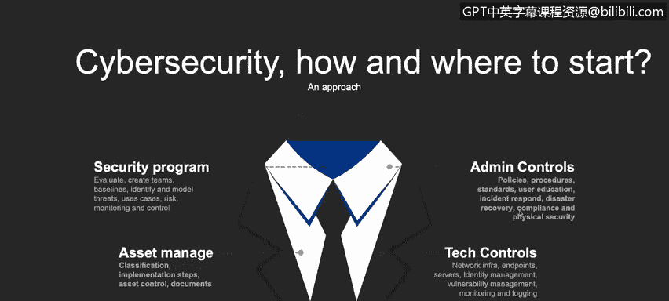

# 课程1：《网络安全工具与网络攻击简介》：12：开始网络安全计划时要考虑的事项

在本节课程中，我们将学习启动一个网络安全计划时必须考虑的关键事项。我们将探讨从风险评估到控制措施实施的完整流程，为构建有效的安全防护体系打下基础。

上一节我们介绍了网络安全的基本概念，本节中我们来看看如何着手启动一个具体的网络安全计划。

一个可行的网络安全计划启动方法包含多个步骤。首先，我们需要建立一个安全计划。这要求我们进行评估、识别，并理解我们正在应对的风险和威胁。接着，我们需要评估、监控并控制这些风险和威胁。

在管理风险之后，我们需要管理资产。这里的“资产”不仅指你面前的电脑、手机或服务器，还包括文档和系统。你电脑上的每一份文档都应被视为一项资产，并通过分类、控制、保密性、完整性和可用性进行管理。我们将在后续视频中详细探讨这些术语。

接下来，我们需要实施控制措施。这不仅仅是技术控制，例如网络基础设施、服务器保护、终端防护、漏洞管理、统一威胁管理（UTM）和防火墙。我们还需要实施管理控制，例如制定策略和流程、组建事件响应团队、制定灾难恢复程序、确保合规性以及加强物理安全。这些同样重要。

以下是需要在公司或数字生活中实施的事项的简要示例。当然，实际需要实施的内容远不止这些，我们将在后续视频中继续探索。

---

本节课中我们一起学习了启动网络安全计划的初步考虑事项，包括建立安全计划、评估风险、管理资产以及实施技术与管理控制。这些是构建稳固网络安全防线的基础步骤。