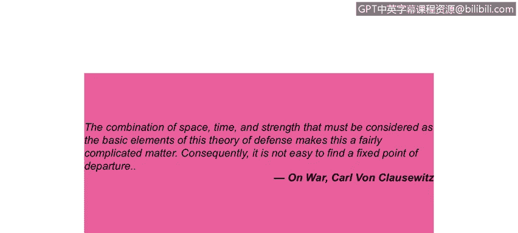
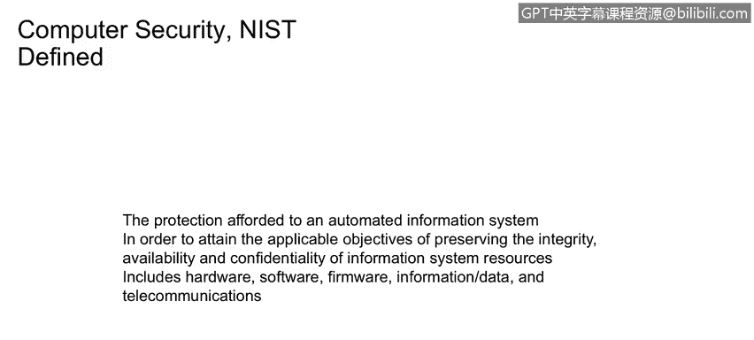

# 课程1：《网络安全工具与网络攻击简介》：13：什么是安全 🔒

在本节课程中，我们将学习网络安全的核心概念，特别是“安全”的定义及其核心原则。我们将了解通信中的主要参与者，并探讨如何通过加密和认证来保护信息。

---

## 什么是安全？

在安全原则中，你经常会听到 **CIA** 这个概念，它代表了**机密性**、**完整性**和**认证**。实际上，它的范畴比这更广一些。

**机密性** 是一个主要原则，指的是只有发送方和接收方能够理解消息内容。如果消息在传输中途被截获，截获者将无法理解其含义。从根本上说，在文献中，发送方（通常是Bob）发送加密消息，而接收方（Alice）接收并解密消息。

与此相关的是 **认证**，在我们的例子中，发送方Alice和Bob需要在发送消息前确认彼此的身份。

与认证同等重要的是 **完整性**，即发送方和接收方（Alice和Bob）需要确保消息在传输过程中或接收端的某个中间阶段**没有被更改**。最重要的是，他们希望能够**在未被察觉的情况下**确认消息是否被更改。我们将探讨几种实现这一点的机制。

最后是 **访问与可用性**，即企业内可用的安全服务和IT服务需要配备正确的访问控制机制，并具备足够的可用性，以确保企业能够按照服务级别协议（SP）正常运营。

> 孙子曰：“故用兵之法，无恃其不来，恃吾有以待也；无恃其不攻，恃吾有所不可攻也。” 这说明了“这不可能发生在我身上”这种想法是错误的。在很大程度上，你需要做好准备。

---

## 安全是一个复杂的领域

防御理论的基本要素——空间、时间和力量的结合——使得问题相当复杂。因此，找到一个固定的出发点并不容易。所以，安全是一个动态变化的复杂领域。

在我们深入探讨安全与密码学的动态交互之前，让我们先了解一下“战场”上的参与者，以便明确相关术语。

---

## 参与者：Alice， Bob 与 Trudy

在密码学文献中，你经常会看到 **Alice**、**Bob** 和 **Trudy**。A、B、T代表了通信中的不同角色。自20世纪60年代的一些论文开始，这些角色就被赋予了这些名字，并沿用至今。

*   **Bob 和 Alice**：他们希望进行安全通信，原因可以是个人或商业的。
*   **Trudy**：她是**拦截者**，意图截获、删除、添加或更改消息，本质上是一个**恶意行为者**。

让我们看一下示意图。Alice有一些数据（可能是一封电子邮件、一个便条或一个网页），她将消息从**明文**转换为**密文**，然后通过一个**信道**传输。

*   **信道**：可以是任何形式的传输媒介，例如电子邮件、直接传输、文件传输协议，或是现代的短信。在拿破仑时期，这可能是一位年轻的海军候补少尉在白厅和伦敦其他地区之间传递的一封信件。信道是传输机制。
*   **数据**：信道中传输的是**有效载荷**（数据本身）和**控制消息**（例如收件人地址、有效期等）。在互联网世界，我们看IP地址和MAC地址；在人工世界，例如英国情报崛起的拿破仑时代，这可能是姓名和实体邮寄地址。实体邮寄地址就是控制信息的人工解读形式。

Bob接收到消息后，对其进行解码，获得Alice发送的明文。Trudy有能力在信道上拦截这些消息，但由于加密的安全保护，她无法读取、删除或更改这些消息。

那么，Bob和Alice可能是谁呢？他们可以是真实的人，但也可以代表：
*   客户端与服务器的关系（例如银行系统）。
*   DNS服务器与客户端在IP地址分配阶段的通信。
*   网络路由器之间交换信息并更新路由表。
*   防火墙与安全情报系统之间的通信。
*   安全情报系统与数据库保护系统之间的通信。

因此，发送方和接收方有许多不同的实例。

---

## NIST 对计算机安全的定义

美国国家标准与技术研究院（NIST）的计算机安全实践非常活跃，他们为计算机安全提供了以下定义：

> “为自动化信息系统提供的保护，以达到维护信息系统资源（包括硬件、软件、固件、信息/数据和电信）的完整性、可用性和机密性的适用目标。”

反过来看这个定义的范围：
*   **计算机安全的范围** 涵盖了OSI协议栈，从顶层的应用程序开始，向下经过表示层、会话层、传输层，直至物理层。所有这些都属于计算机安全的范畴。
*   定义中提到“为自动化信息系统提供的保护”，这意味着保护对象不仅包括平台、主机和软件，还包括这些系统正在**处理的信息**。

---

## 总结

在本节课中，我们一起学习了网络安全的基础。我们明确了安全的三大核心原则——**机密性**、**完整性**和**认证**（CIA），并引入了**访问与可用性**。我们认识了安全通信中的经典角色模型：希望安全通信的 **Alice 和 Bob**，以及意图破坏的恶意拦截者 **Trudy**。最后，我们了解了NIST对**计算机安全**的广泛定义，它涵盖了从硬件、软件到数据和通信的整个信息系统范围。理解这些基本概念是进一步学习网络安全工具和应对网络攻击的基石。