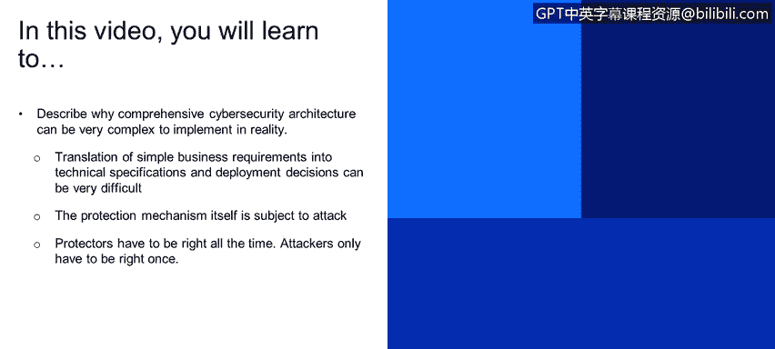
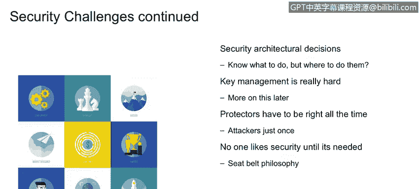
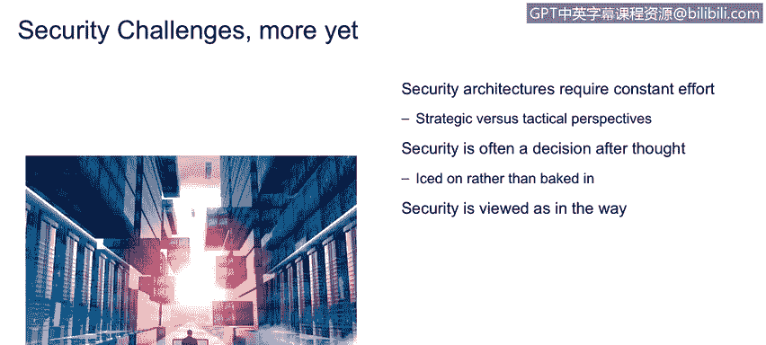

# 课程1：《网络安全工具与网络攻击简介》：14：其他安全挑战

在本节课程中，我们将探讨在现实世界中实施全面网络安全架构时面临的其他复杂挑战。我们将了解为何看似简单的业务需求会转化为复杂的技术实现，以及防御者与攻击者之间固有的不对称性。

---

## 概述

网络安全架构的实施远比表面看起来复杂。本节将详细分析这种复杂性，包括将业务需求转化为技术方案的困难、安全机制自身面临的攻击风险，以及防御者必须始终保持正确而攻击者只需成功一次的根本性挑战。

---

## 安全并非表面那么简单

上一节我们讨论了网络攻击的基本类型，本节中我们来看看构建防御体系时面临的内在挑战。首先需要明确的是，安全领域的复杂性被严重低估了。

解决方案的复杂性本身就是安全生态系统面临的一个额外挑战。因此，“安全并非表面那么简单”这一说法实际上是一个巨大的轻描淡写。

---

## 从简单需求到复杂实现

我们的客户经常提出非常简单的需求。例如，一个典型的需求可能是：“所有用户都必须向企业进行身份验证。” 这听起来足够简单。

然而，当我们开始研究如何实现一个全面的访问控制系统时，情况就变得复杂了。这个系统可能涉及基于角色的访问控制（RBAC）、基于属性的访问控制（ABAC）、特权用户管理以及审计归档等功能。即使高层需求非常简单，其背后的解决方案也会变得极其复杂。

将这类相对简单的业务需求进行分解，转化为可完成或可实现的技术模块，正是安全专业人员工作职责的一部分。

---

## 安全机制自身成为攻击目标

安全架构的另一个复杂性在于，解决方案本身也可能遭受攻击。这涉及到**安全执行点**的概念。

**安全执行点**是业务策略的技术实现。例如，我们刚才讨论的访问控制，其业务安全需求是“所有用户都将登录系统”。其技术实现可能是强身份验证，例如结合“你知道的”（密码）和“你拥有的”（令牌）两种因素，并对可以更改安全策略的系统管理员等特权用户进行跟踪。

我们通过软件、硬件和固件等技术来交付满足这些业务安全需求的解决方案，这就是安全执行点的定义。

关键在于，攻击者知道，要获取他们想要的信息，他们需要**击败这些保护机制**。他们需要突破护城河、翻越城墙、打破大门。因此，这些执行结构与数据本身一样，都是攻击目标。这种复杂性是其他技术领域所没有的，也是我们在安全世界中必须非常清楚认识到的。

保护这些安全执行点结构，不仅可能，而且必然会使得解决方案更加复杂，因为你增加了保护“保护机制”的额外层面。

---

## 架构决策与密钥管理

安全专业人员面临的额外挑战还与我们的安全架构决策有关。

我们讨论描述“做什么”而非“如何做”的逻辑架构。然后，我们需要决定这些执行机制在架构中的部署位置，即拓扑结构。例如，通常我们希望访问控制技术更靠近网络边界或DMZ区，而某些网络流量传感器可能更靠近企业网络中心。这些架构决策涉及权衡研究、风险与收益分析，需要经验丰富的架构师来帮助确定技术的部署位置。

第二点，**密钥管理非常困难**。当我们谈论密钥管理时，指的是加密密钥。回想之前爱丽丝和鲍勃的图示，爱丽丝在将消息放入传输通道之前会对其进行加密保护。加密系统使用一个密钥，而在鲍勃的领域有一个对应的密钥用于解密该消息。这些密钥的创建和分发管理是一个非常复杂的解决方案，这一点需要我们保持清醒认识。

---

## 防御者与攻击者的不对称性

然后是一个更宏观的原则：我们作为防御者，必须**始终正确**。外界动态变化的攻击每天都在、每周都在演变，安全架构必须足够灵活，能够**100%** 地防御这些攻击。人员、地点、事物、时间和金钱，所有这些资源都以某种方式制约着我们，要求我们建立一个动态的安全架构来保护信息和执行点，以应对这些不断变化的威胁，并且它必须始终有效。

一个只能提供90%时间保护的安全架构不会被任何企业所接受。然而，攻击者实际上**只需要成功一次**就能达成目标。由此可见攻击者与保护者之间在成功概率上存在的巨大差异、不平衡和不成比例。

业务部门通常将安全视为一种必要的负担。这里有一个“安全带哲学”的原则：在车辆中安装安全带的成本大约是200美元，但在发生严重车祸前的半秒钟，那条安全带的价值超过一百万美元。安全构造物是完全相同的道理。业务部门经常认为安全是一种阻碍，而我们作为安全专业人员的责任，就是确保安全构造物实际上成为**业务赋能者**，让我们在复杂的世界中更容易开展业务。

---

## 被视为障碍与持续努力

我们最后要讨论的一系列挑战，这些挑战层次较高，但可以分解为更多具体问题。它们涉及持续的努力、安全的事后考虑，以及安全经常被视为障碍。

按照某种反向顺序来说，企业内的业务部门经常将安全视为障碍和壁垒，认为它是一种“必要的恶”，我们只能尽力去应对。这甚至会鼓励人们试图绕过安全措施。安全专业人员的职责是让安全成为**赋能者**，使其产生积极价值，帮助我们在非常复杂且充满威胁的世界中开展业务。

为什么安全有时被视为障碍？原因在于它没有在生命周期早期被集成进去，无论是开发生命周期还是系统生命周期。我们观察生命周期模型，如瀑布模型或迭代工程，在功能定义阶段通常看不到安全的影子。安全专业人员需要说服项目领导者，将安全**尽早**纳入考虑是成本最低的方式。这样，应用程序开发人员、基础设施人员、安全人员、测试工程师、质量保证人员等都能在项目早期就参与进来。

关于安全架构需要**持续努力**的这一点，说明了攻击的动态本质。对手在不断引入新的攻击模式，软件制造商不断发布新的漏洞，这些漏洞随后被转化为攻击手段。这场“战争”每周都在变化。因此，我们的防御机制、安全架构也必须非常灵活、非常敏捷，以适应和应对这些不断变化的攻击。否则，我们就会像20世纪90年代那样，停留在非常静态的“城堡、护城河、吊桥”式的安全架构。

---

## 总结

本节课中，我们一起学习了实施全面网络安全架构时面临的多重挑战。我们认识到将简单业务需求转化为技术实现的复杂性，理解了安全执行点自身也是攻击目标，并深刻体会到防御者必须始终正确而攻击者只需成功一次的根本不对称性。此外，我们还探讨了安全常被视为业务障碍的原因以及构建动态、持续演进的安全架构的必要性。这些认知是成为一名有效网络安全分析师的基础。