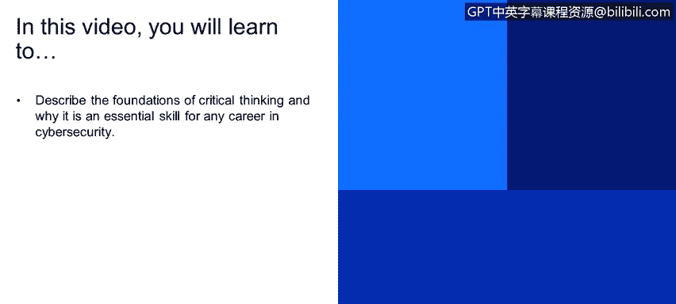
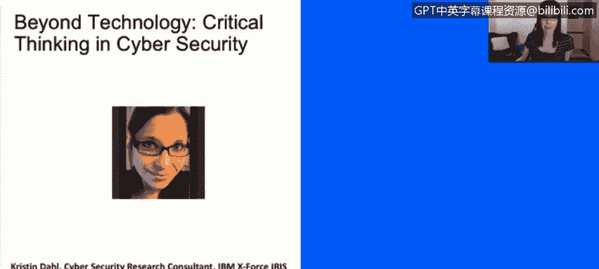
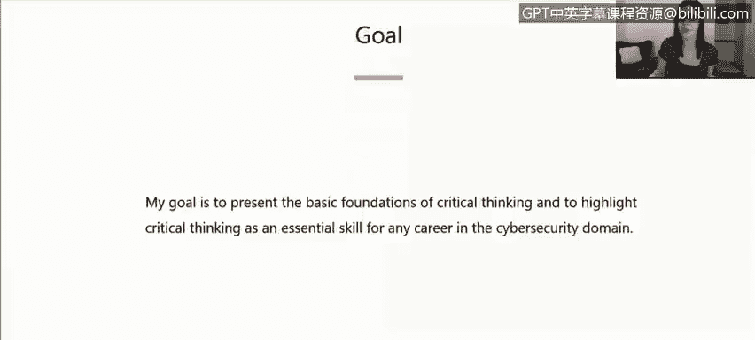
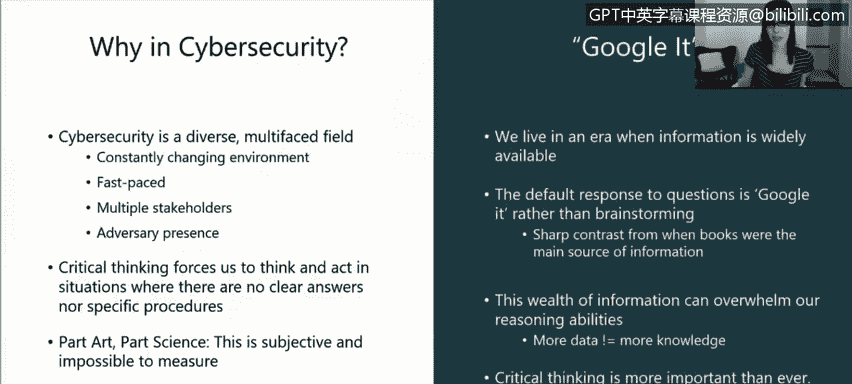

# 课程1：《网络安全工具与网络攻击简介》：15：超越技术的网络安全关键思维 🧠

在本节课中，我们将学习批判性思维的基础知识，并探讨为何它是网络安全领域任何职业都不可或缺的一项核心技能。

上一节我们讨论了网络安全的技术层面，本节中我们来看看超越技术的关键思维能力。

## 课程背景与目标

我叫Kristendal，是Exforce Iris的一名情报开发员。我加入IBM大约九个月，在此之前，我在MIT林肯实验室担任研究员。本次“超越技术”的主题，是我几个月前为波士顿一个名为“Day of Shacur”的会议准备的演讲。该会议主要面向网络安全领域的女性从业者，特别是职业生涯早期的女性。

我的目标是强调批判性思维是网络安全的重要组成部分。通常，当我们想到网络安全时，第一反应是这是一个技术性很强的领域。我们的思维会自动转向操作系统等非常技术性的东西。我认为，我们思考和批判性分析问题的能力常常被忽视。这正是我试图通过这次演讲来呈现的内容。

## 什么是批判性思维？

批判性思维没有一个放之四海而皆准的硬性定义，每个人对其都有自己的理解。我进行了一些研究，找到了几个定义，然后总结出了一个我喜欢的定义，放在了下文。

**对于本次讨论的目的，批判性思维是**：**有控制的、有目的的、指向特定目标的思考**。它不同于白日梦，也不同于思考早餐吃了什么或待办事项清单。它是一种非常受控、有目的的思考。

我本次演讲的目标是呈现批判性思维的基本基础，并强调这是网络安全领域任何职业都必不可少的一项技能。无论你从事金融、人力资源、法律工作，还是担任技术角色，我相信你都能从中有所收获，并能够应用这项技能，无论你的角色或项目是什么。

## 为什么批判性思维在网络安全中至关重要？

除了我本身在网络安全领域工作这一事实外，该领域的许多特性都使得这种讨论非常必要。

以下是网络安全领域的一些关键特征：
*   **环境瞬息万变**：这是一个快节奏的领域，技术日新月异。
*   **涉及多方利益相关者**：这些利益相关者来自不同背景，如经济、法律、人力资源等。
*   **存在明确的对手**：网络空间中存在对抗性的对手。
*   **领域相对较新**：网络安全是一个相对较新的领域，我们尚未掌握所有答案，没有完全弄清楚网络安全的方方面面。

因此，批判性思维技能迫使我们**在那些没有明确答案、也没有特定规程的情况下进行思考和行动**。

这既是艺术也是科学，没有固定的方法，它是主观的，难以衡量，但我认为讨论它并进行这些对话非常重要。

我还想经常提到的一点是，我们生活在一个“谷歌时代”。当我们面临问题时，下意识的反应往往是使用谷歌，在搜索框中输入问题，然后互联网告诉我们答案。这与过去我们必须依赖书籍、图书馆和较慢的研究方法来回答问题的情况不同，那时信息并非如此广泛可得。

然而，这种信息爆炸并不总是好事。**更多的数据并不总是等于更多的知识**，它可能迅速压垮我们的推理能力。正因如此，**批判性思维比以往任何时候都更加重要**。我们需要具备**从浩瀚的信息海洋中辨别重要信息，并做出有根据的、明智决策的能力**。

## 总结

本节课中，我们一起学习了批判性思维在网络安全中的核心地位。我们了解到，批判性思维是一种有控制、有目的的思考方式，是应对网络安全领域快速变化、多方参与和存在对手等复杂挑战的关键。在信息过载的时代，培养从海量数据中提取真知并做出明智判断的能力，对于任何希望在网络安全领域取得成功的人都至关重要。