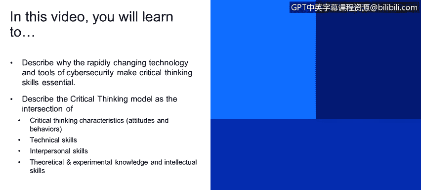

# 课程1：《网络安全工具与网络攻击简介》：16：关键思维模型 🧠

在本节课中，我们将学习为什么网络安全领域快速变化的技术和工具使得批判性思维技能变得至关重要。我们将描述一个批判性思维模型，它位于批判性思维特质、技术技能、人际交往技能、理论与经验知识以及智力技能的交汇处。

---

为了阐明批判性思维的必要性，我们先从一个思维实验开始。

假设你是一栋市中心高层建筑的物业经理。楼内有多个租户，包括零售店、公寓和办公室。你最近收到了大量关于电梯运行缓慢的投诉，包括邮件和电话。人们对此感到不满，甚至威胁要解除租约。你当然不希望租户流失。

那么，你会如何解决这个问题？你可以有多种不同的方法：可以采取软件方案，更新电梯调度算法；可以建议人们走楼梯；可以安装更多电梯；或者干脆什么都不做。在接下来的讨论中，请思考你会如何解决这个问题，以及你是如何得出这个结论的。我们将在课程最后回到这个例子。

---

现在，让我们正式开始。当我们思考网络安全领域备受追捧的技能时，首先想到的往往是技术技能。

我曾非正式地调查了一些大型科技公司（如IBM、微软、Facebook、谷歌）在网络安全领域的招聘要求。最引人注目的正是这些技术技能：操作系统知识、入侵检测、逆向工程等，所有这些都非常重要。

随之而来的是一系列支持这些活动的工具，例如Wireshark、Splunk或各种数据库工具。这就带来了一个难题：有数百种工具定期更新，每个人都有自己的偏好，这些工具的数据格式不同，有时并不兼容。处理起来可能很混乱，而且几乎不可能跟上所有工具的更新。精通所有这些工具是不可能的。

因此，这里存在一个常见的误解：**跟上最新的技术工具和趋势是成功的关键**。但现实是，技术和我们的对手总是在不断变化。好消息是，安全与设计的基础原理变化缓慢。例如，TCP/IP协议、操作系统、内核基础等变化都很慢。

所以，**将批判性思维技能与对安全基础原理的理解相结合**，将使我们能够识别出解决未知、未定义复杂问题和情况的方案，无论我们面前的技术或工具是什么。

---

我进一步思考了批判性思维，并想知道是什么区分了一个优秀的批判性思考者和一个不那么优秀的思考者。哪些特质促成了批判性思维？我做了一些研究，虽然没有找到专门针对网络安全的内容，但这个领域在医疗保健行业被研究得很深入。

想象一下急诊室里的医生和护士。他们处于高压环境中，有时必须在几分钟内，仅凭不完整的数据做出可能关乎生死的决定。因此，在短时间内进行批判性思考、做出明智决策的能力至关重要。批判性思维在这个领域被广泛研究。

幻灯片上的这个模型实际上来自一本医疗保健教科书。我非常喜欢这个模型，并且认为同样的原则也适用于网络安全。

下面，我将简要介绍这个模型的每个组成部分。

**首先是顶部的圆圈：批判性思维特质。** 这是指你作为一个人的态度和行为，即你的个性、世界观以及你处理问题的方式。它受到你的成长经历、生活经验和职业经验的影响，对我们每个人来说都是独特的。这是好事，因为在这个领域，我们需要多样化的视角。

根据我的职业生涯，特别是在网络安全领域的观察，最成功的人往往也是最好奇的人。他们对世界充满好奇，有持续学习和成长、解决问题的渴望。无论是在进行威胁追踪还是调查工作，他们都有一种内在的动力去找到答案和解决方案。仅仅是这种**好奇心**就能让你走得很远。

**顺时针方向下一个是理论与经验知识。** 这包括你在学校学到的关于操作系统如何工作的基础知识，以及你在工作中从不同项目里获得的经验与知识。

**接着是智力技能。** 这指的是你的分析、推理和解决问题的能力。

**然后是你的人际交往技能。** 你与他人互动的能力如何？你在多大程度上与同事、同行交流？你是否提问，是否提供自己的见解？因为网络安全不是一项单打独斗的职业。我每天都依赖我的同事，无论是分享信息、提问还是寻求帮助。我也依赖公司内外的其他研究人员，他们可能来自不同的领域。因此，你与他人协作和共享信息的能力至关重要。

**最后是技术技能与能力。** 这包括你使用Wireshark的能力、处理SIEM警报的能力，以及之前提到的那些技术技能，如逆向工程等。

在这个模型中，这些组成部分的交集就代表了一个人的**批判性思维能力**。

---

本节课中，我们一起学习了批判性思维在快速变化的网络安全领域中的核心重要性。我们探讨了一个综合模型，该模型指出，强大的批判性思维能力源于个人特质、扎实的理论与经验知识、智力技能、良好的人际交往能力以及专业技术能力的有机结合。掌握这个模型，将帮助你在面对任何未知挑战和复杂工具时，都能有效地进行分析和决策。