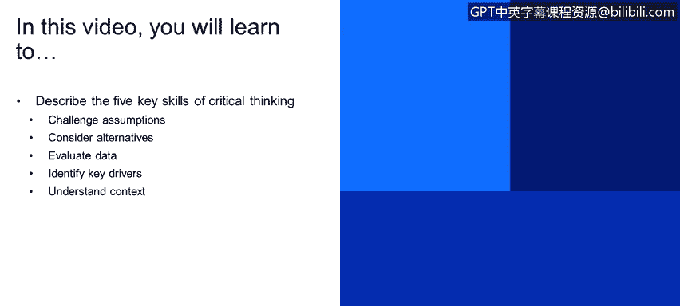
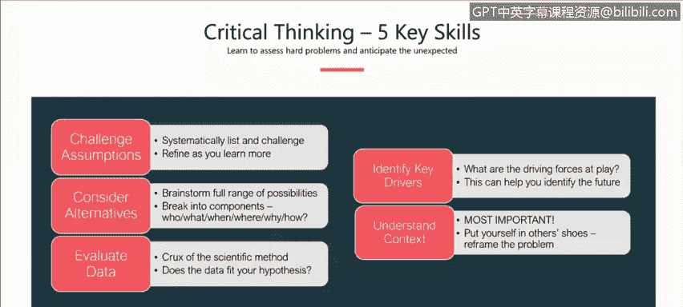
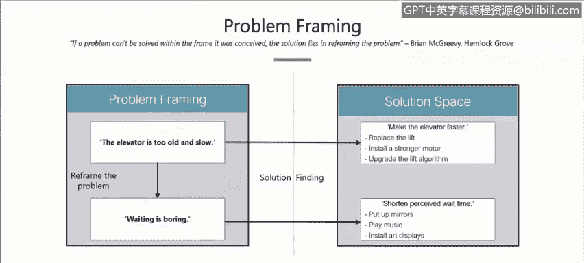
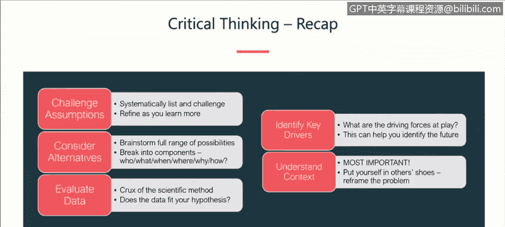

# 课程1：《网络安全工具与网络攻击简介》：17：批判性思维的5项关键技能 🧠

在本节课程中，我们将学习批判性思维的五项核心技能。这些技能对于网络安全分析师至关重要，能帮助我们更客观、系统地分析问题，避免认知偏见，从而做出更准确的判断。

---

## 概述

批判性思维是一种有目的、有纪律的思考方式。在网络安全领域，它帮助我们超越表面现象，深入分析威胁、数据和系统行为。本节将详细介绍五项关键技能：**挑战假设**、**考虑替代方案**、**评估数据**、**识别关键驱动因素**和**理解上下文**。掌握这些技能，你将能更有效地应对复杂的安全挑战。

---

## 挑战假设 🧐

上一节我们概述了批判性思维的重要性，本节中我们首先来看看如何挑战假设。这听起来简单，但在实践中颇具挑战性，因为它要求我们质疑自己推理所依据的心理模型。

我们常常在无意识中做出假设，这些假设基于过去的经验、想法、证据甚至个性。因此，第一步是意识到这些假设的存在。

以下是实践“挑战假设”的一个系统性框架：

1.  **明确列出所有假设**：邀请所有相关方（如项目经理、同事）进行头脑风暴，尽可能列出所有潜在的假设。
2.  **逐一审视假设**：对每个假设提出关键问题：
    *   我为什么认为这是正确的？
    *   在什么情况下这可能不成立？
    *   我对这个假设的有效性有多大信心？
    *   如果这个假设无效，会产生什么影响？
3.  **对假设进行分类**：根据证据将假设归类：
    *   **坚实且有充分支持的**
    *   **正确但有限制条件的**
    *   **缺乏支持或存疑的**（这并不意味着错误，仅表示需要更多数据）
4.  **迭代与精炼**：根据分类结果，修正或移除假设，收集必要的新数据，并在整个项目周期中不断重复此过程。

通过这个“关键假设检查”流程，我们可以系统地识别和验证思维中的潜在盲点。

---

## 考虑替代解释 🔄

在检查了我们的假设之后，接下来需要思考是否存在对同一行为或活动的其他解释。我们的大脑倾向于用少量数据拼凑出一个情境，但如果不考虑缺失的数据或替代解释，就可能导致误判。

避免让自己固守于一种解释至关重要。实践表明，引入不同视角是打破思维定式的有效方法。

以下是考虑替代解释的具体方法：

*   **进行头脑风暴**：邀请更多人参与讨论，利用不同的视角和创造性思维过程来审视问题。
*   **运用“6W”框架**：使用经典的记者提问法，从多个维度评估每种解释：
    *   **Who**（谁）：涉及谁？受害者、目标、利益相关者是谁？
    *   **What**（什么）：利害关系是什么？发生了什么问题？期望的结果是什么？
    *   **Where**（何处）：发生在哪里？地理位置、基础设施、受害者或对手的位置是否重要？
    *   **When**（何时）：时间点是否关键？是否有需要关注的截止日期？
    *   **Why**（为什么）：我们为什么这么做？关键动机是什么？
    *   **How**（如何）：我们如何解决？方法是否可行？需要具体和详细地思考。
*   **考虑零假设**：思考与你主要假设完全相反的情况。这能强迫你从另一个角度审视问题。

通过“6W”透镜来审视和刻画每种替代解释，可以更全面地理解局势。

---

## 评估数据 📊

我们已经识别了假设并考虑了替代解释，现在进入核心环节：评估数据。这是科学方法的关键——根据多种假设来评估数据的吻合度。

一个重要的原则是：如果你偏爱的假设与数据不符，就必须放弃它。在网络安全领域，数据评估面临独特挑战。

网络安全数据 notoriously hard to get（ notoriously hard to get ）。这可能源于政策隐私问题（如HIPAA、GDPR）、数据未被收集（网络或主机未配置相应的日志记录）等。因此，采取主动措施至关重要。

**建议**：在建立新的网络环境或系统时，就应主动规划。确立正常行为的基线，理解网络中什么重要，以及需要捕获哪些数据来排查问题或监控健康状态。这不仅有助于异常检测，也能让你警惕不一致的数据。

**核心行动**：如果数据不存在，就无法进行分析。因此，务必主动建立良好的数据收集实践。

---

## 识别关键驱动因素 🎯

识别关键驱动因素是第四项技能。关键驱动因素指能显著影响局势的因素，它们**并非总是技术性的**。

在网络安全背景下，关键驱动因素包括：

*   **技术因素**：加密、认证工具、框架、基础设施可用性。
*   **监管与政治因素**：隐私法规（如GDPR）、安全法规、知识产权。
*   **运营与人员因素**：供应链物流、员工培训、技能与视角。
*   **威胁行为体因素**：对手的技术能力、动机、机会。例如，国家支持的威胁行为体与“脚本小子”在资源和动机上截然不同。

意识到这些多样化的驱动因素，对于全面理解安全形势至关重要。

---

## 理解上下文 🌍

最后一项技能是理解上下文。上下文即你工作的操作环境。IBM的上下文与大学、微软或其他公司的上下文都不同。

上下文至关重要。你需要意识到你的经理、同事、客户的不同视角。问自己：他们需要我做什么？我如何构建这个问题？我是否需要将问题置于更广阔的背景下？

这时，“框架构建”技术就派上用场了。回想本课程开始时对目标和批判性思维的定义，那就是一种框架构建，旨在确保所有人达成共识、使用相同的词汇，从而避免后续的混淆和问题。

以下是更客观地审视问题或局势的步骤：

1.  **识别关键组成部分**：将局势分解为组成部分，列出关键参与者和类别。
2.  **识别影响因素**：理解各组成部分后，识别正在起作用的不同因素（驱动力量）。这有助于揭示最初未察觉的额外见解和关系。
3.  **审视关系与模式**：不同组成部分和因素之间存在何种关系和模式？是静态还是动态的？在威胁追踪调查中，图数据库可能有助于可视化实体间的关系。
4.  **寻找相似与差异**：是否存在历史类比？你是否在其他上下文或经验中见过类似的模式、行为或情况？
5.  **重新定义问题**：尝试用不同方式重新构建问题。写下已知和未知信息。能否从不同角度看待它？是否存在尚未发现的根本原因？

---

### 案例分析：电梯问题 🛗

回顾之前的电梯问题：作为高层公寓经理，住户抱怨电梯太慢。

传统思路可能聚焦于**加快电梯速度**（升级电机、算法等）。然而，通过理解上下文和重新构建问题，发现了不同的解决方案。

**实际采取的措施是安装镜子**。投诉随之消失。

**问题重构**：真正的核心问题并非“电梯太慢”，而是“等待很无聊”。安装镜子后，等电梯的人被分散了注意力，不再专注于等待时间。

**解决方案空间转移**：从“缩短实际等待时间”转变为“缩短感知等待时间”。这可以通过安装镜子、播放音乐、设置显示屏等更简单、廉价的方式实现。

这个案例生动展示了问题重构的力量，以及通过识别问题的不同方面，如何为看似棘手的问题找到突破性的解决方案。这也再次说明了在网络安全领域保持思维多样性的重要性。

---

## 总结

在本节课中，我们一起学习了批判性思维的五项关键技能：

1.  **挑战假设**：随着了解更多信息，不断精炼你的假设。
2.  **考虑替代解释**：不要固守于一种解释，避免思维僵化。
3.  **评估数据**：检验数据是否与你的假设相符，并主动确保数据的可获取性。
4.  **识别关键驱动因素**：记住驱动因素不总是技术性的，可能涉及政治、人员等多方面。
5.  **理解上下文**：理解你工作的环境，尝试换位思考，并学会重构问题以改变解决方案的空间。

掌握这些技能，将使你成为一名更具洞察力和分析能力的网络安全专业人士。