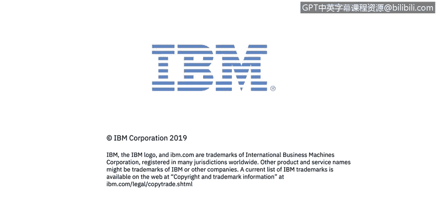

# 课程1：《网络安全工具与网络攻击简介》：18：17_安全攻击者及其动机 🎯

在本节课中，我们将学习网络安全攻击的不同类型、其影响，以及发动这些攻击的攻击者类型及其动机。我们还将了解安全分析师在安全运营中心（SOC）中处理网络攻击的日常工作。

上一节我们介绍了课程的整体结构，本节中我们将深入探讨安全攻击者及其动机的具体内容。

在模块2中，你将听到来自Kenneth、John以及一位新的主题专家Domenico Ruusio的讲解。Dom是IBM Security意大利分公司的首席技术官，他将涵盖网络安全攻击的类型、这些攻击的影响，以及攻击者的类型和他们的动机。

你还将听到来自IBM安全运营中心的Javier Portuguemoura的分享。Javier将描述安全分析师在实时应对网络攻击时的日常工作状态。

此外，你将需要下载并阅读波耐蒙研究所关于网络弹性组织的第四份年度研究报告。

以下是本课内容的核心要点列表：

*   网络安全攻击的类型。
*   网络攻击造成的影响。
*   发动攻击的攻击者类型。
*   攻击者背后的动机。

让我们开始学习。

本节课中我们一起学习了网络安全攻击的基本分类、其潜在影响，并初步认识了不同类型的攻击者及其动机。了解这些是构建有效防御策略的第一步。