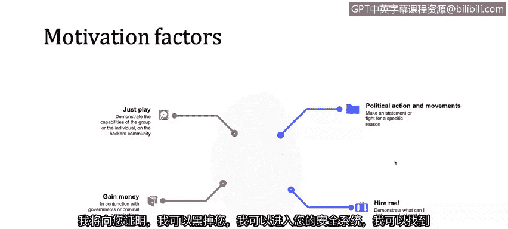

# 课程1：《网络安全工具与网络攻击简介》：19：攻击者类型及其动机简要概述 🎯

在本节课程中，我们将学习网络犯罪中的主要参与者是谁，以及他们实施攻击的动机是什么。了解攻击者的身份和意图，是构建有效防御策略的第一步。

上一节我们介绍了网络攻击的基本概念，本节中我们来看看这些攻击背后的“人”。

## 攻击者类型 👥

网络攻击的参与者多种多样，但我们可以将其主要归纳为以下四类。

以下是四种主要的攻击者类型：

1.  **黑客**
    这些黑客可能受雇于人，也可能独立行动。例如，私营组织可能雇佣一群黑客去攻击一家公司，窃取其数据库结构，以获取知识产权等。这在过去确实发生过，例如被称为“极光行动”的事件，建议对此进行延伸阅读。

2.  **内部用户**
    这类攻击者的行为可能是有意的，也可能是无意的。例如，如果你在公司工作，将一些机密文件转发到你的个人邮箱，以便晚上回家继续工作，这并非出于恶意意图，但它构成了一次安全事件。你不应该在公司安全网络之外使用机密文件。这种情况的发生，往往是因为员工缺乏相关培训或公司没有明确的管控政策。与之相对的是，如果员工故意将带有病毒的U盘插入公司电脑并执行，这就是有意的恶意行为。有时，区分内部用户的行为是否有恶意动机是比较困难的。

3.  **黑客行动主义者**
    黑客行动主义与黑客行为类似，但区别在于，通常没有人付钱给黑客行动主义者去发动攻击。例如，分布式拒绝服务攻击常被用于向许多国家施压，以影响其特定决策。我们将探讨一个黑客行动主义团体对新加坡政府网站的攻击案例，起因是新加坡政府试图对互联网实施新的合规性要求和监管措施。

4.  **政府**
    我们之前讨论过政府行为体。他们的意图通常不是经济利益，而是情报目的。他们通常希望了解其他国家的内部情况，获取其管理的机密数据。

## 攻击动机 💡

了解了攻击者是谁之后，我们再来看看他们为何要发动攻击。

以下是攻击者可能持有的一些常见动机：

*   **炫耀与证明能力**：为了“好玩”，或为了证明自己有能力入侵一个安全系统。
*   **经济利益**：试图通过诈骗或黑客行为赚钱。这通常与犯罪组织有关。
*   **政治与行动**：如果一群人想要攻击政府，在大多数情况下，这种攻击声明源于其政治动机。他们希望通过行动向政府表明立场，表达对某些政策的不满。
*   **“雇佣我”**：这是一种有趣的动机，即“我会向你证明我可以黑进你的系统，发现你安全体系中的漏洞，以便让你明白我很厉害，是一个可以雇佣来修复这些安全漏洞的优秀专业人士。”

---

本节课中我们一起学习了网络攻击中的四类主要参与者：黑客、内部用户、黑客行动主义者和政府，并探讨了他们发动攻击的多种动机，包括炫耀、经济利益、政治目的和寻求雇佣等。理解“谁”在攻击以及“为什么”攻击，是分析网络安全威胁和制定防护措施的基础。