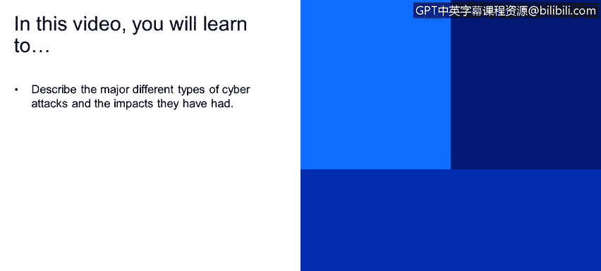

# 课程1：《网络安全工具与网络攻击简介》：20：主要不同类型的网络攻击

在本节课中，我们将学习描述几种主要的网络攻击类型及其造成的影响。我们将通过一些真实案例来了解这些攻击的运作方式和严重后果。

## 概述

本节将介绍近年来发生的一些重大网络攻击事件，并分析攻击者所使用的工具和攻击手法。通过了解这些案例，我们可以更好地认识网络威胁的多样性和严重性。

## 主要网络攻击案例

以下是近年来一些具有代表性的网络攻击事件。

*   **索尼攻击**：2011年，黑客组织LulzSec入侵了索尼的PlayStation网络系统，泄露了大量用户信用卡信息和账户数据。
*   **新加坡攻击**：大量黑客曾对新加坡的政府网站、银行和公司网站发起攻击，以抗议该国政府通过的一些政策和法律。
*   **2014年系列攻击**：这一年发生了多起重大数据泄露事件，包括领英、eBay、家得宝等知名公司。
*   **塔吉特百货攻击**：2015年，塔吉特百货遭遇攻击，导致至少1亿张信用卡信息泄露。
*   **2016年系列攻击**：包括影响美国大选的攻击、针对美国有线电视新闻网的攻击，以及利用Mirai恶意软件首次通过物联网设备对DNS服务商发起的DDoS攻击。
*   **2017-2018年系列攻击**：出现了影子经纪人、永恒之蓝漏洞利用、WannaCry勒索软件、NotPetya勒索软件以及美国国家安全局工具泄露等重大事件。
*   **华硕供应链攻击**：这是一起典型的供应链攻击案例。攻击者入侵了华硕的软件供应链，在其电脑操作系统的更新程序中植入恶意软件。这意味着在过去几个月内出货的华硕电脑可能已预装恶意软件。如果您拥有华硕设备，建议联系供应商并运行杀毒软件进行检查。
*   **SWIFT网络攻击**：SWIFT是全球银行间金融电讯协会的汇款协议。攻击者通过身份冒充等手段，利用该协议发起国际转账诈骗。例如，2015年厄瓜多尔的Banco del Austro银行因此损失了近1000万美元。攻击手法通常是向用户发送钓鱼邮件，诱骗其点击链接更新个人信息，从而窃取凭证。

## 攻击者使用的工具与效果

上一节我们回顾了具体的攻击案例，本节中我们来看看攻击者在这些事件中使用的具体工具及其效果。

*   **美国大选攻击工具**：攻击者使用了名为`Cdaddy`和`CDuke`的工具，在政党委员会的系统中创建后门，以窃取电子邮件和文档，访问权限持续了至少六个月。
*   **BlackEnergy**：这是俄罗斯黑客使用的一种工具，用于利用工控系统、可编程逻辑控制器或工业控制系统中的漏洞。这些系统通常应用于发电厂、核电站和水厂等关键基础设施。乌克兰在2016年和2017年遭受的一系列攻击中就使用了此工具。
*   **其他恶意工具**：包括`Shamoon`、`Duqu`、`Flame`、`DarkSeoul`和`WannaCry`等。这些工具被犯罪分子或受政府资助的黑客用来攻击基础设施、窃取企业数据、个人信息乃至整个互联网。拥有重要知识产权的公司，如谷歌和西门子，常成为这类攻击的目标。

## 总结

本节课中，我们一起学习了多种主要类型的网络攻击及其深远影响。从索尼的数据泄露到利用SWIFT协议的银行诈骗，从供应链攻击到针对关键基础设施的破坏，这些案例展示了网络威胁的复杂性和严重性。同时，我们也了解了攻击者常用的工具，如用于创建后门的`Cdaddy`、针对工控系统的`BlackEnergy`以及造成广泛破坏的勒索软件`WannaCry`。认识这些攻击模式和工具是迈向有效防御的第一步。