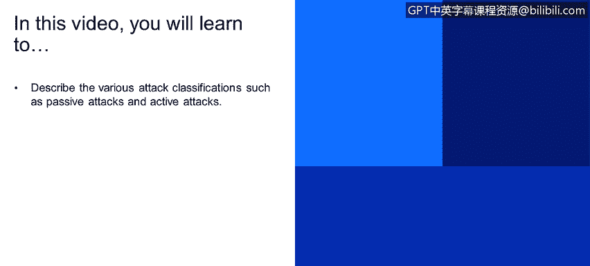
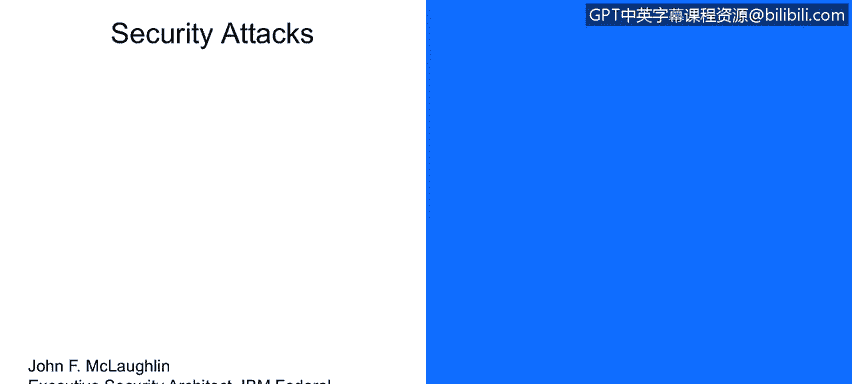
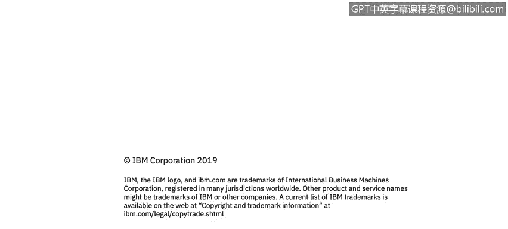

# 课程1：《网络安全工具与网络攻击简介》：21：安全攻击定义

在本节课程中，我们将学习如何描述不同类型的攻击分类，特别是被动攻击和主动攻击。理解这些分类是构建网络安全知识体系的基础。

## 攻击分类概述

首先，我们来探讨攻击的分类。攻击主要可以分为两大类：被动攻击和主动攻击。本节我们将逐一详细解析。

## 被动攻击

被动攻击是指攻击者在未经授权的情况下，秘密地获取或监听信息，但不对信息流进行任何修改。这类攻击的核心是“窃听”。

被动攻击主要有两种形式：**消息内容窃听**和**流量分析**。

以下是两种被动攻击的具体说明：

*   **消息内容窃听**：攻击者（例如名为Darth的入侵者）在通信信道上进行窃听，截获发送方（Bob）和接收方（Alice）之间的消息。这个过程对通信双方而言是**不可察觉**的。攻击者就像在通信线路上安装了一个“窃听器”（tap）。
    *   **公式/概念**：`攻击者(Darth) 截获 消息(从Bob到Alice)`
*   **流量分析**：攻击者不关注消息的具体内容（载荷），而是分析通信的**模式**，例如消息的频率、大小、发送时间等。通过分析这些元数据，攻击者可以推断出有价值的情报。一个著名的例子是，通过监测白宫在晚间特定时间后送达的披萨数量，来推测第二天可能发生的国家安全事件。

被动攻击是否容易被发现？答案是否定的。它们**难以被检测**，因为从通信双方（Alice和Bob）的角度看，通信过程似乎完全正常：消息认证成功、完整性未被破坏。只有**机密性**遭到了破坏，但双方无法察觉攻击者已经获取了消息副本。因此，被动攻击可能是最危险的情报收集手段之一，可以持续数年而不被发现。

## 主动攻击

上一节我们介绍了难以察觉的被动攻击，本节中我们来看看更具破坏性的主动攻击。主动攻击涉及对数据流的**修改**或**伪造**，会直接影响系统或数据的可用性、完整性和真实性。

主动攻击主要分为四个基本类别。

以下是四种主动攻击的具体说明：

*   **伪装**：攻击者冒充一个合法的实体。例如，Darth截获Bob的消息后，伪装成Bob与Alice通信，提议更改午餐时间。Alice会误以为是Bob在和她沟通。
*   **重放**：攻击者截获一个有效的消息或数据片段，并在稍后时间**重新发送**它，以产生未经授权的效果。这常用于中间人攻击。虽然消息本身未被修改（保持了完整性），但其来源是伪造的（破坏了认证性）。
*   **消息修改**：攻击者对合法消息的部分或全部内容进行**更改**、**延迟**或**重新排序**，以产生非预期的效果。例如，将“下午1点见面”改为“上午11点半见面”。确保消息的完整性是防御此类攻击的关键。
*   **拒绝服务**：攻击者阻止或禁止通信设施的正常使用和管理。例如，通过洪水攻击使服务器瘫痪，导致合法消息根本无法送达。

与被动攻击相反，主动攻击虽然**难以完全预防**（因为攻击方式多种多样），但通常**更容易被检测**到，因为它们会留下异常活动的痕迹。因此，防御主动攻击的主要目标是**尽早检测**攻击行为，并从攻击造成的破坏或延误中**快速恢复**。

## 课程总结

本节课中，我们一起学习了网络安全中两种主要的攻击分类：**被动攻击**和**主动攻击**。被动攻击侧重于秘密窃听信息，难以检测；而主动攻击则涉及对信息的修改或伪造，更具破坏性但相对容易察觉。理解这些攻击的本质和区别，是制定有效防御策略的第一步。