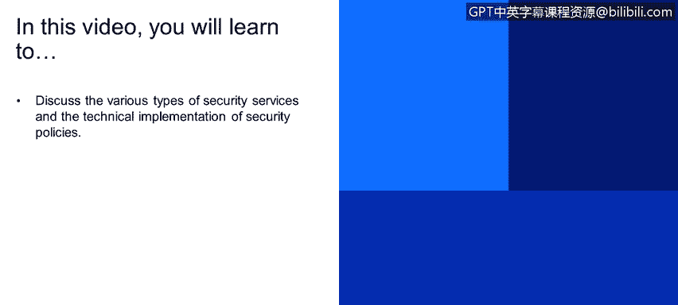
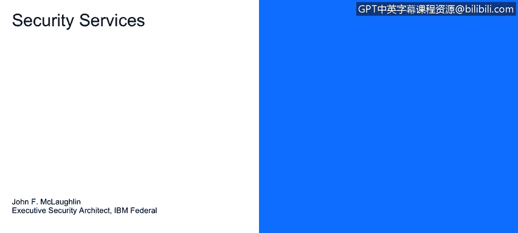
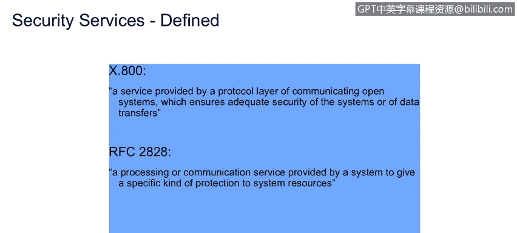

# 课程1：《网络安全工具与网络攻击简介》：22：安全服务 🔐

在本节课中，我们将学习讨论各种类型的安全服务，以及安全策略的技术实现方式。我们将了解安全服务如何作为安全策略的具体技术体现，并深入探讨几个关键的安全服务定义。

上一节我们介绍了安全攻击的分类，本节中我们来看看如何通过安全服务来防御这些攻击。

---

安全服务是由系统提供的一种处理或通信服务，旨在为系统资源提供特定类型的保护。安全服务是安全策略的技术实现。我们在之前的模块中讨论过访问控制，而实现这些安全策略的正是安全服务。

安全服务通过安全机制来实现。在此上下文中，安全机制就是我们第一模块中讨论的安全执行点。安全服务旨在增强组织的数据处理系统和信息传输的安全性。这意味着我们要利用安全服务来改进企业的业务流程，并保护组织内部（如从数据库到服务器）和外部（如到业务伙伴）的信息流动。安全基础设施的目的，是提供抵御安全攻击的防御机制。

一个安全服务可以与多个安全执行点建立一对多的关系。这很合理，因为一项技术策略的实现，可能会涉及安全执行的多个环节。在现实世界中，这常常意味着能力的复制。例如，我们通过信封确保信息机密性，通过签名和公证确保真实性和不可否认性。

以下是国际电信联盟（ITU）和RFC 2828标准中关于安全服务的定义：

*   **ITU X.800标准**：由通信开放系统的协议层提供的服务，用以确保系统或数据传输的充分安全性。这涉及OSI协议栈的各层，保护发送方、接收方及通信传输过程。
*   **RFC 2828标准**：由系统提供的处理或通信服务，用以向系统资源提供特定类型的保护。这个定义更为清晰，明确指出服务由安全执行点实现，是安全策略的具体实施。

---

现在，让我们深入探讨X.800标准中定义的一些具体安全服务类别。William Stallings在其经典教材中归纳了五大类共14项具体服务。我们可以将这些服务理解为网络安全领域的“高级宪法”。

以下是其中六项核心安全服务的定义：

*   **认证**：确保通信是真实可信的。它确认通信双方的身份以及信息的可验证性。
    *   **对等实体认证**：为关联中的对等方身份提供证实。例如，Bob和Alice可以相互确认对方身份。当Alice发送消息时，她可以说“嗨Bob，我是Alice”，Bob能验证这确实是Alice。
    *   **数据源认证**：证实数据的来源。Bob可以确认消息确实来自Alice。这是两个非常强大的安全点。
*   **访问控制**：限制和控制通过通信链路对主机系统和应用程序的访问。在我们的语境中，这特指计算机网络访问，而非实体门禁。其过程通常包含三个步骤：**识别**（声称“我是John”）、**认证**（验证“你确实是John”）和**授权**（批准“John，你可以执行以下操作”）。这是一种基于角色的访问控制（RBAC）模型。
*   **数据完整性**：确保接收到的消息与发送时一致，没有发生**重复**、**插入**、**修改**、**重排序**、**重放**或**丢失**。例如，防止将“下午1点见面”篡改为“上午11点见面”。
*   **不可否认性**：防止通信双方（如Alice和Bob）事后否认曾参与过某项交易。Alice能证明她发送了消息且Bob收到了，Bob也能证明他收到了来自Alice的消息。这在金融服务（银行、保险）中至关重要，旨在消除“我没做过”的抵赖可能性。识别、认证和机密性都在此发挥作用。
*   **可用性**：确保系统资源可访问且可使用。这意味着企业提供的服务能力是存在的，并且能够及时响应。如果一个请求需要等到第二天才得到响应，那就不符合“及时”的要求，也就破坏了可用性。

---

本节课中，我们一起学习了安全服务的核心概念。我们了解到安全服务是安全策略在技术层面的具体实现，它们通过安全机制来增强组织系统和数据的安全性。我们重点探讨了认证、访问控制、数据完整性、不可否认性和可用性等关键服务，并理解了它们如何像现实世界中的信封、签名和公证一样，在网络空间保护我们的信息和交易。掌握这些基础服务，是构建有效网络安全防御体系的起点。