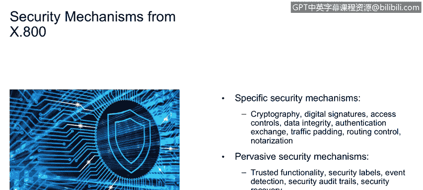

# 课程1：《网络安全工具与网络攻击简介》：23：安全机制 🔐

在本节课程中，我们将学习安全机制的概念及其包含的内容，并深入探讨其在企业安全中的应用。

安全机制被定义为**硬件、软件和流程的组合**，旨在增强IT安全性。上一节我们介绍了安全执行的原则，而安全机制正是安全策略的技术实现。安全策略源于业务策略，业务策略描述“我们要做什么”，而安全策略则描述“我们如何去做”。安全执行点或安全机制，就是该安全策略的技术实现。

因此，安全机制是安全策略的实施机制或交付载体。以下是几个例子：
*   **协议抑制**：例如，根据“不允许使用FTP”的安全策略，其对应的业务策略可能是“禁止未经授权的大规模数据传输”。安全执行点就是**禁用FTP服务**。
*   **标识与认证**：我们讨论过访问控制的三个方面——标识、认证和授权。这些都是将被采用的安全服务。

正如之前所述，安全服务是安全执行的工具。Stallings提供了一系列安全机制的例子，例如**密码学、数字签名、访问控制**等。这些都属于具体的安全执行点。在所有这些安全机制之上，都有一个控制性的安全策略。安全策略是一种源自逻辑性业务策略的技术性策略。这就是完整的链条：业务策略 -> 安全策略 -> 安全执行点（安全机制）。

这些被称为**特定安全机制**。此外，还存在一些**普遍性安全机制**，它们超越了具体策略：
*   **可信功能**：我们如何信任内部用户和特权用户？用户分为两类：普通用户（你和我）和特权用户（可以更改安全策略的人）。特权用户的行为应受到高度关注。
*   **安全标签**：在政府领域，有秘密、绝密、敏感但不保密等分类；在私营领域，有保密、高度保密、业务核心等分类。这些都是应用于数据的**安全标签**。如何使用这些标签进行访问控制和数据流转，有一些模型描述，其中最著名的是**Bell-LaPadula模型**。
*   **事件检测**：这是安全智能（如QRadar）的核心。我们能够检测到事件的发生，关键在于判断该事件是否异常且具有高风险，这就进入了异常检测的领域。
*   **安全审计跟踪**：这也是一种普遍性机制，指收集安全情报数据并确保其可用、受保护（防止未经授权的更改）并能发送给正确人员的能力。这与刑事证据链保管有相似之处，在取证领域至关重要。
*   **恢复机制**：即恢复与备份，这影响着我们对安全事件的响应方式。

我们可以看到，这些机制与NIST安全模型及课程模块一中描述的IBM安全框架存在一些相似之处。

接下来，我们来看一个安全机制（或安全执行点）的具体示例。

以下是一个主要关注访问控制策略的示例。我们看到，这些安全执行机制最初在两个防火墙之间的**DMZ（非军事区）** 中实现。一个良好的设计原则是使用不同设计的防火墙，这样即使攻击者攻破了一个防火墙，也无法简单地用同样的攻击方法攻破第二个。

在安全域和安全管理层中，我们看到了**凭证管理**，能够获取事件、管理凭证。这些凭证包括角色、权限和身份信息。

本节课中，我们一起学习了安全机制的定义，它作为安全策略的技术实现，将业务目标转化为具体的防护措施。我们区分了特定安全机制（如密码学、访问控制）和普遍性安全机制（如可信功能、安全标签、审计跟踪），并通过一个网络架构图了解了访问控制等机制在实际环境中的部署位置。理解这些机制是构建有效企业安全防御体系的基础。