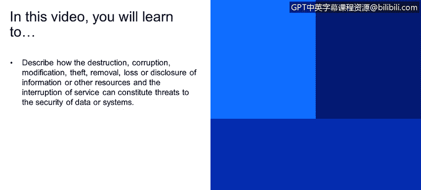
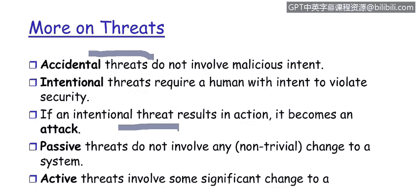

# 课程1：《网络安全工具与网络攻击简介》：25：组织威胁

## 概述
在本节课程中，我们将学习如何描述信息的破坏、损坏、修改、盗窃、移除、丢失或泄露，以及服务的中断，如何构成对数据或系统安全的威胁。我们还将探讨这些威胁的来源。

## 威胁的构成要素
对数据通信系统（即我们的企业）的威胁包括以下要素：

*   **破坏**：信息或其他资源的破坏。例如，拒绝服务攻击。这是对大规模信息处理企业的主要威胁。信息的破坏，以及安全执行点的破坏，都属于此类。
*   **修改**：这与我们之前讨论的完整性方面有关。能够在信息从发送方传输到接收方的过程中修改信息，是一个重大风险。许多人，包括政府部门，更担心的是修改，而非损坏。损坏可以被检测到，而修改则不那么容易被发现。不过，我们稍后会介绍一种机制来检测信息是否被修改。
*   **盗窃与移除**：攻击的主要目标是盗窃关键信息，例如信用卡号或国防网络上的机密信息。
*   **泄露**：从保密性的角度来看，信息的泄露也构成威胁。例如，过去一年让政府深感不安的维基解密文件泄露事件，就是信息泄露。这绝对是对IT企业的威胁。
*   **服务中断**：这涉及到可用性方面。我们之前在第一模块讨论过，我们不仅需要关注服务是否可用，还需要担心时间限制。例如，如果我们发送一条消息并期待回复，那么回复必须在合理的时间内发生。

## 威胁的分类
威胁主要可以分为两类：

*   **意外威胁**：指没有犯罪意图的威胁。
*   **故意威胁**：指有意违反安全策略的威胁。

从安全防护的角度来看，我们并不太区分这两者。无论是一个拥有特权的用户发生了“意外”，还是故意违反了影响企业的安全策略，其结果完全相同。因此，在结果层面，我们不对这两者做过多区分。但我们需要意识到意外威胁和故意威胁之间的区别。

## 从威胁到攻击
那么，如何判断一个事件是意外还是故意的结果呢？关键在于，如果企业数据外流、权限被降低或安全生态系统的状态发生了任何变化，那么这就构成了一次**攻击**。

这就是我们从**漏洞**（可能发生某事）到**威胁**，再到**攻击**或**利用**（某事已经发生）的转变。我们担心的是漏洞（可能发生什么），并对攻击（已经发生了什么）做出反应。

## 被动攻击与主动攻击
这里再次区分被动攻击和主动攻击：

*   **被动攻击**：极其危险，攻击者可以长期潜伏在网络中，不被任何用户察觉。行业数据显示，攻击在被检测到之前，平均可以在网络上被动潜伏284天。
*   **主动攻击**：与被动攻击的关键区别在于，它会导致安全生态系统的**状态**发生变化。

## 总结
本节课我们一起学习了构成组织安全威胁的各种行为，包括破坏、修改、盗窃、泄露和服务中断。我们了解了威胁可以分为意外和故意两类，但从防护角度看结果相同。最重要的是，我们明确了从潜在漏洞到实际攻击的转变过程，并再次强调了被动攻击的隐蔽性和长期危害性。理解这些威胁是构建有效防御体系的第一步。