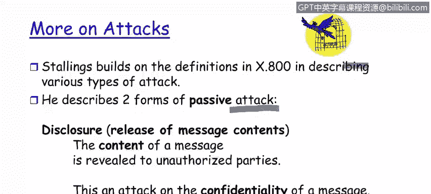

# 课程1：《网络安全工具与网络攻击简介》：26：攻击

在本节课中，我们将学习如何描述一个由人类实施的、意图违反安全性的行为如何构成一次攻击。我们将探讨攻击的定义，并深入了解几种不同类型的攻击。

## 攻击的定义

上一节我们介绍了安全架构的基本概念，本节中我们来看看什么是攻击。

根据定义，**攻击**是指一个由人类实施的、意图违反安全性的行为。关键在于攻击者的意图，而非攻击是否成功。无论攻击者是否成功地将一个**漏洞**转化为有效的**利用**，只要该行为发生，攻击即告成立。攻击的发起者是人，虽然攻击过程可能涉及协议、代理等中间环节，但总归有人启动了这一系列导致攻击的事件链。

## 被动攻击的类型

以下是两种主要的被动攻击类型，它们主要威胁信息的保密性。

### 信息泄露攻击

这是一种针对信息保密性的攻击。其核心是**将消息内容泄露给未经授权的第三方**。可以将其想象为拦截并拆阅了一封寄给他人的信件。

*   **具体过程**：攻击者特鲁迪拦截了鲍勃和爱丽丝之间的通信。如果特鲁迪仅仅是拦截了消息但并未查看或传播其内容，这不构成信息泄露攻击。**只有当拦截行为加上内容的泄露**，才构成完整的信息泄露攻击。

### 流量分析攻击

这也是一种威胁信息保密性的攻击。与直接泄露内容不同，流量分析旨在**通过分析通信的模式来推断信息**。

*   **分析方法**：攻击者不直接获取消息内容，而是通过分析通信的**频率、消息大小、时间以及通信双方的身份**来获取情报。
*   **举例说明**：例如，如果攻击者观察到系统管理员和数据库管理员之间的通信流量突然显著高于正常水平，即使不知道具体内容，也能推断出数据架构可能出现了问题（如数据泄露或存储故障）。通过分析这些元数据，攻击者可以洞察发送方的意图和行为。

## 主动攻击：伪装攻击

之前我们提到过四种攻击风格，现在我们来详细看看其中一种主动攻击——伪装攻击。

伪装攻击是指**假冒一个已知或已授权的用户或系统**。这种攻击会导致身份验证和识别的失败。

以下是伪装攻击的两种常见形式：

1.  **假冒用户**：攻击者特鲁迪伪装成用户爱丽丝，与鲍勃进行通信。
2.  **假冒系统/服务**：攻击者特鲁迪设置一个虚假的谷歌登录页面。当用户爱丽丝尝试登录时，她会误以为这是真正的谷歌服务，从而输入自己的用户名和密码。在这个例子中，特鲁迪的虚假系统成功地**欺骗**了爱丽丝，让她在身份识别（这是谷歌吗？）和身份验证（这个服务是真的吗？）两个环节上都做出了错误的判断。

本节课中我们一起学习了攻击的核心定义，并探讨了被动攻击（如信息泄露和流量分析）与主动攻击（如伪装攻击）的具体形式。理解这些不同类型的攻击是构建有效防御策略的第一步。