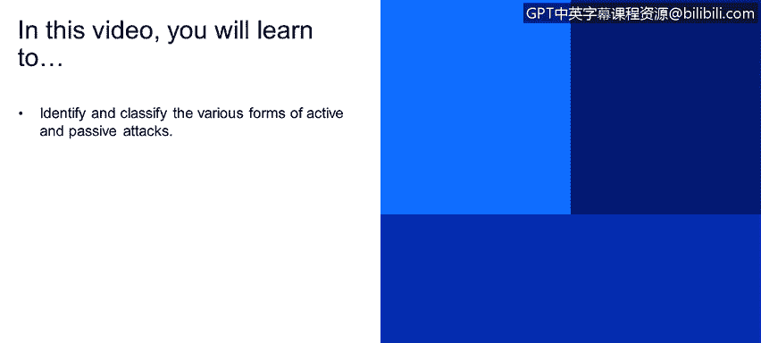
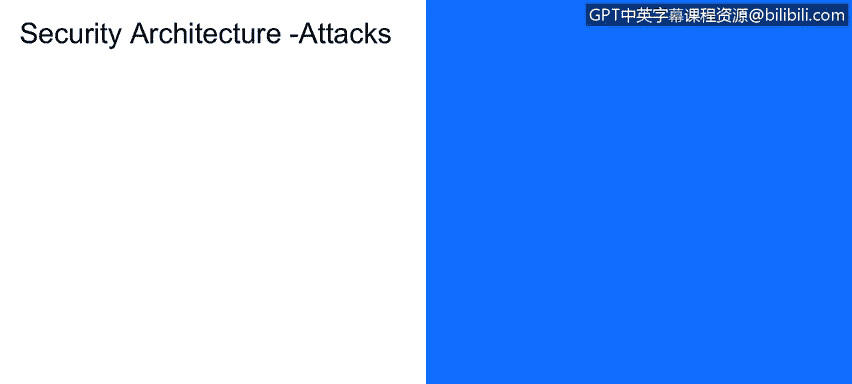

**网络安全工具与网络攻击简介课程：27：安全体系结构攻击**

在本节课程中，我们将学习如何识别和分类各种形式的主动攻击与被动攻击。上一节我们介绍了主动攻击中的伪装攻击，本节中我们来看看另一种主动攻击形式：重放攻击。

**重放攻击**

重放攻击是指攻击者特鲁迪截获一份合法的通信消息副本，并在稍后时间重新发送该消息。

例如，一条原本是“我们周三休息去吃午饭吧”的消息被截获、延迟，然后在周四才发送给鲍勃。鲍勃收到这条来自爱丽丝的消息（实际上消息确实来自爱丽丝，只是被延迟了），会误以为午饭安排在周四而非周三。

在金融服务场景中，可以理解这种消息延迟（如“完成股票订单”或“转账”）会如何严重影响金融机构的核心使命——忠实执行客户指令。这对金融社区是一个重大问题。

因此，这实际上是对系统**完整性**的攻击。攻击之所以针对完整性，是因为消息虽合法，但未及时发送。例如，“从我的储蓄账户转账100美元到支票账户”是一条合法消息，但在错误的时间被重传，这就构成了完整性破坏。

我们需要思考：消息是被修改了，还是被延迟了？之前讨论的攻击（如修改）是针对消息完整性的攻击，而重放攻击则通过延迟来破坏完整性。

接下来，我们探讨针对企业的另一些主动攻击组件。目前仍在广泛发生的一大类攻击是拒绝服务攻击。

**拒绝服务攻击**

在拒绝服务攻击中，对手特鲁迪会阻止授权用户鲍勃和爱丽丝访问某个系统。这可能是他们的电子邮件系统、短信系统或某个通信信道。

攻击者阻止授权用户访问通信信道进行交流。这是一种**可用性**攻击，因为它涉及及时性因素。爱丽丝发送给鲍勃的消息可能数天都无法送达，甚至永远无法到达。这涉及服务的及时性和可访问性，即服务在时间维度上的可用性。

**总结**

本节课中，我们一起学习了两种主要的主动攻击类型：
1.  **重放攻击**：攻击者截获并延迟发送合法消息，破坏系统的**完整性**。
2.  **拒绝服务攻击**：攻击者阻止授权用户访问服务或资源，破坏系统的**可用性**。

理解这些攻击如何针对信息安全的不同核心属性（如完整性和可用性），是构建有效防御策略的基础。