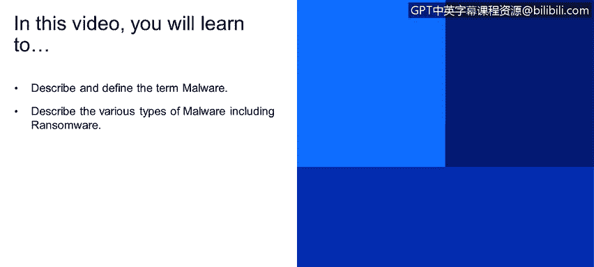
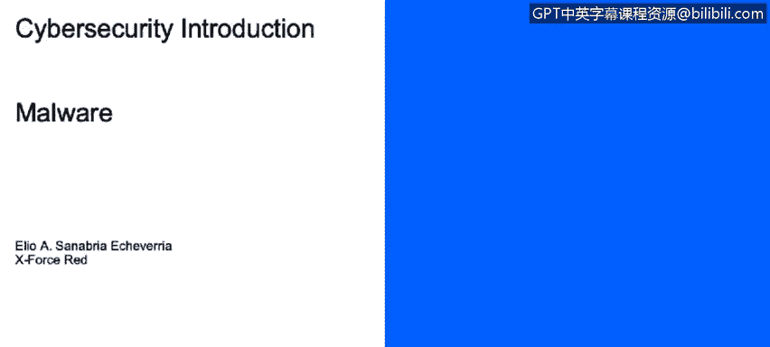
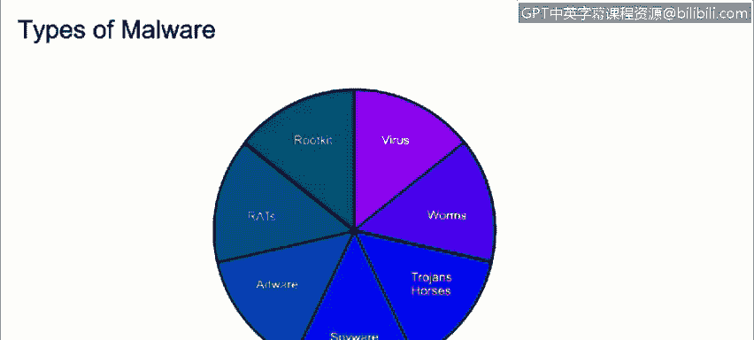
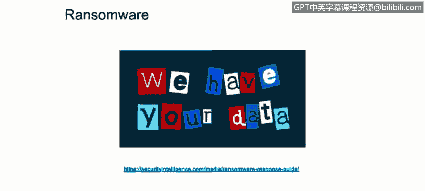

# 课程1：《网络安全工具与网络攻击简介》：29：恶意软件和勒索软件

在本节课程中，我们将学习如何描述和定义“恶意软件”这一术语，并了解包括勒索软件在内的各种恶意软件类型。我们将尝试回答以下问题：什么是恶意软件？恶意软件有哪些类型？以及我们如何防范它？

首先，我们来定义恶意软件。

恶意代码或恶意软件，是指在主机上运行的任何非期望或未经授权的软件，其目的是破坏操作或利用主机资源为自己谋利。近期的恶意软件攻击试图隐藏在主机上，利用资源进行潜在用途，例如发起其他服务攻击、托管非法数据、窃取个人或商业信息。

## 恶意软件的类型

目前存在多种形式的恶意软件，它们具有不同的特征。以下是主要的几种类型：

*   **病毒**：一种恶意代码片段，通过附着在其他文件上并使用**自我复制**的方式从一台计算机传播到另一台计算机。请注意，它需要**人为交互**才能自我复制。由于其自我复制的特性，它们很难从系统中清除。它们还使用高级技术来隐藏自己，例如**多态代码**，它会加密并复制自身，这使得杀毒软件更难发现，这被称为**多态病毒**。另一类是**装甲病毒**，它试图通过混淆其在系统中的真实位置和代码来保护自己，这使得逆向工程师更难为其创建特征码。

*   **蠕虫**：一种**自我复制**的恶意软件，**不需要人为交互**。其主要目标只是传播并耗尽资源，或将计算机变成“僵尸”。

*   **特洛伊木马**：一种隐藏的恶意软件，旨在造成损害或为攻击者提供对主机的访问权限。它们通常通过伪装成合法软件包（如游戏、壁纸或任何类型的下载）被引入计算机环境。

*   **间谍软件**：其主要目标是跟踪和报告主机的使用情况，或收集攻击者希望获取的数据。这些数据可以包括网络浏览历史、个人信息、财务信息以及攻击者想要获取的任何类型的文件。

*   **广告软件**：一种自动显示或下载未经请求的广告的代码，通常在浏览器弹出窗口中看到。

*   **RAT**：代表**远程访问工具**或**远程访问木马**。RAT允许攻击者获得未经授权的访问并控制计算设备。

*   **Rootkit**：一种旨在**最低级别**上完全或部分控制系统的一段软件。

## 勒索软件

现在我们来谈谈勒索软件。我们都听说过勒索软件，但它到底是什么？

勒索软件是一种恶意软件，它用代码感染主机，**限制对计算机或其上数据的访问**。攻击者要求支付**赎金**以换回数据。如果未在规定时间内支付，数据将被销毁。在右侧，我们可以看到勒索软件控制主机后显示的横幅，要求支付赎金并带有计时器。最近一次大规模传播发生在2017年5月的WannaCry勒索软件事件。

如果您希望了解更多关于如何应对勒索软件攻击的信息，请查看提供的链接。该链接包含以下主题：如何保护您的关键信息和资源、如何识别特定变种的勒索软件，以及如何从受感染系统中遏制和清除勒索软件。

## 总结

在本节课中，我们一起学习了恶意软件的核心定义，即任何未经授权、旨在破坏或利用系统资源的软件。我们详细介绍了多种恶意软件类型，包括需要人为交互的**病毒**、能自我传播的**蠕虫**、伪装成合法软件的**特洛伊木马**、窃取信息的**间谍软件**、推送广告的**广告软件**、提供远程控制的**RAT**，以及深入系统底层的**Rootkit**。最后，我们重点探讨了**勒索软件**，它通过加密或锁定数据来索要赎金。了解这些不同类型的恶意软件及其运作方式是构建有效网络安全防御的第一步。