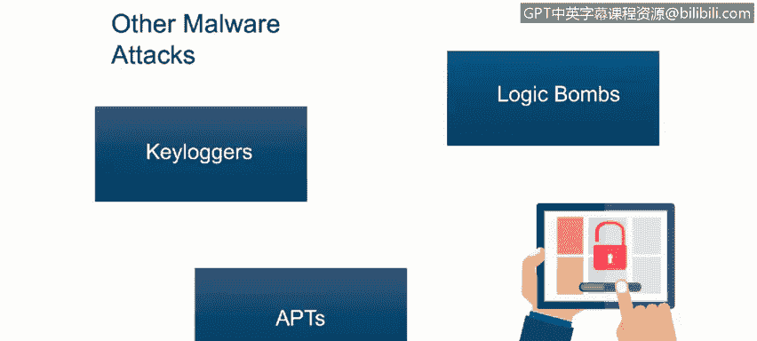

# 课程1：《网络安全工具与网络攻击简介》：30：威胁示例

在本节课程中，我们将学习描述除恶意软件之外的其他网络安全威胁。具体来说，我们将了解僵尸网络、键盘记录器、逻辑炸弹及其组成部分。

## 僵尸网络 🧟‍♂️

上一节我们介绍了恶意软件，本节中我们来看看其他类型的网络威胁。首先介绍僵尸网络。

僵尸网络是一组被攻陷的主机，攻击者可以利用这些计算机资源来发起攻击。这种策略通常被黑客用于执行发送垃圾邮件、分布式拒绝服务攻击、网络钓鱼、间谍软件、窃取个人信息或挖掘加密货币等操作。

以下是僵尸网络的关键组成部分：
*   **僵尸或傀儡机**：构成僵尸网络的计算机，也被称为“僵尸”或“傀儡机”。
*   **僵尸主控机**：这些受控的计算机会接收来自“僵尸主控者”或“僵尸牧人”的远程指令。

## 键盘记录器 ⌨️

了解了僵尸网络后，我们来看另一种威胁：键盘记录器。

键盘记录器是任何能够记录用户每次击键的硬件或软件。其核心功能是**捕获并记录键盘输入**，从而窃取密码、信用卡号等敏感信息。

## 逻辑炸弹 💣

接下来，我们探讨逻辑炸弹。

逻辑炸弹是一种代码，它潜伏在目标系统中，直到被特定事件（如某个日期和时间）触发。当预设条件满足时，它就会引爆，执行其被编程的任务，通常是**破坏数据或损坏系统**。

## 高级持续性威胁 🎯

最后，我们介绍一种更复杂、更具针对性的威胁：高级持续性威胁。

高级持续性威胁的主要目标是**获取网络访问权限并进行长期监控以窃取信息**，同时长时间保持不被发现。它通常针对拥有高价值信息的组织，如军事、政府、金融或大型企业。

一些已知的APT组织包括：
*   **Fancy Bear**：来自俄罗斯。
*   **Lazarus Group**：来自朝鲜。
*   **Periscope Group**：来自中国。

## 总结

本节课中，我们一起学习了除恶意软件外的几种主要网络安全威胁。我们了解了僵尸网络如何利用被控主机发起攻击，键盘记录器如何窃取击键信息，逻辑炸弹如何潜伏并等待条件触发，以及高级持续性威胁如何长期潜伏并窃取高价值信息。认识这些威胁是构建有效防御的第一步。