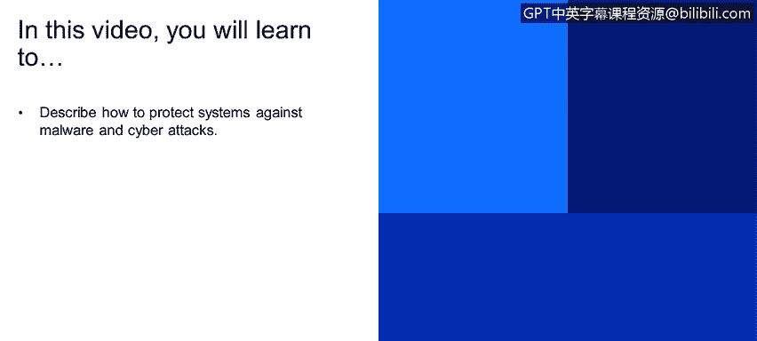
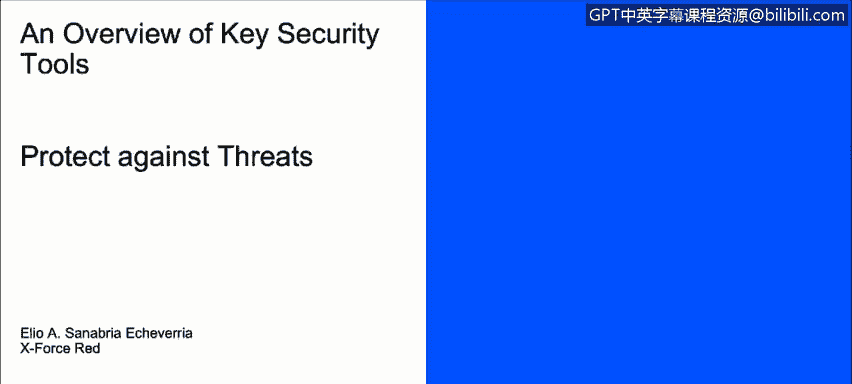
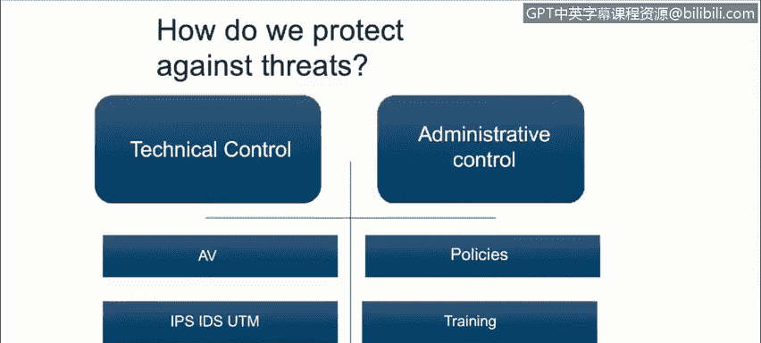

# 课程1：《网络安全工具与网络攻击简介》：31：定义威胁保护

在本节课程中，我们将学习如何描述保护系统免受恶意软件和网络攻击的方法。我们将探讨技术控制与操作控制两大类防护措施，并了解它们如何协同工作以构建有效的安全防线。

上一节我们介绍了恶意软件及其危害，本节中我们来看看如何防御它们。

我们如何保护自己？主要可以通过两类控制措施：技术控制和操作控制。

技术控制是指用于保护系统和信息的硬件或软件。以下是几种主要的技术控制手段：

*   **防病毒软件**：这类软件通过扫描文件中的可执行代码，并与已知病毒的**特征签名库**进行比对，来检测和清除恶意软件。
*   **入侵检测系统与统一威胁管理系统**：这些系统能够实时监控网络流量或主机活动，寻找可能表明系统已遭入侵的**攻击特征**或异常行为。每个组织的具体实施方案都是独特的，取决于其特定的安全需求。

除了部署安全工具，持续的维护也至关重要。

*   **更新与补丁**：随着部署的软件越来越多，我们必须保持所有系统处于最新状态，以防止出现新的安全漏洞。这主要通过应用软件供应商发布的**安全补丁**来实现。

技术控制需要坚实的基础，而操作控制则确保了这些技术能被正确使用。

操作控制，也称为管理控制，由管理层制定并依赖于员工的遵守才能生效。以下是几种关键的操作控制：

*   **安全策略**：这是组织发布的书面文件，旨在确保所有用户遵守与安全相关的规则和指南。例如，一份**密码策略**可能要求企业所有账户的密码长度至少为15个字符，且必须包含至少一个特殊符号。
*   **安全意识培训**：培训的目的是确保组织的用户了解既定的安全策略以及外部存在的威胁。例如，**社会工程学防范培训**可以向用户展示如何识别和处理此类攻击。
*   **审查与跟踪**：这意味着要确保我们刚才提到的所有策略、培训和工具都能得到定期评估和更新，以保持其有效性。

本节课中，我们一起学习了保护系统免受网络威胁的两大支柱：**技术控制**（如防病毒软件、入侵检测系统、及时更新）和**操作控制**（如安全策略、员工培训、定期审查）。有效的网络安全需要将技术工具与严格的管理流程相结合，并确保两者都能持续维护和更新。