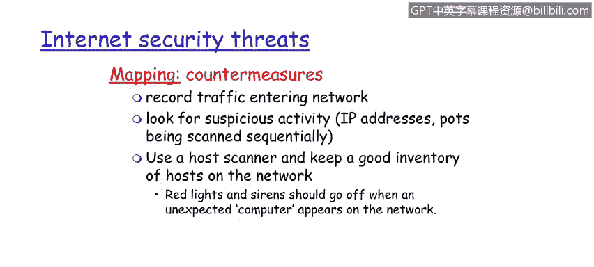

# 课程1：《网络安全工具与网络攻击简介》：32：互联网安全威胁映射 🌐

在本节课程中，我们将学习网络映射的概念，了解攻击者如何利用它来侦察目标网络，以及我们可以采取哪些防御措施来应对此类威胁。

---

上一节我们介绍了网络安全的基本概念，本节中我们来看看一种具体的网络攻击侦察手段——网络映射。

## 网络映射：攻击者的“踩点”

网络映射，通常被比喻为“踩点”，是指攻击者通过扫描目标网络，以发现网络中的设备、服务和协议信息的过程。

以下是攻击者在进行网络映射时常用的方法和工具：

*   **Ping命令**：用于探测网络中的主机是否在线。
*   **NMap工具**：这是一个功能强大的网络探测和安全审计工具。攻击者使用NMap来发现网络中的主机及其IP地址，并识别这些主机上开放的端口和运行的服务。其基本扫描命令格式为：`nmap [扫描类型] [目标IP或域名]`。
*   **端口扫描**：这是网络映射的核心环节，通过扫描目标主机上的一系列端口，来确定哪些端口是开放的，从而推断出可能运行的服务。

## 针对网络映射威胁的防御措施

了解了攻击者如何进行网络映射后，我们来看看可以采取哪些有效的防御措施。

以下是几种关键的防御策略：

*   **监控网络流量**：持续记录和分析进入网络的流量，寻找可疑活动。例如，检测来自同一IP地址对大量端口进行的顺序扫描，这类网络异常行为可以被安全系统识别。
*   **部署安全信息与事件管理（SIEM）系统**：例如**IBM QRadar** 这样的优秀SIEM工具，能够自动检测网络异常（如端口扫描），并生成安全警报。
*   **维护准确的主机清单**：使用可靠的主机扫描工具，对网络中的所有资产（主机、设备）保持清晰的清单管理。这不仅是实施补丁管理的基础，也是进行有效资产管理的关键。
*   **实施网络访问控制**：通过建立基于MAC地址的白名单，明确授权哪些设备可以接入网络。其核心逻辑可以表示为：`if (device.MAC not in whitelist) then block_access()`。这样，任何未经授权的设备接入网络时，都会触发白名单违规警报，使我们能够及时察觉。

---

本节课中，我们一起学习了网络映射攻击的原理。攻击者利用Ping、NMap等工具扫描网络以获取拓扑信息。作为防御方，我们可以通过监控流量、部署SIEM系统（如QRadar）、维护资产清单以及实施网络访问控制（如MAC地址白名单）来有效应对此类侦察威胁，提升网络的安全性。