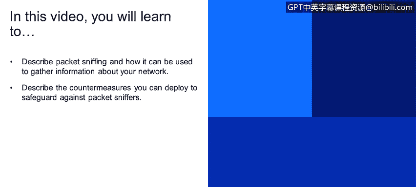

# 课程1：《网络安全工具与网络攻击简介》：33：互联网安全威胁：数据包嗅探


在本节课程中，我们将学习数据包嗅探这一互联网安全威胁。我们将描述数据包嗅探的工作原理，以及它如何被用来收集网络信息。同时，我们也将探讨可以部署哪些防护措施来抵御数据包嗅探攻击。

## 数据包嗅探概述

数据包嗅探是另一种主要的互联网安全威胁。它本质上是一种广播式的监听方法，利用了某些网络协议（例如UDP）的广播特性来捕获流经网络的数据。

## 网络接口卡与混杂模式

网络接口卡（NIC）在默认情况下只读取发送给它的数据包。然而，当NIC被设置为**混杂模式**时，它的行为会发生改变。




在混杂模式下，NIC会读取所有流经其所在网络段的数据包，包括那些并非发送给它的数据。这意味着，如果信息（例如密码）是以明文形式在网络中传输的，那么处于混杂模式的NIC就能捕获到这些信息。

我们可以用以下伪代码来理解NIC的工作模式：
```pseudocode
if NIC.mode == “promiscuous”:
    capture(all_packets_on_network_segment)
else:
    capture(only_packets_addressed_to_me)
```

## 数据包嗅探实例分析

现在，让我们通过一个具体场景来理解数据包嗅探的威胁。请看下图所示的网络通信示意图。


图中，客户端B正在与客户端A进行通信。数据包的IP头部指明了源地址（B）和目的地址（A），并携带了有效载荷数据。

此时，客户端C的NIC卡运行在混杂模式下。尽管通信发生在A和B之间，但客户端C能够侦听到并捕获到所有这些通信数据，包括头部信息和明文传输的有效载荷。

## 针对数据包嗅探的防护措施

了解了威胁之后，我们来看看如何实施防护。核心思路是检测和限制NIC的混杂模式，因为这是构成威胁的关键因素。

以下是两种主要的防护措施：

1.  **定期检测混杂模式**：在所有网络主机（包括客户端、服务器、路由器和交换机）上运行软件，定期检查其网络接口是否处于混杂模式。一旦发现异常，即可及时报警和处理。

2.  **网络分段与交换技术**：在网络设计上，尽量确保每个广播域（或网段）内只有一台主机，或者使用交换机替代集线器。交换机能够进行数据链路层的转发，只将数据帧发送到目标主机所在的端口，而不是像集线器那样进行广播，这极大地限制了数据包被嗅探的范围。

下图再次展示了客户端C在混杂模式下窃听A与B之间通信的威胁场景，也凸显了采取上述防护措施的必要性。


## 本节总结


在本节课中，我们一起学习了数据包嗅探这一网络威胁。我们首先描述了数据包嗅探利用网络广播特性捕获信息的基本原理。接着，我们深入探讨了网络接口卡在**混杂模式**下的危险性，它使得攻击者能够监听非发送给自己的网络流量。最后，我们介绍了两种关键的防护措施：通过软件定期检测网络接口状态，以及利用网络分段和交换技术来限制数据广播的范围，从而有效防范数据包嗅探攻击。