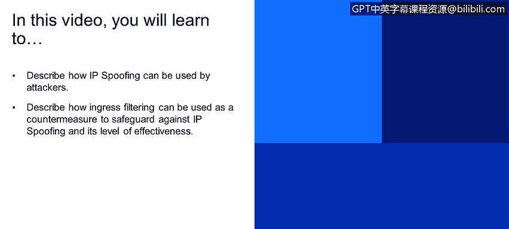

# 课程1：《网络安全工具与网络攻击简介》：34：安全威胁：IP欺骗 🎭


在本节课程中，我们将学习IP欺骗攻击的原理，并了解一种名为“入口过滤”的防御措施及其有效性。

## 概述

IP欺骗是一种网络攻击技术，攻击者通过伪造数据包的源IP地址来隐藏自己的身份或冒充他人。本节将解释攻击者如何利用IP欺骗，以及如何使用入口过滤技术来防御此类攻击。

## IP欺骗攻击原理

在之前的认证模块中，我们曾简要提及IP欺骗。攻击者可以直接从应用程序生成伪造的IP数据包，并在**源IP地址**字段中填入任意想要的值。

例如，攻击者可以伪装成用户Alice。接收方Bob无法辨别数据包的源地址是伪造的。

下图（教材第16页）直观地展示了客户端C试图伪装成客户端B的过程。攻击者发送的数据包中，其源地址字段被设置为B的地址。


## 防御措施：入口过滤

为了防范IP欺骗攻击，我们可以采用一种称为“入口过滤”的技术。

入口过滤要求内部路由器不转发那些源地址无效的数据包。具体来说，路由器会检查数据包的源IP地址是否属于其所在的网络范围。如果不属于，则丢弃该数据包。

其核心逻辑可以用以下伪代码描述：
```python
if packet.source_address not in router.local_network:
    drop(packet)  # 丢弃数据包
else:
    forward(packet) # 转发数据包
```



## 入口过滤的局限性

然而，我们无法强制所有网络都部署入口过滤。因此，这项技术最多只能算作一个**部分解决方案**，无法完全根除IP欺骗威胁。

其有效性受到限制的主要原因如下：
*   网络部署的普遍性难以保证。
*   攻击者可能从已部署过滤措施的网络内部发起攻击。
*   在复杂或分布式的网络环境中，策略实施可能不一致。


## 总结

本节课我们一起学习了网络安全中的IP欺骗威胁。我们了解到，攻击者通过伪造IP数据包的源地址来实施欺骗。作为应对，入口过滤技术可以通过让路由器丢弃源地址不属于本网络的数据包来提供一定程度的防护，但由于无法全局强制部署，它只是一个部分有效的解决方案。


理解这些基础攻击与防御机制，是构建更全面安全策略的重要第一步。