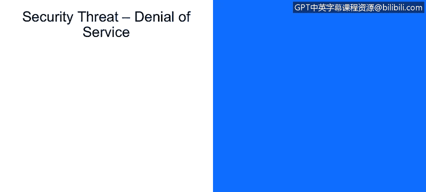

# 课程1：《网络安全工具与网络攻击简介》：35：安全威胁：拒绝服务攻击

在本节课中，我们将学习拒绝服务攻击与分布式拒绝服务攻击的工作原理，并探讨如何通过数据包过滤和溯源技术来应对这些攻击，同时了解这些措施的局限性。

---

在网络安全领域，拒绝服务攻击是一种主要的攻击场景。

这种攻击通过产生大量恶意数据包，使接收方系统不堪重负，从而耗尽所有处理资源，导致其无法执行其他计算密集型任务。

拒绝服务攻击分为单源攻击和分布式攻击。

分布式拒绝服务攻击利用多个来源同时向一个接收方发起攻击，这种分布式特性使其能够抵抗针对单个IP地址的封锁措施。

下图（位于第18页底部）展示了这种攻击活动的示意图。

---

那么，如何应对这种攻击呢？以下是一些常见的对策。

一种方法是在恶意数据包到达目标主机之前进行过滤。

这种方法的问题是，在过滤掉恶意数据包的同时，也可能将一些合法、良好的数据包一并过滤掉。

另一种方法是尝试追溯洪水攻击的源头。

但这种方法通常只对已被攻陷的“无辜”机器有效，难以追溯到真正的攻击者。

因此，结合动态过滤与智能数据包识别技术是更有效的策略。

动态过滤能够根据实时流量模式进行调整，而智能过滤则能更精确地识别并丢弃恶意数据包，从而显著降低拒绝服务攻击的影响。

---

本节课我们一起学习了拒绝服务攻击与分布式拒绝服务攻击的基本概念。我们了解到，这类攻击旨在耗尽目标系统的资源。在防御方面，我们探讨了数据包过滤和攻击溯源两种技术，并认识到它们各自的优势与局限。最终，结合动态与智能的过滤策略是缓解此类威胁的更有效途径。