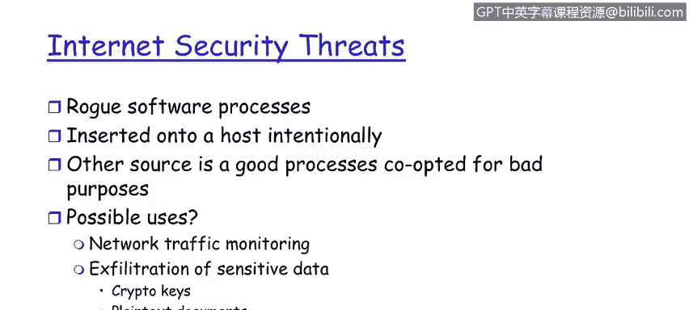

# 课程1：《网络安全工具与网络攻击简介》：36：安全攻击主机插板

在本节课程中，我们将学习主机插板攻击。你将了解攻击者如何利用主机插板来入侵网络，并掌握保护网络免受此类攻击的关键措施。

主机插板攻击，是指内部威胁者有意将一台计算机客户端或服务器接入网络的行为。攻击者希望这台设备不被发现，并能在网络中潜伏，伺机实现其恶意目标。此类攻击既可能针对客户端，也可能针对服务器。

那么，如何防范主机插板攻击呢？接下来我们将探讨具体的防护策略。

以下是防范主机插板攻击的核心措施：

*   **维护准确的资产清单**：这是资产管理的基石。通过维护一份基于MAC地址的计算机主机精确清单，可以有效识别未经授权的设备。QRadar等工具的扫描功能可以持续生成网络资产的详细清单。
*   **实施白名单策略**：通过持续扫描，系统可以识别出不在MAC地址白名单上的新主机。这些“未知主机”的出现就是危险信号，需要立即响应。
*   **识别并清除恶意软件进程**：除了硬件设备，恶意软件进程也是重大威胁。它们可能由内部或外部攻击者植入。一个健全的治理程序应包含对合法软件应用的白名单管理，以帮助识别和清除企业内不需要的软件进程。

上一节我们讨论了如何识别和阻止未经授权的硬件接入，本节中我们来看看软件层面的威胁。恶意软件进程通常被故意植入到客户端或服务器主机上。另一种变体是合法的软件进程被修改以用于恶意目的。

为了应对这类威胁，我们需要采取以下监控措施：

*   **网络流量监控**：通过观察和分析网络流量模式，可以洞察企业内部的异常活动。我们在第一模块讨论的流量分析工具在此处至关重要。
*   **检测数据外泄**：此类攻击常被用于窃取敏感数据，如客户信息、信用卡号，甚至是加密密钥。流量监控有助于发现异常的数据外传行为。

本节课中，我们一起学习了主机插板攻击的原理与防御。我们了解到，攻击者会尝试将未经授权的设备或恶意软件接入网络。防御的关键在于**实施严格的资产管理和白名单策略**，并辅以**持续的网络流量监控**，以及时发现异常活动与潜在的数据外泄风险。