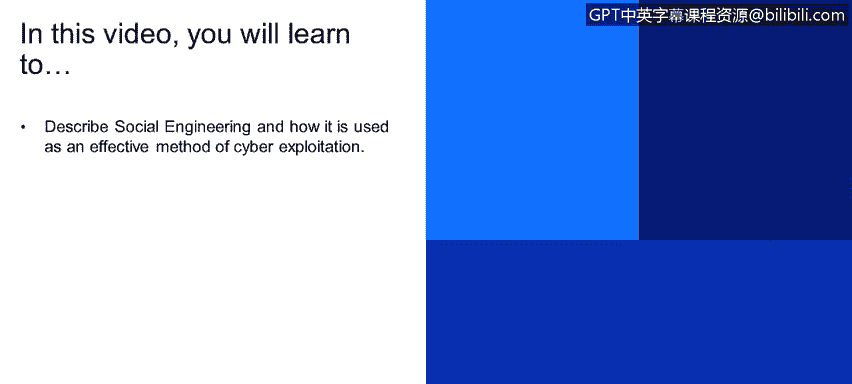
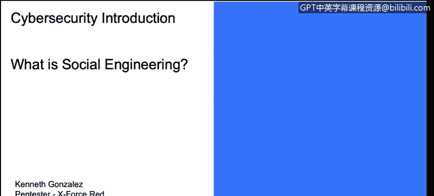
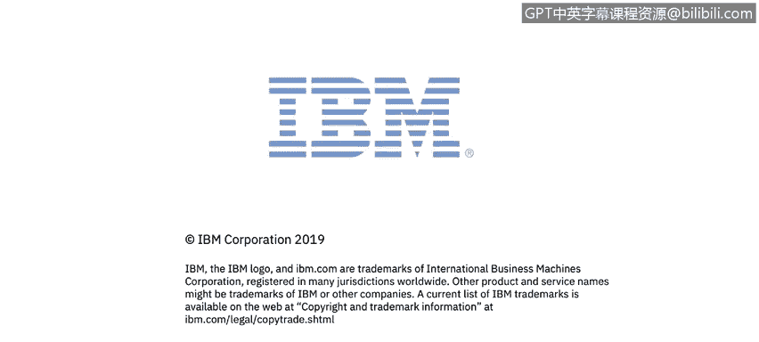

# 课程1：《网络安全工具与网络攻击简介》：38：什么是社会工程学 🎭

在本节课程中，我们将学习社会工程学的概念，并了解它如何被用作一种有效的网络攻击手段。

上一节我们讨论了技术层面的网络攻击，本节中我们来看看一种更侧重于“人”的攻击方式——社会工程学。

社会工程学实际上很容易理解。你可以问自己一个问题：如何才能诱使某人去做他们本不愿意做的事情？这是一个很好的思考方式。例如，你如何能诱使某人向你提供帮助，或者交出他们的密码？如果你直接向朋友索要社交网络的密码，他们很可能不会给你，因为他们明白密码是重要的私人信息，不应与可公开分享的信息混为一谈。因此，实施社会工程学攻击的核心问题在于：**如何诱使某人交出他们的私人信息**。

在进攻性安全操作中，我们经常会用到社会工程学。因为当我们试图从技术角度进行渗透时，有时会遇到高级的防火墙和系统，它们会阻挡我们针对客户或受害者网络发起的所有攻击。因此，获取信息或尝试在目标网络内部进行渗透的一个简便方法，就是尝试从用户那里获取信息。例如，从已经拥有VPN系统登录凭据（用户名和密码）的内部人员那里获取信息。如果你已经掌握了登录SSL VPN系统的外部URL，但缺少密码和用户名，那么获取这些信息最简单的方法可能就是社会工程学攻击。

那么，如何实施社会工程学攻击呢？这实际上也相当简单。再次强调，**你必须获得授权才能进行此类测试**。市面上有很多工具可以使用，其中一个非常易用的工具叫做**SET工具包**。

以下是关于SET工具包的介绍：
SET工具包最初随Kali Linux发行版提供，但你也可以在其他系统上安装它，无需特定的Linux发行版。它是一套工具集合，正如其名，是一个工具包。你可以用它来创建虚假网站，或者克隆公共或私有互联网域名的网站。

例如，你可以克隆你的客户或受害者的外部网站。通过一些技巧，你可以尝试**冒充某人**。然后，这个冒充的身份可以向目标网络内部的用户发送**网络钓鱼邮件**，观察用户是否会点击你发送的链接，并在那个伪造的登录页面上输入他们的用户名和密码凭据。

当然，社会工程学工具包的功能远不止于此。它包含大量工具。实际上，你还可以用它来进行**语音呼叫欺骗**。这是一个有趣的测试领域。但请务必记住，你必须获得客户授权，才能尝试利用这些方法进行测试。你绝不能未经许可就克隆私有网站、尝试对一组用户进行网络钓鱼、诱使他们点击链接并获取任何系统的登录凭据。获得许可是至关重要的。

理解的重点在于，存在许多优秀的工具和方法，你可以开始学习并理解如何诱使某人做出他们本不该做的事情。

本节课中，我们一起学习了社会工程学的基本概念。我们了解到，这是一种通过操纵人的心理而非技术漏洞来获取敏感信息的攻击方法。我们探讨了其实施思路，并介绍了一个强大的工具——社会工程学工具包。最重要的是，我们反复强调了**在进行任何安全测试前必须获得明确授权**的道德和法律准则。