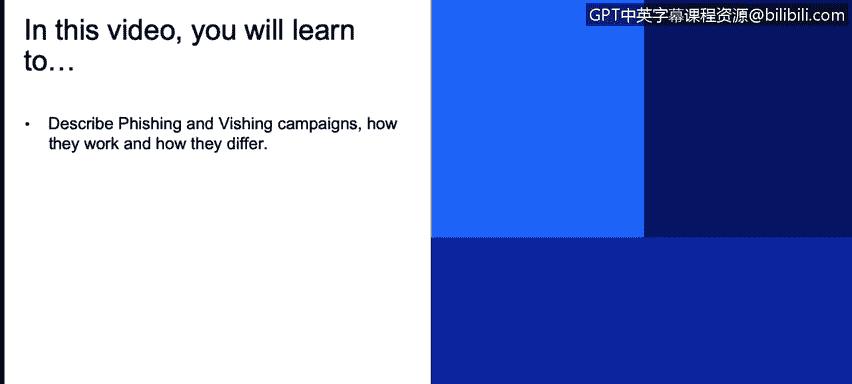
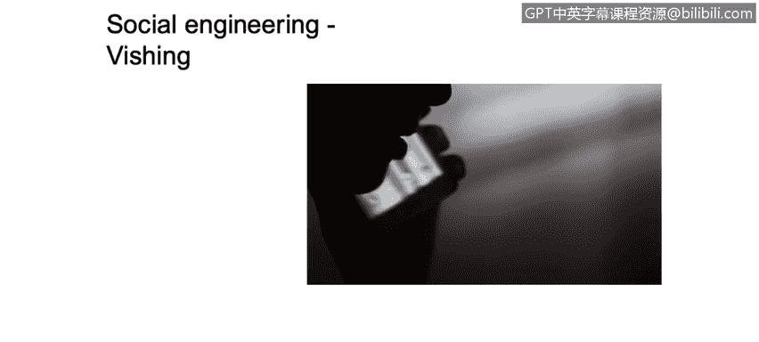

# 课程1：《网络安全工具与网络攻击简介》：39：社会工程：网络钓鱼和语音钓鱼

## 概述
在本节课中，我们将学习两种常见的社会工程攻击手段：网络钓鱼和语音钓鱼。我们将描述它们的工作原理、区别，并了解如何通过模拟攻击来评估组织的安全意识水平。

---

## 网络钓鱼攻击与模拟测试

上一节我们介绍了社会工程的基本概念，本节中我们来看看具体的攻击形式。网络钓鱼是一种通过伪造电子邮件、网站等手段，诱骗用户泄露敏感信息的攻击方式。

为了评估企业内部网络安全意识培训的效果，可以启动所谓的网络钓鱼模拟活动。有许多优秀的工具可用于此目的，其中一个常用的开源平台是 **Gofish**。

**Gofish** 是一个开源网络钓鱼平台，它提供了丰富的工具和信息，帮助你理解公司内部的网络安全培训计划是否真正提升了用户的知识水平。

以下是使用 **Gofish** 框架进行模拟测试的一个简单流程：

1.  你可以创建一个包含虚假电子邮件、虚假网址和虚假HTML页面的活动。
2.  将这封伪造的钓鱼邮件发送给一组目标用户。
3.  通过平台监控用户行为，例如：用户是否打开了邮件、是否点击了邮件中的链接，或者是否在伪造的网站上输入了凭据。

通过分析这些数据，你可以判断公司现有的安全意识和培训计划是否足够，以及用户在面对钓鱼邮件时是否清楚自己不该做什么。

---

## 语音钓鱼攻击示例

除了电子邮件，攻击者也会利用电话进行社会工程攻击，这被称为语音钓鱼。

另一个社会工程的例子是下面这个YouTube视频，它展示了一种我们称之为“语音钓鱼”的攻击。在这个视频中，你会看到一位名叫Carol的人与一家电话公司的客服代表通话。

她试图欺骗客服人员，将她添加为她丈夫电话套餐的联系人。这个例子中有几个关键点需要注意。显然，这是一个语音钓鱼攻击的简要示例。

网络钓鱼攻击是通过发送包含虚假信息的伪造电子邮件，试图诱使用户提供信息。而语音钓鱼的做法类似，但它不使用电子邮件，而是使用你的声音，因此我们称之为“语音钓鱼”。

我建议你观看这个视频，并密切关注她所使用的技巧，这些技巧旨在欺骗电话公司的客服人员。通过这个案例，你可以尝试理解社会工程过程中的各个方面。

要成功执行这类攻击，你需要具备一定的技能。显然，你需要有自信，并且需要掌握一些在与人交谈并试图操纵对方以获取信息时非常有用的技巧。

---

## 总结
本节课中，我们一起学习了两种主要的社会工程攻击：网络钓鱼和语音钓鱼。我们了解了网络钓鱼模拟测试工具（如 **Gofish**）如何帮助评估安全意识，并通过案例分析了语音钓鱼的攻击手法与所需技能。理解这些攻击方式有助于更好地识别和防范社会工程威胁。