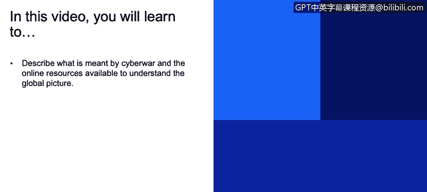
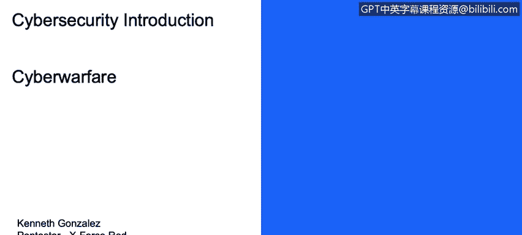
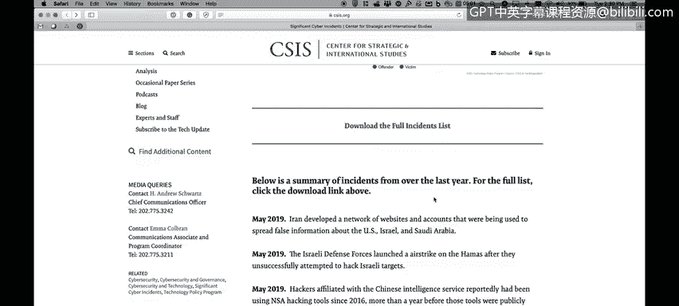
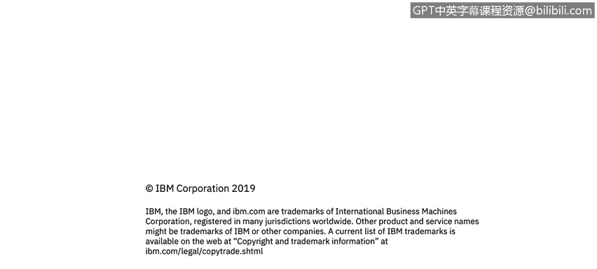

# 课程1：《网络安全工具与网络攻击简介》：40：网络战 🌐⚔️

在本节课中，我们将学习网络战的概念，并了解用于理解全球网络攻击态势的在线资源。

## 概述

网络战是指国家或国家支持的组织之间，通过计算机网络进行的冲突行为。它涉及使用数字攻击手段，如恶意软件、黑客攻击和分布式拒绝服务攻击，来破坏或破坏敌方的关键基础设施、信息系统或网络资产。理解网络战的动态对于全面认识现代网络安全格局至关重要。

## 网络战的定义与特点

上一节我们概述了课程内容，本节中我们来看看网络战的具体含义。网络战的核心在于其攻击源和目标通常与国家行为体相关，但其执行者可能多样化。

以下是网络战的几个关键特点：
*   **国家行为体**：攻击可能直接由国家网络部队发起。
*   **非国家行为体**：攻击也可能由受国家雇佣或支持的黑客组织执行。
*   **归因困难**：攻击者常使用虚假旗帜行动来掩盖真实身份，使得准确归因于特定国家变得复杂。
*   **破坏性目标**：攻击目的可能包括间谍活动、破坏关键基础设施或影响政治进程。

## 全球网络事件资源

为了理解网络战的全球图景，我们可以利用一些公开的在线资源。这些资源记录了全球范围内发生的重大网络事件。

以下是一个重要的资源介绍：
*   **CSIS重大网络事件列表**：该链接提供了自2006年以来重大网络事件的信息。其中包含由国家或与国家结盟的力量所执行的当前网络行动信息。

## 网络事件数据分析

通过分析上述资源中的数据，我们可以获得对国家间网络活动的一些洞察。信息图表显示了各国发起和遭受的网络事件数量。

例如，根据一份网络安全报告的数据：
*   中国在本年度发起了近100起网络攻击事件。
*   中国同时也遭受了25起网络攻击事件。
*   美国在本年度遭受了117起网络攻击事件。
*   美国在本年度发起了9起网络攻击事件。

这些数据有助于量化国家在网络空间中的活跃程度。

## 网络战中的行为体分析

网络战的一个复杂之处在于攻击行为体的多样性。并非所有以国家名义报道的攻击都直接来自该国政府。

以下是两类主要的行为体：
1.  **国家直接行动**：例如，某国情报部门侵入特定目标人物的手机。这类行动的证据链通常直接指向政府情报机构。
2.  **非国家代理人行动**：例如，报道称“伊朗黑客”对英国地方政府网络发起攻击。这不一定意味着伊朗政府直接实施了攻击，可能是受雇或受支持的黑客组织所为，他们有时会利用国家作为虚假旗帜来掩盖自己的行动。

理解这种区别对于准确解读网络战报道至关重要。

## 延伸学习资源

若想更深入地了解网络战的历史与案例，有一些优秀的资源可供参考。

以下是一个推荐资源：
*   **书籍/电影《零日》**：该书（及相关电影）讲述了“震网”病毒的故事。“震网”是一种据信由国家开发的恶意软件，于2007年左右被用于破坏伊朗的核计划。它被认为是近代互联网历史上首次有记录的重大国家间网络攻击。通过这个案例，可以以叙事方式更好地理解网络战。

## 总结

本节课中，我们一起学习了网络战的基本概念。我们了解到网络战涉及国家层面的网络攻击与防御，但其执行者可能包括国家部队和黑客组织。我们介绍了一个记录全球重大网络事件的资源（CSIS列表），并通过数据分析了国家间的网络活动。最后，我们探讨了区分国家直接行动与非国家代理人行动的重要性，并推荐了《零日》作为深入了解网络战历史案例的延伸学习材料。理解这些内容有助于构建对全球网络安全态势的宏观认识。