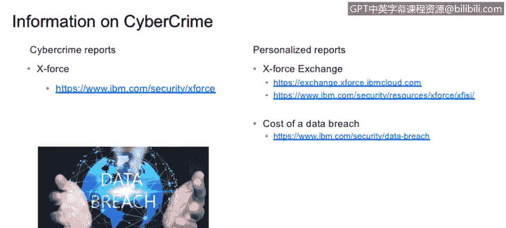

# 课程1：《网络安全工具与网络攻击简介》：41：网络犯罪资源 🛡️

在本节课中，我们将学习如何描述可用于帮助组织防范网络犯罪和网络犯罪分子的各种资源。了解这些资源对于制定有效的防御策略至关重要。

## 概述

上一节我们探讨了攻击方法学，理解了攻击者可能使用的“武器库”。然而，要有效防御，仅仅知道攻击方法是不够的。我们还需要持续获取和分析最新的威胁情报与行业报告。本节将介绍一系列关键的信息资源，帮助你保持对网络安全态势的认知更新，从而更好地保护你的组织。

## 关键报告与资源

以下是几类值得关注的高可信度报告和信息资源，建议定期查阅以了解最新的威胁动态。

*   **行业权威报告**：IBM的X-Force威胁情报报告、Verizon的数据泄露调查报告以及网络安全研究机构的其他季度/年度报告都是非常可信的信息来源。建议下载并持续关注这些报告。
*   **威胁情报查询门户**：例如IBM的X-Force Exchange门户。你可以通过该门户查询特定的IP地址、域名、文件哈希或电子邮件地址，获取与之相关的已知威胁情报。这能帮助你快速评估特定目标的潜在风险。
*   **行业与地域定制化报告**：IBM等机构提供可根据特定行业、国家或地区定制的网络安全报告。例如，你可以查询SQL注入攻击在意大利的流行程度。了解针对你所在行业或客户所在地域的特定威胁，有助于你更精准地分配安全防护资源。
*   **数据泄露成本报告**：这类报告提供了数据泄露事件可能造成的平均经济损失估算。虽然并非精确数字，但它在进行安全投资决策或向管理层阐述安全预算重要性时，是一个非常有价值的参考依据。它帮助你量化风险，决定将资金投入到哪些防护措施上。

## 持续学习的重要性

网络安全领域日新月异，攻击者不断开发新的工具和技术。因此，保持每日学习与信息更新是生存和保持竞争力的关键。你不能防御自己不了解的威胁。利用上述资源，将信息消化理解，是保护组织免受网络犯罪侵害的重要一环。

## 总结

本节课我们一起学习了防范网络犯罪的关键信息资源。我们介绍了包括行业权威报告、威胁情报查询平台、定制化分析报告以及数据泄露成本研究在内的多种工具。掌握并善用这些资源，能够帮助你洞察威胁态势，做出明智的安全投资决策，从而更有效地保护你的组织。记住，在网络安全领域，信息就是力量。