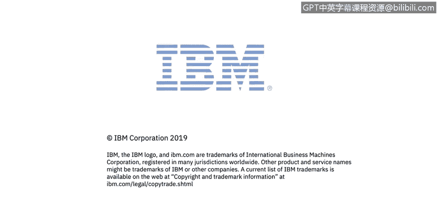

# 课程1：《网络安全工具与网络攻击简介》：43：哈维尔对网络安全技能的看法

## 概述
在本节课程中，我们将通过网络安全工程师哈维尔的视角，了解网络安全领域的日常工作内容、核心技能以及关键工具。这有助于初学者构建对网络安全职业的初步认识。

---

大家好，我是哈维尔，我是IPM安全公司的一名网络安全工程师，我在这个团队工作大约四年了。

我大约在十年前最初是从网络安全工程师开始职业生涯的。

当我开始工作时，我与安全运营中心紧密合作，审查网络安全事件并做出决策，以提升我们的检测能力。

作为我日常工作的一部分，我经常与威胁情报打交道。

我进行演练，以审查和理解攻击及其技术，例如MITRE ATT&CK框架中描述的那些，并协助集成更好的工具来抓住攻击者。

我非常熟悉诸如**SIEM**、**防火墙**、**IPS**、弹性机器学习等技术。其中，我认为**SIEM**是一个至关重要的工具，因为它使我们能够执行高级关联分析和威胁情报集成，这无疑为我们的运营带来了巨大价值。

非常感谢。

---

## 总结
本节课中，我们一起学习了网络安全工程师哈维尔的日常工作，包括事件审查、威胁情报分析以及技术演练。同时，我们认识到了**SIEM**等关键工具在提升安全检测与响应能力中的核心作用。这些内容为理解网络安全实践提供了宝贵的现实视角。