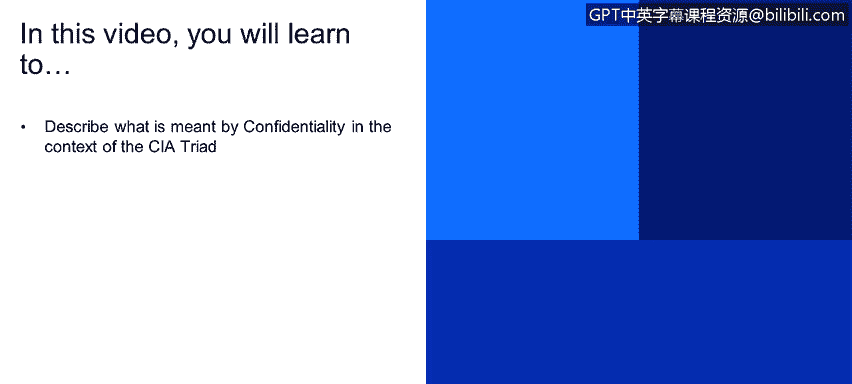
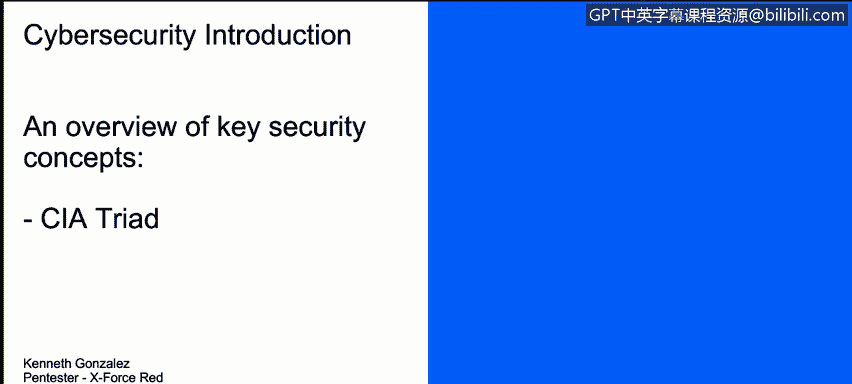

# 课程1：《网络安全工具与网络攻击简介》：45：CIA三角之保密性 🔒

在本节课中，我们将要学习CIA三角模型中的一个核心概念——保密性。我们将探讨保密性的含义、它在日常生活中的体现，以及如何在网络安全领域实现它。

---

上一节我们介绍了CIA三角模型是网络安全的基石。本节中，我们来看看其中的第一个字母“C”所代表的“保密性”。

保密性的概念其实很简单。我们几乎每天都在处理保密性问题。它意味着我们需要保护数据、系统和技术资产的机密性，防止任何未经授权的方访问或泄露这些机密信息。

例如，我们通常需要保密的个人数据。并非所有我们认识的人都需要知道我们存储在电脑或手机上的所有信息。

为了在网络世界中实现保密性，我们通常会使用加密技术。加密意味着我们使用一种密码来防止机密数据被公开或暴露给未经授权的人。我们将在另一个视频中详细讨论加密。

以下是其他一些帮助我们实现保密性的关键要素：

*   **身份验证**：确认用户身份的过程。
*   **访问控制**：限制用户对系统或数据的访问权限。
*   **物理安全**：保护硬件和设施免受物理接触或盗窃。

这些措施共同帮助我们维持对数据、系统和技术资产的一定级别的访问限制。

---

本节课中，我们一起学习了CIA三角中的“保密性”。我们了解到，保密性就是确保信息只被授权的人访问，并通过加密、身份验证、访问控制和物理安全等手段来实现这一目标。理解保密性是构建安全系统和保护敏感数据的第一步。