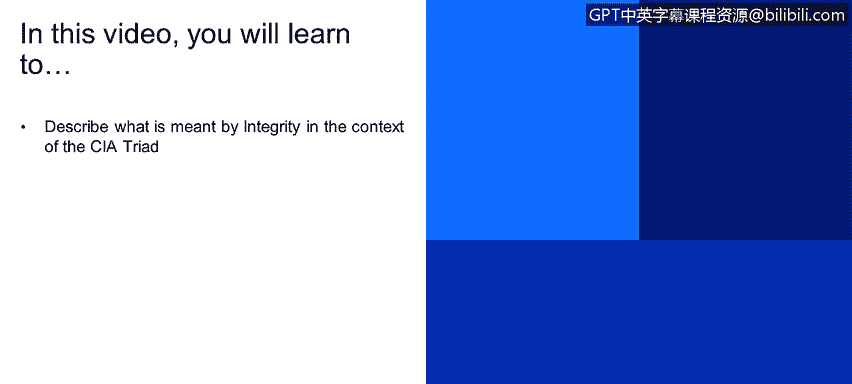
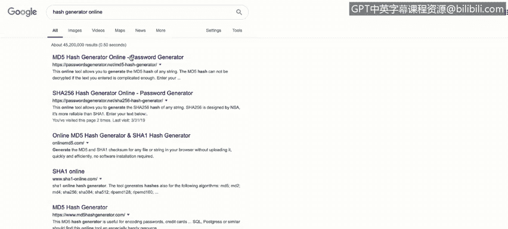
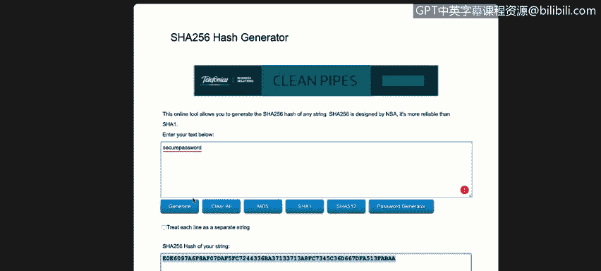
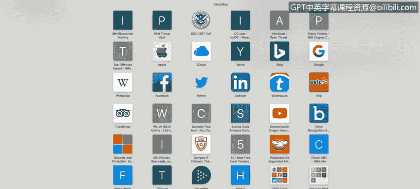
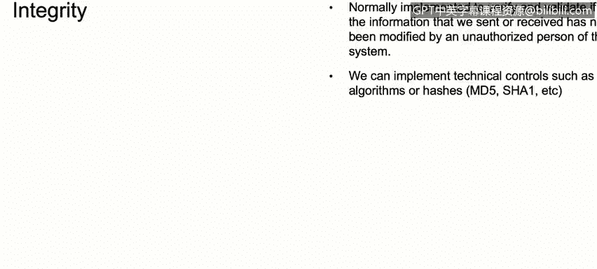

# 课程1：《网络安全工具与网络攻击简介》：46：CIA三要素之完整性 🔒

在本节课中，我们将学习CIA三要素中的“完整性”概念。我们将探讨完整性的含义、它与保密性的区别，以及如何在网络安全实践中通过哈希算法来确保数据的完整性。

上一节我们介绍了CIA三要素中的保密性，本节中我们来看看另一个核心概念——完整性。

完整性是指确保数据、信息或系统在传输、存储或使用过程中不被未经授权地修改或篡改的原则。它与保密性相似，但侧重点不同：保密性关注的是防止未经授权的访问，而完整性关注的是防止未经授权的更改。

例如，如果你从自己的邮箱向公司总部发送一封电子邮件，内容是关于将使用特定软件远程访问客户计算机。完整性要求这封邮件在传输过程中内容不被任何人或系统修改。简而言之，完整性确保我们发送和接收的信息是原始的、未经篡改的。

那么，我们如何在公司或网络安全实践中实现和运用完整性呢？

我们通常使用哈希算法。哈希是一个重要的概念，我们将在后续课程中深入探讨。目前，你需要理解的核心是：哈希是一种数学算法，它能为我们使用的文件、电子邮件或数据生成一个唯一的“数字签名”。

为了更清晰地解释哈希，让我们看几个例子。

以下是使用在线工具生成哈希的步骤：

1.  访问一个在线哈希生成网站，例如 `hashgenerator.net`。
2.  在文本框中输入一个词，例如 “Secure password”。
3.  选择一种哈希算法，例如 SHA-256。
4.  点击生成，你会得到一串由字母和数字组成的哈希值。

这个哈希值就是“Secure password”这个短语的唯一签名。如果你尝试用这串哈希值本身作为密码登录邮箱，系统会拒绝你。但在网络安全领域，这个哈希值用于验证数据是否被更改。例如，如果我们把输入的词从“Secure password”改为“Secure password”，生成的哈希值会完全不同。这清楚地展示了哈希的特性：输入的微小变化会导致输出（哈希值）的巨大差异。

哈希不仅可以用于文本，也可以用于文件。一个更实际的例子是下载软件时验证文件完整性。

以下是下载Kali Linux时验证文件完整性的步骤：

1.  访问Kali Linux官方网站的下载页面。
2.  在下载链接旁，你会找到一个SHA-256校验和（例如一串很长的字符）。
3.  下载完Kali Linux的ISO文件后，访问一个在线文件哈希计算网站，如 `md5file.com`。
4.  将下载好的文件上传到该网站。
5.  选择SHA-256算法进行计算。
6.  将网站计算出的哈希值与官网提供的SHA-256校验和进行比对。

如果两个哈希值完全一致，则证明文件在下载过程中未被损坏或篡改。如果不一致，则说明文件可能已损坏或在传输过程中被修改。这就是在真实网络安全世界中利用哈希来确保数据完整性的一个清晰范例。

本节课中我们一起学习了CIA三要素中的“完整性”。我们了解到，完整性是确保数据不被篡改的原则，它与保密性相辅相成。我们通过哈希算法的概念和实际应用示例，学习了如何利用哈希值为数据生成唯一签名，从而在文件下载等场景中验证其完整性，这是网络安全中一项基础且重要的实践。