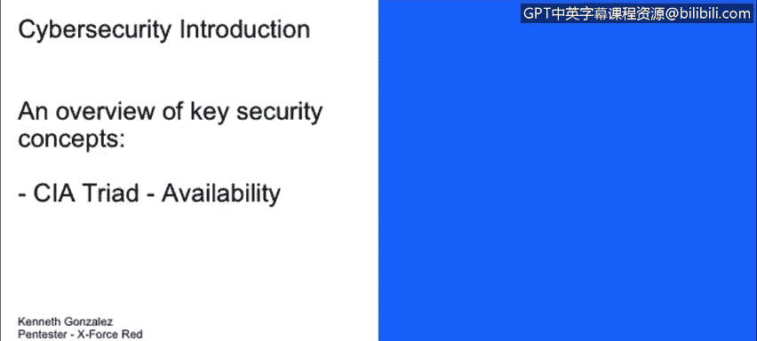
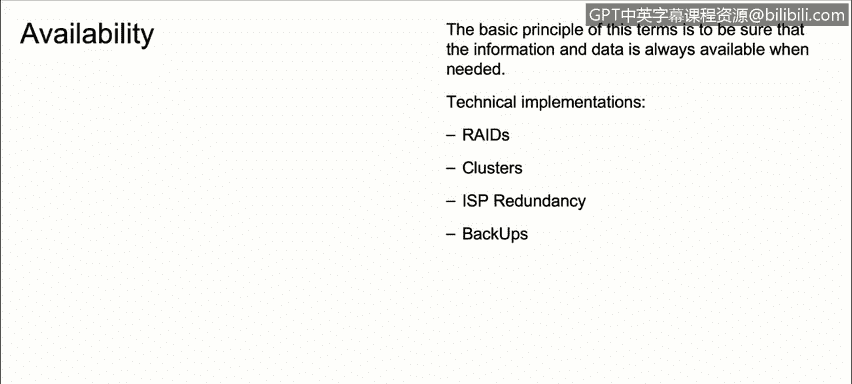

# 课程1：《网络安全工具与网络攻击简介》：47：CIA三要素之可用性 🔒

在本节课程中，我们将学习CIA三要素中的最后一个核心概念——可用性。我们将探讨可用性的定义、重要性，以及如何通过具体的技术手段来保障系统和数据的可用性。

---

上一节我们介绍了CIA三要素中的机密性和完整性。本节中，我们来看看第三个要素：可用性。

可用性意味着，当需要时，任何数据都应始终可供访问。一个缺乏可用性的典型例子是：我们的数据或系统没有任何形式的备份。

例如，当网络遭受勒索软件攻击，导致计算机或服务器上的所有数据被删除或加密时，会发生什么？最直接的解决方法是使用我们最近的可用备份来恢复数据，然后像什么都没发生一样继续工作。

然而，在某些情况下，备份或恢复数据的过程并非所有企业都普遍实施。

以下是我们可以用来在网络和系统中实现或增强可用性的一些技术方案：

*   **RAID（独立磁盘冗余阵列）**：这项技术允许我们在服务器中安装两个、三个甚至数千个硬盘，为数据添加冗余。例如，如果文件服务器中的一个硬盘因机械故障损坏，我们仍有其他包含相同信息的硬盘，可以维持对数据的访问。
*   **集群**：集群技术允许我们将多组服务器作为一个整体来运行。这与RAID类似，但集群处理的是服务器层面，而非硬盘层面。
*   **ISP（互联网服务提供商）冗余**：这一点非常重要。如果我们公司只有一条互联网连接，而该连接中断了会怎样？在当今大量使用云服务的时代，拥有第二条或备用的ISP连接来确保公司网络畅通是一个好主意。
*   **备份**：我们之前已经讨论过备份。在处理备份和恢复数据时，牢记其重要性至关重要。

---

本节课中，我们一起学习了CIA三要素中的**可用性**。我们了解到，可用性确保授权用户在需要时能够可靠地访问信息和资源。通过实施如**RAID**、**服务器集群**、**ISP冗余**和定期**备份**等技术策略，可以有效地防范因硬件故障、网络中断或网络攻击（如勒索软件）导致的服务中断和数据丢失，从而保障业务的连续性。