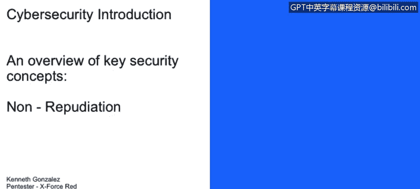
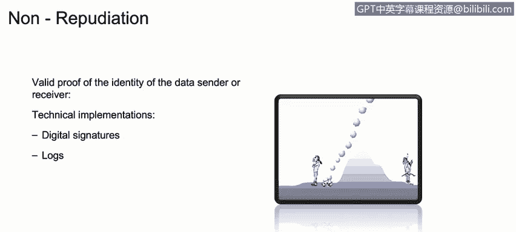

# 课程1：《网络安全工具与网络攻击简介》：48：不可否认性如何应用于CIA三要素

在本视频中，你将学习描述不可否认性的含义，以及它如何应用于CIA三要素。

我们需要理解的另一个关键术语是“不可否认性”。

不可否认性其实很简单，它指的是关于数据发送者或接收者身份的确凿证据，证明数据在传输过程中或存储区域内未被修改或篡改。

例如，我们如何实施某种技术，来帮助我们确认一封电子邮件是否确实由声称的发送者发出，而不是来自另一个国家的攻击者试图冒充该发送者。

我们通常通过数字签名来实现这一点。如果我们以这个具体场景为例，查看我们的邮件服务器，我们也可以检查日志。

例如，如果肯尼斯给他的老板发了一封说他辞职的邮件，但接收方没有日志记录，也没有数字签名来证明这封邮件确实来自肯尼斯，那么这一点对于理解不可否认性的概念就非常重要。

因此，当肯尼斯的老板去他办公室询问“你真的要辞职吗？”时，肯尼斯可能会说“不，我没有发那封邮件，是有人在冒充我”。

在后续课程中，我们将讨论如何使用加密技术、如何使用公钥基础设施来生成数字签名，以及如何理解不同系统中的日志。但目前，理解不可否认性这个概念至关重要。

