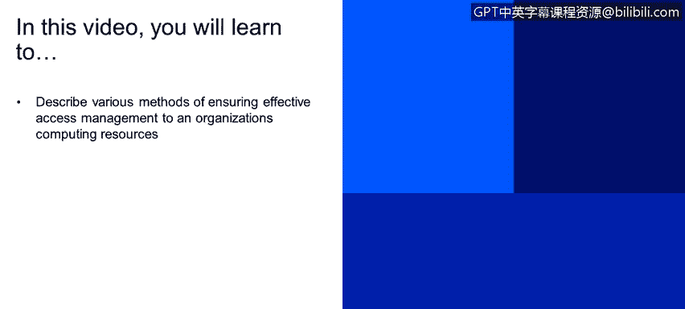
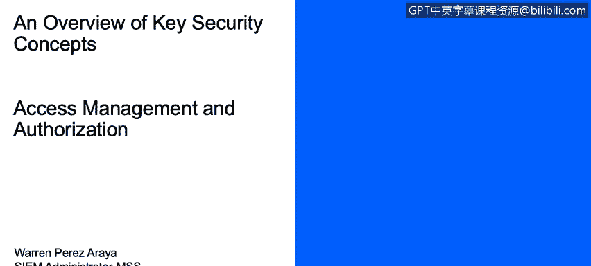
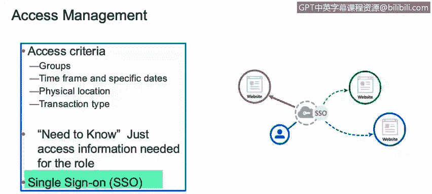
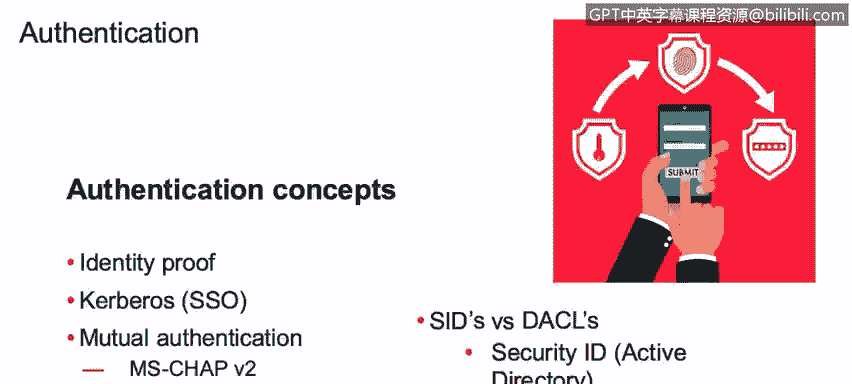

# 课程1：《网络安全工具与网络攻击简介》：49：访问管理 🔐

在本节课程中，我们将学习如何描述确保有效访问组织计算资源的各种方法。我们将重点探讨授权、身份验证以及相关的核心概念。

---

## 授权：访问控制的核心

上一节我们介绍了网络安全的基础，本节中我们来看看访问管理中的核心环节——授权。授权是允许某人访问特定对象的过程。

以下是几种不同的访问控制标准：

*   **按组限制访问**：例如，研发部门可能比财务部门访问更多数据。
*   **按时间框架或特定日期限制**：例如，仅允许在工作日（周一至周五）的上午8点至下午5点访问某些文件。
*   **按物理位置限制**：例如，仅允许位于美国境内的用户访问特定文件。
*   **按事务类型限制**：例如，允许用户读取文件，但不允许写入或修改。

## “须知”原则与单点登录

除了上述标准，我们还需要讨论“须知”原则。“须知”是某人请求访问特定数据的正当理由。如果我的具体工作需要我了解某些信息，这便是我有权访问特定文件和目录的正当理由。

所有这些访问控制机制通常集中在一个称为**单点登录**的系统中。这在企业中被广泛使用。它的作用是，用户只需登录一次，SSO系统便允许其访问多个网站或不同文件，无需重复登录。

## 身份验证：确认你是你

理解了授权，我们还需要了解一些身份验证方面的关键点。首先，是身份证明。在大多数系统中，你需要提供身份标识和身份验证。

举例来说，用户名是你的**身份标识**，它唯一地标识了你。但为了证明你确实是所声称的用户，你需要进行**身份验证**，这通常通过密码来完成。因此，密码提供了验证，而用户名提供了标识。

在技术实现层面：
*   **Kerberos** 是一种用于实现单点登录的协议。
*   存在一些相互身份验证协议，如 **CHAP** 和 **EAP**。这些是系统间通信使用的身份验证过程，它们依赖于共享密钥或令牌。

更具体地说，在 **Active Directory** 中，有一个称为**安全标识符**的概念。它是一个分配给主体（如用户）和客体（如组）的唯一ID，用于标识特定的人或具有特定配置文件的组。

## 自主访问控制

我们熟知的大多数操作系统都使用**自主访问控制**。DAC是一种允许用户自行决定将个人数据的访问权限授予任何人的访问控制类型。

这意味着，如果我有一个包含敏感数据的文本文件，我有权决定谁可以查看和编辑该文件，因为这是我的文件，我有自主权将访问权限授予我选择的任何人。

---

**本节课总结**：我们一起学习了访问管理的关键组成部分。我们探讨了**授权**的不同标准（如按组、时间、位置控制），理解了**“须知”原则**和**单点登录**的便利性，区分了**身份标识**与**身份验证**，并介绍了**Kerberos**、**SID**等技术概念，最后了解了**自主访问控制**模型如何将数据访问权限交予用户手中。这些是构建有效网络安全访问策略的基础。