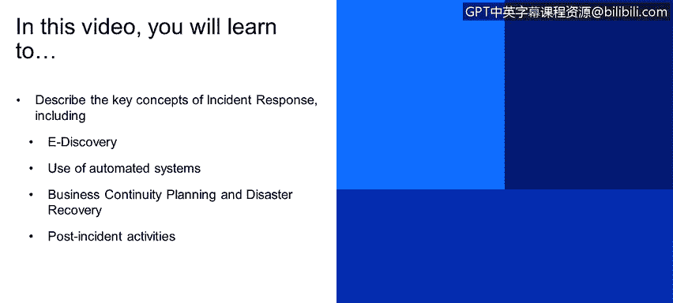
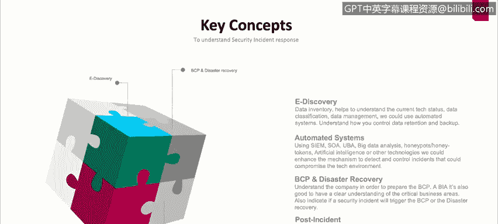

# 课程1：《网络安全工具与网络攻击简介》：51：关键概念：安全事件响应

在本视频中，你将学习描述事件响应的关键概念。

这些概念包括电子取证、自动化系统的使用、业务连续性规划与灾难恢复，以及事件后活动。

## 概述

在本节中，我们将探讨安全事件响应中的几个核心概念。理解这些概念对于有效管理和应对网络安全事件至关重要。我们将逐一介绍电子取证过程、自动化系统、业务连续性规划与灾难恢复，以及事件后活动。

## 电子取证过程

首先，我们需要理解电子取证过程。这个过程非常重要，它要求我们为将在公司系统中使用的技术、系统和资产建立一个基线。

电子取证过程使我们能够获取所有数据、系统和信息的当前状态，这些信息存在于我们的计算机、系统和网络中。它还能让我们理解如何控制数据保留期和该数据的备份。

数据不仅限于文件，也包括对系统重要性的理解。例如，处理月度工资的系统是否重要？我们是否需要关注此处的数据保留？我们是否需要关心备份？在发生任何事件时，我们是否需要关心该系统的其余部分？因此，电子取证是一个重要的过程。

## 自动化系统

接下来，我们来看自动化系统。在我们当前的环境中，存在许多自动化工具和系统。

以下是当前环境中常见的自动化系统示例：

*   **安全信息与事件管理**：例如 Splunk、QRadar。
*   **用户行为分析**。
*   **大数据分析**。
*   **蜜罐与蜜标**。
*   **人工智能**。

我们拥有如此多工具的原因是，我们拥有大量资产和数据。如果公司只有一台电脑，响应团队可能很容易理解事件发生的原因、如何恢复受影响的服务以及为何事件反复发生。

但是，如果我们拥有1000台电脑、100台服务器和10台不同的路由器及系统呢？我们需要关联并集中这些系统生成的所有数据，生成报告和有用的信息。更重要的是，我们需要生成事件或自动事件警报。

这能使我们或在用户或公司受到事件影响之前，就提醒事件响应团队有事情发生了。

## 业务连续性规划与灾难恢复

现在，我们来讨论业务连续性规划和灾难恢复。BCP代表业务连续性计划，灾难恢复与之类似，但我们将讨论主要区别。

**业务连续性过程**是一个完整的流程和计划，我们需要在公司中实施它。其目的不仅是指引事件响应团队，更是在事件发生时指导整个组织。例如，当某项服务受到影响，并且该服务在未来3-4小时内对外部用户不可用时，我们的公司将如何处理？客户服务系统或IT部门将如何应对？财务服务部门将如何处理来自组织外部人员的所有来电？

**灾难恢复**则是我们需要实施或遵循的过程，以便在灾难发生时恢复所有不同领域。这里的“灾难”不一定指飓风或龙卷风等自然灾害，也可能是像摧毁我们数据中心所有数据的网络攻击。

我们如何从数据中心恢复一切？我们如何还原所有内容？我们需要实施的过程不仅是为了恢复，还包括通知当局、公司CEO或公众，告知由于数据中心发生事件，我们将出现服务中断。

## 事件后活动

显然，我们要探讨的最后一个术语是事件后活动。事件后活动是指，当一切恢复正常、所有内容都已恢复、服务重新启动并运行后，我们需要做的工作。

我们需要了解这次事件发生了什么。事件的根本原因是什么？例如，谁发动了攻击？谁实施了更改？我们需要理解错误、问题和事件之间的区别。

以下是关键区别：

*   **错误**：是由于某人犯错而导致系统上发生的事情。例如，如果你进入财务系统，输入银行账号时误输入了姓名，然后点击回车导致系统崩溃，这可能就是一个错误，因为系统对用户输入到文本框的内容处理不当。
*   **问题**：是通常由一系列错误引发的情况。如果你检测到错误并更新系统、实施补丁来修复该输入错误，但随后发现另一个用户进入系统的另一部分，再次输入字母而非数字导致系统崩溃，那么这可能是一个问题。系统可能在输入验证方面存在问题。
*   **孤立事件**：可能是指只发生一次、我们尚不清楚原因的情况。例如，用户输入数字或字母代替数字时系统崩溃，但当我们尝试复现该错误、复现相同行为时，却什么也没发生。这就可能是一个孤立事件。

关键在于，我们需要理解、调查并完全弄清我们在系统中检测到的不同类型的错误、问题和事件。我们需要区分什么是错误、什么是问题、什么是孤立事件。

事件后概念的下一个部分是让我们从这些错误、问题和事件中学习，并生成报告，以便理解发生了什么、如何预防这些事件，以及如果这些事件再次发生，我们如何能尽快恢复服务。

## 总结

本节课我们一起学习了安全事件响应的几个关键概念。我们首先介绍了**电子取证过程**，它帮助我们建立系统基线并管理数据。接着，我们探讨了**自动化系统**（如SIEM工具）在集中分析和自动警报方面的重要性。然后，我们区分了**业务连续性规划**（指导整个组织）和**灾难恢复**（专注于技术恢复）的不同侧重点。最后，我们明确了**事件后活动**的核心，即通过分析错误、问题和孤立事件来吸取教训并改进防御。掌握这些概念是构建有效事件响应能力的基础。