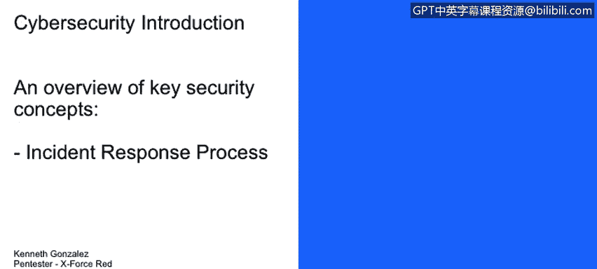
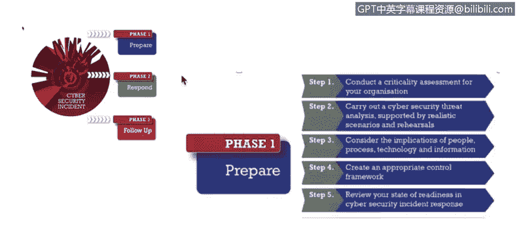
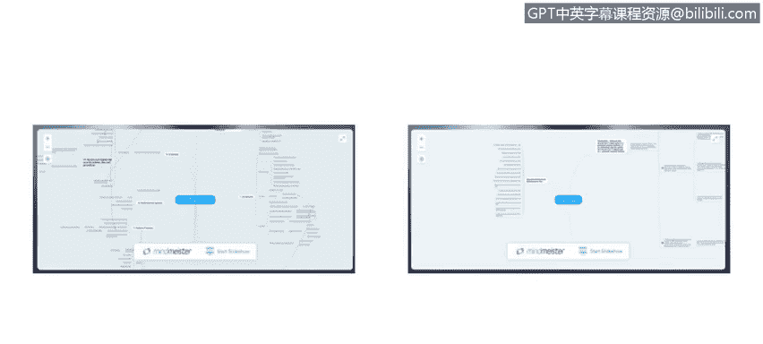

# 课程1：《网络安全工具与网络攻击简介》：52：安全事件响应过程

在本节课中，我们将要学习网络安全事件响应过程，并详细描述其三个核心阶段：准备、响应和跟进。

## 概述

网络安全事件响应是一个结构化的过程，用于有效管理和缓解安全事件的影响。一个组织化的响应流程能帮助团队快速行动，减少损失，并从事件中学习以改进未来的防御。CREST组织将这一过程总结为三个主要阶段：准备、响应和跟进。

## 准备阶段

上一节我们介绍了事件响应的整体框架，本节中我们来看看第一个阶段——准备。准备阶段是事件响应的基础，其核心目标是建立应对能力，确保在事件发生时能够迅速、有效地行动。

以下是准备阶段需要完成的关键任务：

*   **了解系统与数据**：你需要清楚组织内有哪些系统，存储了哪些电子数据。这包括对数据进行分类，识别哪些是关键或敏感数据。
*   **实施控制措施**：部署管理性、技术性和物理性的控制措施来保护资产。例如，制定访问控制策略、安装防火墙、设置门禁系统。
*   **进行业务影响分析**：评估特定系统宕机可能造成的损失。这有助于理解事件的潜在财务和运营影响，公式可以表示为：`损失 = 宕机时间 × 单位时间成本`。

## 响应阶段

在做好了充分准备之后，当安全事件真正发生时，我们就进入了响应阶段。此阶段的目标是控制事态、消除威胁并恢复运营。

以下是响应阶段的核心步骤：

*   **识别事件**：首先需要判断发生的是否为网络安全事件。例如，员工将来历不明的U盘插入公司电脑并导致恶意软件感染，这属于网络安全事件。而有人砸碎办公楼窗户则不属于网络安全事件范畴。
*   **启动恢复计划**：根据事件严重程度，触发业务连续性计划或灾难恢复计划，以确保关键业务功能能够继续运行。
*   **收集证据与遏制**：在调查过程中，需要安全地收集和保存证据（如日志文件、内存镜像），同时采取措施遏制事件的扩散，例如隔离受感染的网络段。

## 跟进阶段

响应行动结束后，工作并未完成。跟进阶段的目标是总结经验教训，完善安全状况，防止类似事件再次发生。

以下是跟进阶段的主要活动：

*   **事件调查**：深入分析事件根本原因，查明它是如何发生的。
*   **趋势分析**：评估某些行为模式是否会成为未来风险的“趋势”。例如，如果多次发生员工使用不明U盘导致感染的事件，则说明需要针对此风险趋势采取行动。
*   **制定改进计划**：基于调查结果，制定并实施改进计划。其输出可能包括更新安全策略、部署新的技术控制或实施安全意识培训项目。这个过程可以概括为：`调查 -> 分析根源 -> 制定行动计划 -> 实施改进`。

## 事件影响与成本估算

为了更好地理解安全事件可能对组织造成的损害，我们可以利用一些工具进行估算。IBM提供了一个数据泄露成本计算器。

访问该工具，你可以选择所在国家、行业类型，并勾选组织已实施的安全措施（如人工智能平台、数据分类方案、员工培训）。工具会动态显示数据泄露的预估成本。通常，完善的事件响应能力、加密技术的使用以及员工培训是降低泄露成本的关键因素。

## 深入理解响应流程

如果你想更深入地研究事件响应流程，可以参考NIST（美国国家标准与技术研究院）等机构发布的框架。这些框架提供了更详细的步骤。

例如，在初始响应过程中，可能需要遵循以下步骤：

1.  召集系统与网络管理员、业务人员组成响应团队。
2.  检查日志、报告和系统架构。
3.  进行信息收集，全面了解受影响系统和事件本身。

这些步骤为协调响应工作提供了清晰的指引。

## 总结

本节课中我们一起学习了网络安全事件响应的完整过程。我们将其分解为三个主要阶段：**准备**（建立能力与计划）、**响应**（识别、遏制与恢复）和**跟进**（调查与改进）。掌握这个结构化的流程，是有效管理安全事件、提升组织整体网络安全韧性的关键。记住，一个良好的响应过程不仅是技术操作，也涉及人员、流程和持续的学习改进。