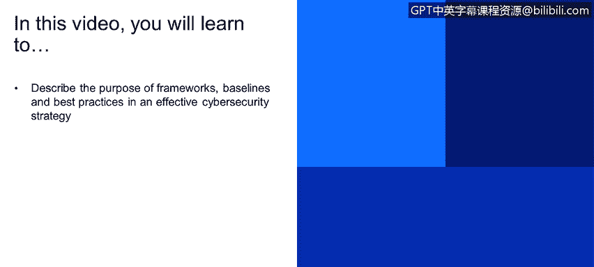
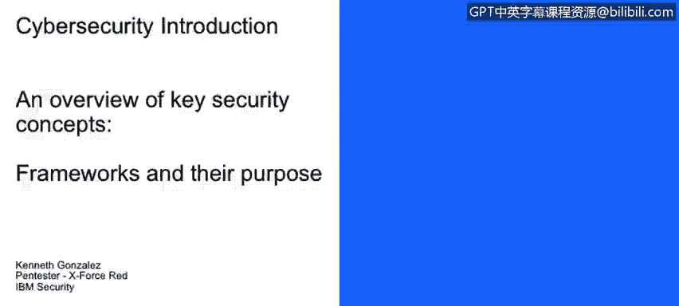
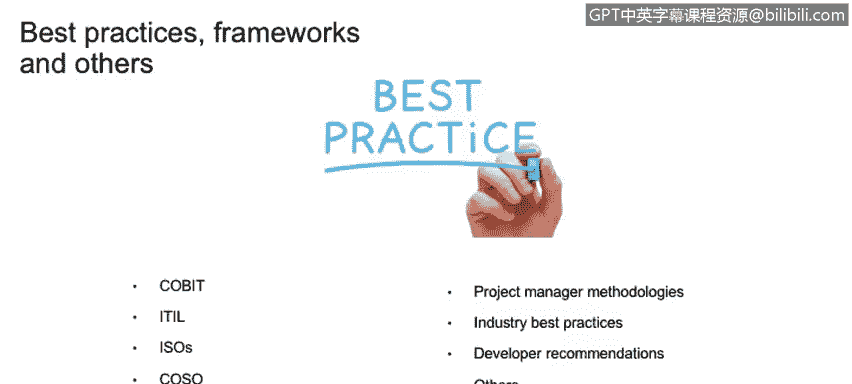

# 课程1：《网络安全工具与网络攻击简介》：53：框架和最佳实践简介

在本节课程中，我们将学习框架、基线和最佳实践在有效的网络安全策略中的目的与作用。

本课程的最后一部分是关于框架及其目的。我们将讨论框架，也将讨论最佳实践。这里需要明确区分最佳实践、基线、框架与规范性要求和合规性要求。

在一个组织中，我们会接触到许多内容，例如最佳实践。我们会遇到基线，或者我们会采用框架。框架的一个好例子是COBIT，最佳实践的一个好例子是ITIL。这些是很好的控制措施，能够改进和增强你的IT治理、IT流程、IT政策和IT程序。这些框架、基线和最佳实践能提升你系统的性能。例如，如果你遵循微软关于其数据库服务器加固的最佳实践，你将得到一个优化过的Microsoft SQL服务器。然而，这些最佳实践或框架并非强制要求，它们是“锦上添花”的部分。你会获得许多好的实践、控制措施和有益的东西，但如果你没有实施它们，并不一定会损害你的业务。如果你没有遵循微软的服务器实施指南，或者没有遵循思科设备的实施指南，或者没有采用COBIT来改进公司的IT治理，你的业务不会因此倒闭，通常也不会因此与监管机构或政府产生问题。

在另一面，我们有规范性要求和合规性要求。这里的区别在于，如果你的业务需要，你就必须实施规范性要求，必须做到合规。例如，HIPAA（健康保险流通与责任法案）是美国任何医疗保健公司都必须遵守的规范性要求。在你的医疗保健公司里，你可以实施COBIT，可以有很多ITIL流程，可以在你的系统中实施所有供应商的最佳实践。但如果你不符合HIPAA的要求，哪怕你只遗漏了两个流程点，你可能就无法在美国运营，并且会面临美国政府的处罚，因为你没有遵守HIPAA。这就是基线、框架、最佳实践与规范性要求、合规性要求之间的主要区别。

正如我们所提到的，我们有很多内容。例如，我们有最佳实践，它们是我们可以实施到业务中以改进技术处理方式的框架和方法论。实际上，我们已经提到了其中的几个。我们可以提到COBIT，可以提到ITIL。在网络安全方面，我们有ISO 27000系列标准，我们有CAL，我们有项目管理协会（PMI）的众多项目管理方法论。对于开发者，一旦你开始使用某种编程语言，你将获得大量文档和信息，其中包含你可以在软件和系统中遵循的最佳实践，以避免任何可能损害或破坏你软件的安全事件或其他事件。

**总结**

本节课中，我们一起学习了网络安全策略中框架、基线和最佳实践的核心概念。我们明确了最佳实践和框架（如COBIT、ITIL）是用于优化和增强组织IT环境的推荐性指南，属于“锦上添花”的部分。同时，我们区分了规范性要求和合规性要求（如HIPAA），这些是业务运营必须满足的强制性规定，属于“必不可少”的部分。理解这两者的区别，对于构建既高效又合规的网络安全体系至关重要。