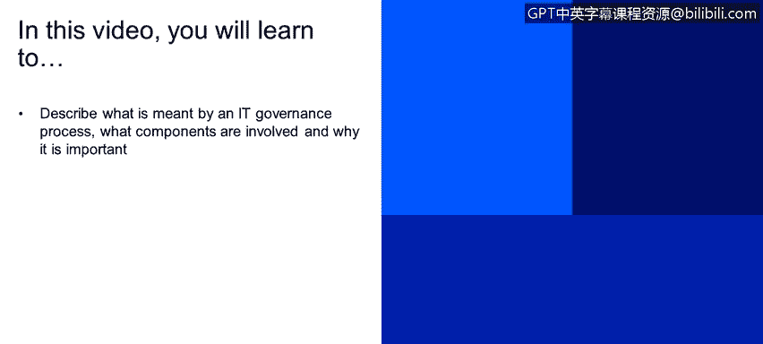
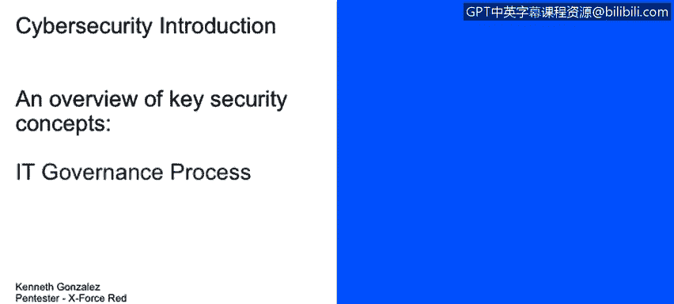
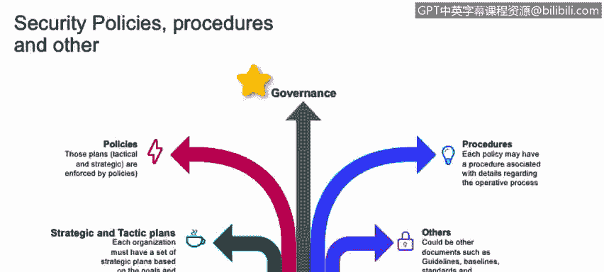

# 课程1：《网络安全工具与网络攻击简介》：54：IT治理流程 🏛️

在本节课中，我们将学习IT治理流程的含义、其包含的组成部分以及为什么它对组织至关重要。我们将探讨战略与战术计划、政策与程序，以及它们如何共同构成有效的IT治理框架。

---

上一节我们介绍了IT治理的基本概念，本节中我们来看看IT治理流程中的核心组成部分。

**战略与战术计划**是组织方向的设定者。战略计划为整个组织及各部门的架构指明方向。例如，如果公司计划在未来两年内将电脑销量提升20%，那么所有部门都需要围绕这一战略目标调整工作重心。战术计划则关注如何实现战略目标，两者相辅相成。

**政策与程序**是IT治理的基石。政策用于设定业务运作的基线规则和结构。程序则描述了为达成某项任务所需遵循的具体步骤。

以下是政策与程序的一个具体示例：

*   **政策示例**：组织需要制定一份“互联网使用政策”，明确规定员工可以及不可以如何使用互联网。
*   **程序示例**：新员工申请互联网访问权限的流程。程序可能要求员工向IT部门提交申请，在获得访问权限前，必须阅读并接受“互联网使用政策”。

一个常见的现实场景是，当你在咖啡店连接公共Wi-Fi时，通常会弹出一个“强制门户”页面，其中包含了服务条款（即政策），你必须接受这些条款才能使用网络。

---

理解了政策与程序后，我们来看看**治理**本身。治理旨在协调组织的各个不同部分，使其朝着一个共同的目标努力。

例如，COBIT是一个优秀的框架，它能帮助组织提升IT治理水平，因为它为所有部门建立了统一的沟通语言。

以下是一个体现IT治理流程的跨部门协作场景：

1.  财务部门的员工在薪资系统中发现了一个错误。
2.  该员工遵循既定流程，通过内部系统创建一张工单（即一个事件案例）。
3.  这张工单被提交给IT部门。
4.  IT部门根据优先级将该事件排入处理队列。
5.  最终由相关专家处理并解决这个问题。

这个过程涉及**变更管理**和**IT服务交付与支持**等流程。它展示了即使是非技术部门（如财务部），也需要理解并与IT部门使用相同的“语言”进行协作，以确保所有部门能够协同工作，实现组织的统一目标。

---

本节课中我们一起学习了IT治理流程。我们了解到，有效的IT治理依赖于清晰的**战略与战术计划**来指引方向，明确的**政策与程序**来规范行为，并通过统一的框架（如COBIT）确保组织内各部门能够协调一致，为实现共同目标而努力。理解这些流程对于构建安全、高效且合规的IT环境至关重要。