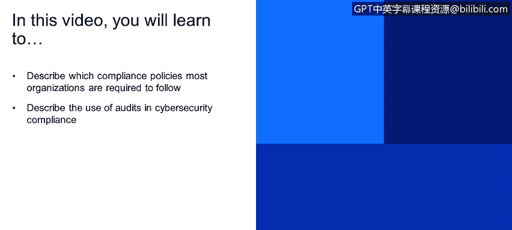

# 课程1：《网络安全工具与网络攻击简介》：55：网络安全合规性和审计概述

在本节课程中，我们将学习网络安全合规性的基本概念以及审计在确保合规性中的关键作用。我们将了解常见的合规性政策，并掌握执行审计项目的基本方法论。

## 合规性政策概述

大多数组织在特定国家或地区运营时，都需要遵循某些法规或合规性政策。以下是几个常见的合规性示例：

*   **HIPAA**：这是一项与医疗保健相关的法规，规定了医疗机构如何处理患者的隐私数据，例如数据在不同医院或组织间的安全传输方式。
*   **SOX**：这是一项与金融相关的法规。
*   **PCI DSS**：这项标准与信用卡或金融流程的管理相关。例如，如果您想在服务器上处理信用卡交易（如运营在线商店），通常就需要遵守PCI DSS。许多处理PCI DSS的公司会定期进行渗透测试或漏洞评估以满足合规要求。

## 审计的作用与类型

为了确认组织是否遵守特定法规或框架，需要进行审计。审计主要分为两种类型：

*   **内部审计**：由组织内部的审计部门执行。这是一个持续进行的过程，贯穿全年或整个生命周期。内部审计生成的报告主要用于改进组织的运营。
*   **外部审计**：通常基于特定合规要求进行。例如，为了获得PCI DSS合规认证，您需要聘请外部审计公司来生成报告，以确认您是否符合PCI DSS的所有要求。外部审计报告是获得相关认证或许可（如处理信用卡业务资格）的关键依据。

## 审计方法论简介

上一节我们介绍了审计的类型，本节中我们来看看执行审计项目可以采用的一种标准方法论。该方法论包含三个阶段，适用于内部和外部审计，但具体步骤可能因组织而异。

以下是审计项目的三个阶段：

1.  **第一阶段：理解组织**
    在此阶段，您需要深入了解被审计的组织。这包括识别系统中的关键参与者和关键用户，以便为后续发现和报告问题奠定基础。同时，您需要创建威胁概况。例如，如果您审计的是一个软件，您需要了解其性质（如基于Web的软件），并识别其可能面临的威胁（如跨站脚本攻击）。

2.  **第二阶段：评估**
    在此阶段，您需要对已识别的威胁进行评估和测试。继续以Web软件为例，您需要了解或测试其是否已进行过安全审查。您可以询问软件创建者是否进行过安全评估，并查看评估结果是否涉及跨站脚本攻击等问题。如果没有任何安全评估记录，您可能需要自行创建测试，或在报告中指出该软件缺乏能保证其安全性的安全审查。

3.  **第三阶段：风险评估**
    这是最后一个阶段，您需要将审计报告中的所有发现转化为风险。例如，如果您发现组织未进行任何安全评估，且没有证据表明该软件能抵御跨站脚本攻击，您就需要将此发现归类为风险。您需要判断这对组织而言是高风险、中风险还是低风险。如果组织的业务依赖于该Web系统，那么这很可能是一个高风险甚至关键风险。

## 总结

本节课中，我们一起学习了网络安全合规性与审计的核心内容。我们了解了HIPAA、SOX和PCI DSS等常见合规性政策，区分了内部审计与外部审计的不同目的，并掌握了一个包含理解组织、评估和风险评估三个阶段的审计基本方法论。理解这些概念是确保组织符合法规要求并管理安全风险的基础。