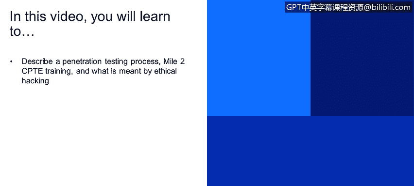
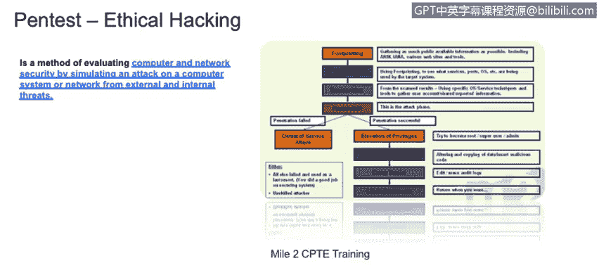

# 课程1：《网络安全工具与网络攻击简介》：56：渗透测试过程与二级CPTE培训 🎯

在本节课中，我们将学习渗透测试的过程，并了解道德黑客的含义。我们将重点介绍一个由Mile2（一家提供多项网络安全认证的供应商）提出的基本且标准化的渗透测试方法论。通过理解这个过程，你将能够区分渗透测试与安全审计，并掌握如何像攻击者一样思考以发现系统漏洞。

## 渗透测试过程概述

上一节我们讨论了安全审计，它侧重于评估和审查系统配置与策略。本节中，我们来看看渗透测试。与审计不同，渗透测试会主动模拟攻击者的行为，尝试利用漏洞。例如，对于一个Web系统，审计可能只是检查其是否存在跨站脚本（XSS）漏洞的风险，而渗透测试则会实际发起一次XSS攻击，观察系统如何响应，并尝试窃取用户数据或控制用户浏览器。

渗透测试，或称道德黑客过程，其核心在于主动验证系统的安全性。以下是Mile2提出的一个标准渗透测试流程，它包含几个关键阶段。

## 渗透测试阶段详解

以下是渗透测试通常包含的几个阶段：

1.  **信息收集（Footprinting）**：在此阶段，我们需要识别和收集关于目标系统的信息。例如，如果目标是之前提到的Web应用程序，我们需要了解它使用的是WordPress平台、自定义平台还是HTML5技术。

2.  **扫描（Scanning）**：此阶段让渗透测试员深入了解目标。通过扫描，我们可以发现开放的端口、Web服务器应用程序的类型、使用的编程语言以及Web应用所连接的数据库类型。

3.  **枚举（Enumeration）**：在此阶段，我们将确定用于测试系统的具体技术和流程。这为后续的实际攻击做好准备。

4.  **利用/渗透（Exploitation/Penetration）**：这是执行攻击的阶段。例如，如果我们发现目标是一个存在SQL注入漏洞的WordPress平台，我们就会构造并发动SQL注入攻击，尝试获取数据库信息。

5.  **维持访问与清理（Maintaining Access & Covering Tracks）**：如果攻击成功，测试者可能需要执行一系列后续步骤。例如，提升权限、操纵数据。同时，为了不被网络安全分析师（CSA）发现，需要清除在系统中的活动痕迹。此外，可能会留下一个后门，以便日后无需重复前期步骤即可轻松重新访问系统。

这个过程，通常被称为**进攻性安全扫描**。它要求你扮演攻击者或黑客的角色，对系统进行战术性测试。当然，执行此类任务必须事先获得客户的明确授权。

## 渗透测试与审计的区别

最后，需要理解的重要一点是：**一次审计不一定包含渗透测试，一次渗透测试也未必是一次审计**。两者存在许多区别。在执行本节介绍的任何一种流程或技术时，都需要牢记这些差异。审计更偏向于合规性检查和策略评估，而渗透测试则专注于通过模拟实战攻击来发现技术层面的深层漏洞。

本节课中，我们一起学习了渗透测试的标准流程及其各个阶段，明确了渗透测试与安全审计的核心区别。理解并掌握这一过程，是成为一名合格的网络安全分析师或道德黑客的关键一步。