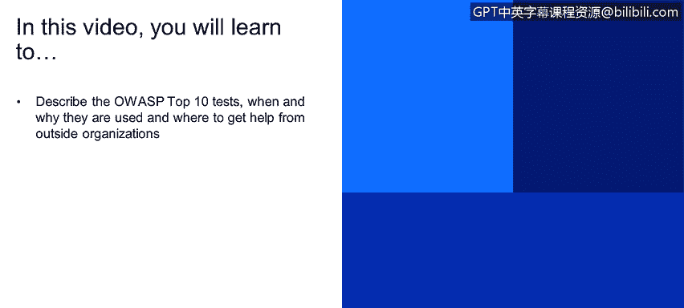
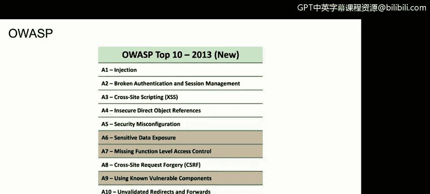
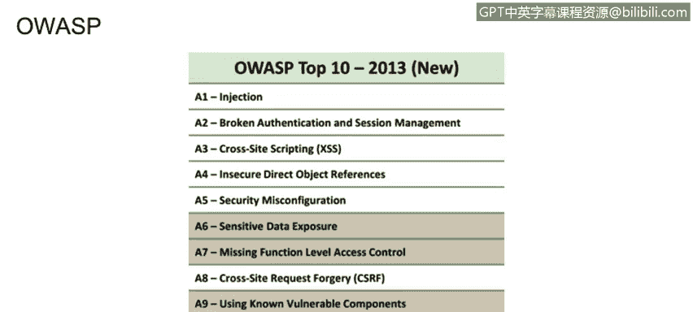

# 课程1：《网络安全工具与网络攻击简介》：57：OWASP框架

在本节课程中，我们将学习如何描述OWASP十大安全风险测试，了解其使用时机与原因，并掌握如何从外部组织获取帮助。

## 概述

OWASP（开放式Web应用程序安全项目）是另一个重要的方法论和最佳实践，大多数Web应用程序都需要遵循其指导原则。本节将介绍OWASP十大安全风险，并说明其在应用程序安全测试中的应用。

## OWASP框架简介

上一节我们介绍了其他安全测试方法，本节中我们来看看OWASP框架。如果你正在处理网页或Web应用程序，甚至任何类型的应用程序，都可以参考OWASP十大安全风险，并开始对其列出的各个部分进行测试。

OWASP是一个提供大量安全信息的组织。如果你在谷歌搜索“OWASP”，可以访问其官方网站（owasp.org），获取关于该组织的丰富信息。这些信息在你对应用程序或Web应用程序进行测试时将非常有帮助。实际上，该网站也提供了大量关于移动应用程序安全的信息。

## OWASP资源获取

以下是获取OWASP资源的具体步骤：

例如，访问官网的“下载”区域，你会看到许多分类。点击“十大安全风险项目”，你可以看到2017年的十大安全风险报告现已可用。在此，你可以下载包含所有详细信息的报告，了解过去几年（如2017年）Web应用程序的十大安全漏洞。

报告中，排名第一的安全风险是“注入攻击”。翻到报告第7页，可以看到关于“注入攻击”的详细解释，例如：什么是注入攻击、如何利用SQL注入从系统获取信息、攻击场景有哪些、以及你需要执行哪些查询来测试系统是否存在注入漏洞。

此外，报告中还涵盖了“失效的身份认证”、“敏感数据泄露”等其他关键风险，提供了大量可供测试和验证的内容。

## OWASP检查清单

再次回到OWASP官网，你还会发现一个名为“检查清单”的文档。这是一份非常重要的文件。

以下是检查清单文档的作用：

该文档提供了大量你需要实施的控件和措施清单。为了确保你的系统或Web应用程序是充分安全的，你需要在你的Web应用程序中实现这些控制措施。

## 总结

本节课中，我们一起学习了OWASP框架及其十大安全风险测试。我们了解了如何描述这些测试、何时以及为何使用它们，并知道了可以从OWASP等外部组织获取详细的帮助文档和检查清单，以指导我们进行全面的应用程序安全测试。