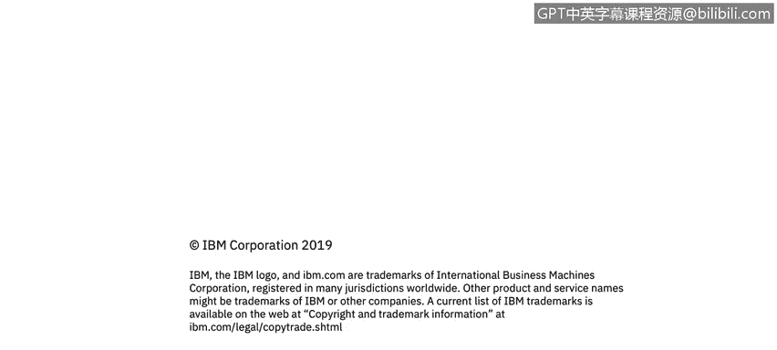

# 课程1：《网络安全工具与网络攻击简介》：59：防火墙简介 🔥

在本节课中，我们将要学习防火墙的基本概念。防火墙是网络安全的核心组件，它通过隔离内部网络与外部互联网，并基于特定规则控制数据包的进出，来保护组织免受各种网络攻击。

---

上一节我们介绍了网络安全的基本背景，本节中我们来看看防火墙的具体作用。

防火墙是一种保护机制，它将组织的内部网络与更广阔的互联网隔离开来。它允许某些数据包通过，同时阻止其他数据包。

防火墙通常成对使用，外部防火墙用于隔离DMZ（非军事区）。它将应用了安全策略的内部企业网络与公共互联网分隔开。公共互联网可以被视为一个几乎没有安全措施的“狂野西部”。

那么，我们为什么需要应用防火墙呢？主要是为了预防拒绝服务攻击。

以下是防火墙能防御的两种主要攻击类型：
*   **SYN洪水攻击**：攻击者发送大量TCP连接请求，耗尽服务器资源，使其无法处理合法连接。
*   **非法修改或访问内部数据**：这违反了安全策略。攻击者可能窃取数据（数据外泄），或者篡改组织的主页内容。

此外，防火墙还能确保只有经过授权的访问才能通过。它与访问控制模块协同工作，确保只有经过身份验证的用户和主机可以访问内部网络。

实际上，防火墙主要有两种类型。

以下是防火墙的两种主要类型：
*   **应用级防火墙**
*   **包过滤防火墙**

（还存在第三种称为XML防火墙的类型，但它本质上是一个XML网关，我们稍后会简要讨论。）

---

本节课中我们一起学习了防火墙的基础知识。我们了解到防火墙通过隔离和过滤网络流量，是防御拒绝服务攻击、未授权访问和数据篡改等威胁的关键工具。理解防火墙的类型和功能是构建有效网络安全防御的第一步。