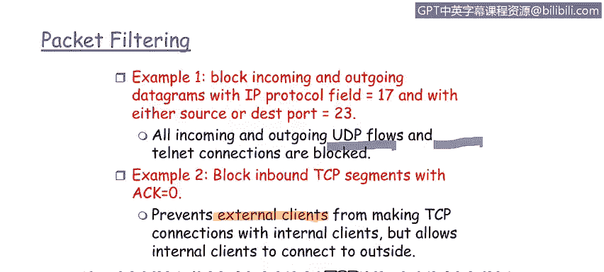

# 课程1：《网络安全工具与网络攻击简介》：60：防火墙数据包过滤 🔒

在本节课程中，我们将学习什么是数据包过滤，以及数据包过滤防火墙是如何工作的。数据包过滤是应用和企业级防火墙的基础技术之一，其核心在于对每个数据包做出转发或丢弃的决策。

## 数据包过滤的工作原理

上一节我们介绍了防火墙的基本概念，本节中我们来看看数据包过滤的具体机制。数据包过滤防火墙基于一系列参数，对每个数据包进行逐一检查，并决定其命运。

以下是数据包过滤所依据的几个核心参数：

*   **源IP地址与目的IP地址**：这是最基础的参数。防火墙会检查数据包来自哪里（源IP）以及要前往哪里（目的IP）。基于这两个信息，可以制定允许或拒绝的规则。
*   **传输层协议**：防火墙可以识别数据包使用的是哪种传输协议，主要是**TCP**（传输控制协议）或**UDP**（用户数据报协议）。TCP是面向连接的可靠协议，而UDP是无连接的。
*   **目的端口号**：端口号对应特定的网络服务（如HTTP服务使用80端口）。防火墙可以根据端口号来允许或阻止对特定服务的访问。
*   **消息类型与标志位**：对于TCP协议，防火墙可以检查数据包中的特定标志位，例如**SYN**（同步）和**ACK**（确认）位。这有助于判断一个连接是发起请求还是建立后的通信。

## 数据包过滤规则示例

了解了核心参数后，我们通过两个例子来看看这些规则如何应用。

以下是两个具体的数据包过滤规则示例：

1.  **规则一：阻止特定协议和端口的流量**
    *   **动作**：阻止传入和传出的数据报。
    *   **条件**：IP协议字段为17（代表UDP协议）**或** 源/目的端口号为23（代表Telnet服务）。
    *   **效果**：这条规则有效地阻止了所有UDP流量以及所有Telnet连接。在企业网络边界实施此类规则，是执行安全策略的常见做法。

2.  **规则二：基于TCP标志位控制连接发起方**
    *   **动作**：阻止传入的TCP报文段。
    *   **条件**：ACK（确认）位设置为0。
    *   **效果**：这可以阻止外部主机主动向内部客户端发起TCP连接（因为建立连接的初始SYN包ACK=0），但允许内部客户端主动向外发起连接。这体现了一种“内部比外部更可信”的安全策略思想。

## 课程总结

本节课中，我们一起学习了防火墙数据包过滤技术。我们了解到，数据包过滤通过检查每个数据包的源/目的IP、协议、端口及标志位等参数，依据预设规则决定其去留。我们还分析了两个具体规则示例，展示了如何利用这些参数来实现访问控制和安全策略。数据包过滤是构建网络安全第一道防线的基础且关键的手段。