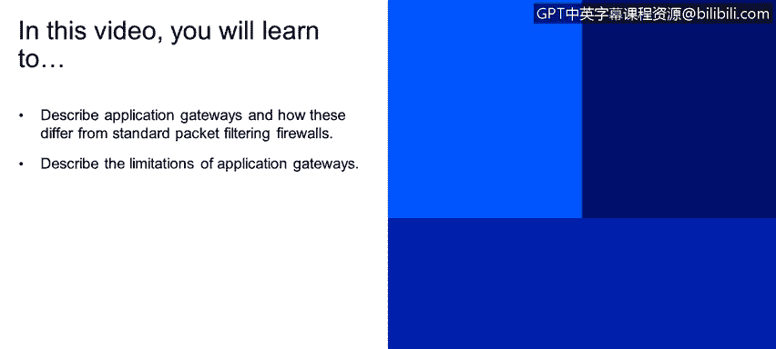
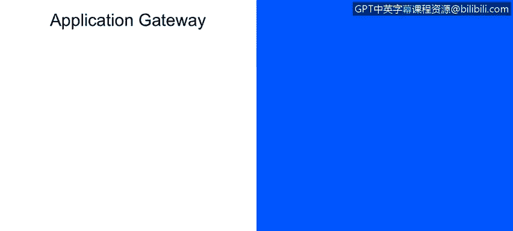

# 课程1：《网络安全工具与网络攻击简介》：61：防火墙应用程序网关 🔒

在本节课程中，我们将学习应用程序网关的概念，并了解它与标准包过滤防火墙的区别。我们还将探讨应用程序网关的局限性。

## 概述

上一节我们介绍了包过滤防火墙的基本原理。本节中，我们来看看另一种更高级的防火墙技术——应用程序网关。应用程序网关工作在OSI模型的更高层，能够提供更精细的访问控制。

## 应用程序网关的工作原理

应用程序网关同样会过滤数据包，但其过滤的重点在于**应用层数据**，即OSI模型最顶层的有效载荷，同时也检查其中的IP和传输层字段。

这种机制允许防火墙基于具体的应用程序（如Telnet、HTTP）来实施访问控制策略。

## 应用程序网关的工作示例

例如，要控制外部用户使用Telnet应用程序，我们可以强制要求所有Telnet连接都必须经过一个网关。该网关会执行访问控制机制：首先判断这是否是一个Telnet连接，然后验证该用户是否被授权。

这本质上是一种应用于特定**应用程序**的访问控制机制。

## 应用程序网关的局限性

尽管功能强大，应用程序网关也存在一些局限性。以下是其主要缺点：

1.  **无法有效验证IP地址真实性**：正如之前提到的，这类防火墙基于传输层协议工作。在互联网攻击中，源IP地址和目标IP地址经常被伪装（Masqueraded），使得流量看起来来自可信来源。我们讨论的这类防火墙缺乏有效机制来验证这一点，这构成了一个重大的威胁领域。

2.  **一对一的应用关系导致成本高昂**：应用程序网关与应用程序存在**一对一**的关系。这意味着每个独立的应用程序（如Telnet）或广播型UDP应用，都需要配置自己专用的应用程序网关。这种关系使得部署和维护过程变得非常昂贵。

3.  **客户端软件需要具备特定感知能力**：客户端软件，如网页浏览器、电子邮件工具、FTP工具、即时通讯软件等，都必须足够“智能”。它们需要预先确定协议，并知道如何与网关（无论是应用程序网关还是包过滤防火墙）进行通信。

4.  **对UDP协议的支持通常是“全有或全无”**：包过滤防火墙在处理UDP协议时，经常采取“全部允许”或“全部禁止”的策略。有一种安全观点认为，由于UDP是广播式的并存在许多安全漏洞，应 largely disengaged（基本禁用）。这就引出了安全与便利的权衡问题。

## 安全与便利的权衡

那么，其中的权衡点是什么呢？权衡在于：是与外部世界完全开放的通信（不实施任何安全策略），还是随着安全级别的提高，对协议、应用程序和用户访问施加更多的控制。

这正是安全工程师需要操作和权衡的空间。

尽管如此，许多高度受保护的站点，包括美国政府站点，仍然遭受着网络攻击。

## 总结

本节课中，我们一起学习了应用程序网关。我们了解到，应用程序网关通过检查应用层数据来提供更精细的控制，但它也存在成本高、客户端需适配以及对地址欺骗防护有限等局限性。网络安全始终是在开放通信与严格管控之间寻求平衡的艺术。