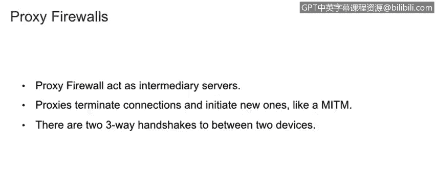

# 课程1：《网络安全工具与网络攻击简介》：63：无状态与有状态防火墙 🔥

在本节课中，我们将学习描述无状态防火墙和有状态防火墙之间的区别，并理解从无状态防火墙过渡到有状态防火墙时需要考虑的权衡。

防火墙是网络安全的核心组件，用于在不同网络之间过滤流量。根据类型的不同，它们处理数据包的方式也各异。防火墙可以是多宿主的，这意味着它们拥有多个网络接口，连接到不同的网络。例如，一个接口连接到互联网，另一个接口连接到我们的本地网络。

防火墙有多种类型，本节课我们将重点介绍两种最常见的形式：无状态防火墙和有状态防火墙。我们将看到，其中一种更为常见，而另一种则更为安全。

## 无状态防火墙

上一节我们提到了防火墙的基本概念，本节中我们首先来看看无状态防火墙。

顾名思义，无状态防火墙没有“状态”的概念。它们也可以被称为包过滤器，其决策基于网络层（第3层）和传输层（第4层）的信息，例如IP地址和端口号。由于缺乏对连接状态的感知，它们的安全性相对较低。

以下是其工作原理的一个示例：
*   在左侧图片的上半部分，一个ICMP Echo请求（ping）和对应的ICMP Echo回复被防火墙接受。
*   在图片的下半部分，攻击者直接发送了一个Echo回复，而这个回复之前并没有对应的Echo请求。无状态防火墙（包过滤器）仍然允许这个数据包通过。

## 有状态防火墙

了解了无状态防火墙的局限性后，本节我们来看看更先进的有状态防火墙。

有状态防火墙维护着状态表，这使其能够将当前的数据包与之前的数据包进行比较。这种机制虽然会使防火墙的处理速度稍慢一些，但其安全性远高于无状态防火墙。它们有时也被称为应用防火墙，因为其决策可以基于应用层（第7层）的信息，例如可以根据用户访问的网站类型来过滤流量。

以下是其工作原理的示例：
*   同样，ICMP Echo请求和对应的Echo回复会被接受。
*   但当攻击者试图发送一个没有对应请求的ICMP Echo回复时，有状态防火墙会检查其状态表，发现该回复没有对应的先前请求，从而阻止该流量。

## 代理防火墙

除了上述两种，还有一种重要的防火墙类型：代理防火墙。

代理防火墙充当中间服务器。如下图所示，它位于客户端计算机和目标服务器之间。它的独特之处在于，它会终止客户端发起的连接。

其工作流程如下：
1.  计算机1尝试与服务器建立连接。
2.  代理防火墙会代表服务器与计算机1完成三次握手，建立第一个连接。
3.  随后，代理防火墙再以自己的身份与真正的目标服务器发起另一个三次握手，建立第二个连接。

这样，代理防火墙就像中间人一样位于两个设备之间。这种架构允许它对流量进行深度分析和过滤，提供更精细的控制。

---

本节课中，我们一起学习了三种主要的防火墙类型：
1.  **无状态防火墙**：基于IP和端口进行简单过滤，速度快但安全性较低。
2.  **有状态防火墙**：通过维护连接状态表来识别和阻止异常流量，安全性更高。
3.  **代理防火墙**：作为中间人终止并重建连接，能进行最深入的流量分析和控制。

理解这些防火墙类型的区别和权衡，是设计有效网络安全策略的基础。