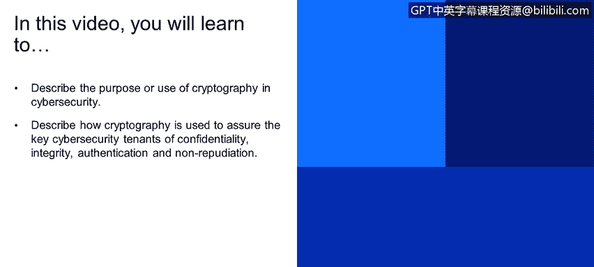
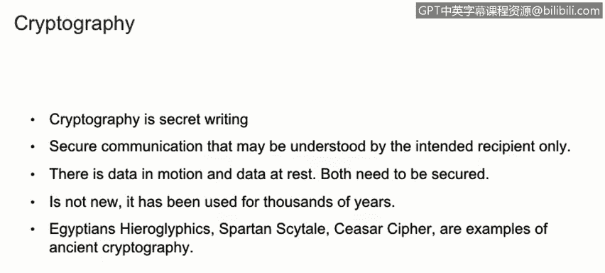
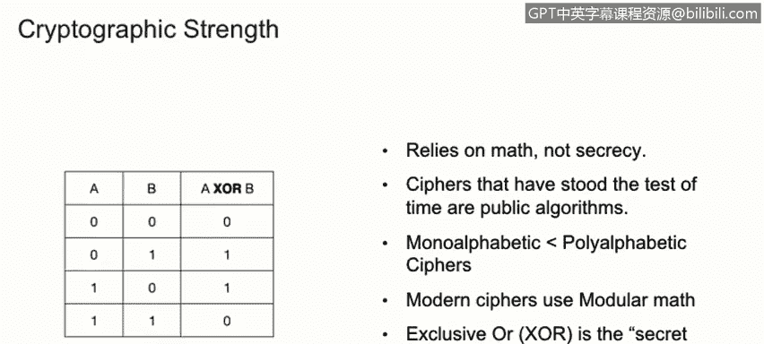

# 课程1：《网络安全工具与网络攻击简介》：65：密码学简介

在本节课程中，我们将学习密码学的基本概念及其在网络安全中的核心作用。密码学是保障信息安全的关键技术，它通过加密和解密过程，确保数据的机密性、完整性、身份验证和不可否认性。

---

## 密码学的定义与目的

密码学本质上是一种秘密书写的方式，旨在实现双方之间的安全通信，并确保只有预期的接收者能够理解通信内容。这是密码学的核心任务。

我们需要理解，无论是传输中的数据还是存储中的数据，都需要通过密码学来确保其安全。

---

## 密码学的历史与发展

密码学并非新生事物，它已被使用了数千年。例如，象形文字和凯撒密码都是古代密码学的实例。如今，随着计算机的兴起，密码学已经演变为一种更先进的加密数据方式。

为了更好地理解密码学及其重要性，我们需要讨论几个关键概念。

---

## 核心安全概念

密码学主要服务于以下几个关键的安全原则：

*   **机密性**：确保只有预期的参与方能够读取和理解信息。
*   **完整性**：检测信息在传输过程中是否被篡改或改变。
*   **身份验证**：确认某人或某物的身份，以判断其是否被授权执行某项操作或信息是否正确。
*   **不可否认性**：确保某人无法否认其执行过的操作或发送过的信息。

---

## 密码学基础术语

以下是理解密码学时需要掌握的基本术语：

*   **密码分析**：分析密码和加密算法的过程。它是密码学的关键组成部分，因为科学家和数学家通过它来确定一个加密算法是否安全。
*   **密码**：用于加密信息的实际算法。例如，凯撒密码就是一个经典的加密算法，它将字母表向左或向右移动特定的位数。
*   **明文**：指人类可读的原始文本。
*   **密文**：指明文经过密码算法处理后的结果，通常是人类不可读的。
*   **加密**：将明文转换为密文的过程。
*   **解密**：将密文转换回明文的过程。

---

## 密码强度与数学基础

密码强度依赖于数学，而非保密性。仅仅保持算法秘密并不能使其更安全。事实上，那些经受住时间考验的最安全算法都是公开的。

现代密码使用模运算。为了更好地解释，我们可以看一个异或运算的例子。

假设：
*   **列A** 代表明文。
*   **列B** 代表用于加密的密钥。
*   **列C** 代表加密后得到的密文。

加密过程可以表示为：`C = A XOR B`。
解密过程则是：`A = C XOR B`。

通过这个简单的例子，我们可以看到密钥在加解密过程中的核心作用。

---

## 密码类型：流密码与分组密码

密码主要分为两种类型：

*   **流密码**：以比特流的方式，一次一个比特地对信息进行加密或解密。
*   **分组密码**：以不同的方式处理信息。它使用比特块或字节块来加密信息。例如，一些算法一次加密64位的信息，即分组密码会以64位为一个块来加密消息。

---

## 课程总结

在本节课中，我们一起学习了密码学的基础知识。我们了解了密码学的定义、历史及其在保障网络安全（机密性、完整性、身份验证和不可否认性）中的核心作用。我们还介绍了密码学的基本术语，如密码、明文、密文、加密和解密，并探讨了密码强度依赖于数学原理这一关键点。最后，我们区分了流密码和分组密码这两种主要的加密类型。掌握这些概念是进一步学习网络安全和加密技术的重要基础。