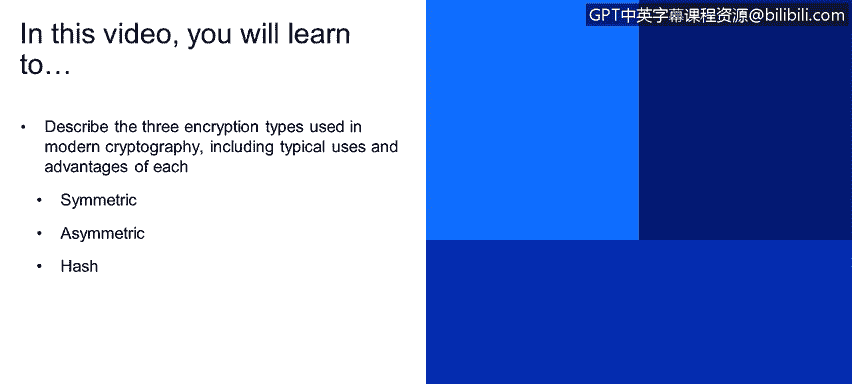
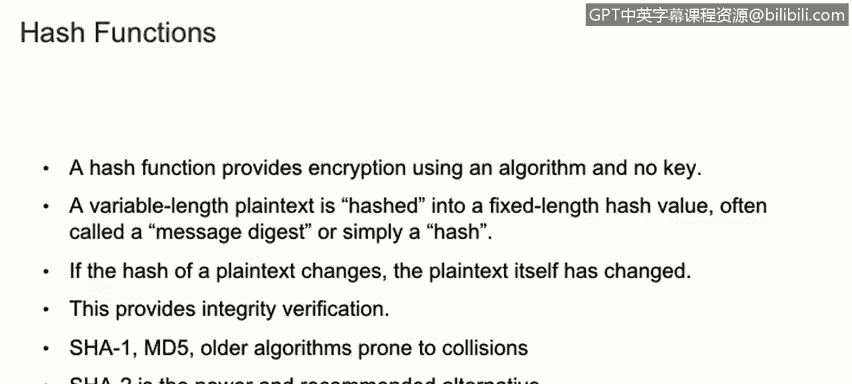

# 课程1：《网络安全工具与网络攻击简介》：66：密码学类型 🔐

在本节课程中，我们将学习现代密码学中使用的三种主要加密类型。我们将探讨对称加密、非对称加密和哈希函数，并了解它们各自的典型用途、优势以及核心工作原理。

---

上一节我们介绍了密码学的基本概念，本节中我们来看看现代密码学中具体使用的三种主要加密类型。

## 对称加密

对称加密使用单一密钥进行加密和解密。以下是其主要特点：

*   **核心公式/代码**：`密文 = 加密算法(明文, 密钥)`；`明文 = 解密算法(密文, 密钥)`
*   **优势**：加密和解密速度快。加密强度随密钥长度增加而提升，即密钥越长，加密越安全。
*   **挑战**：密钥需要通过安全的方式在通信双方之间共享。不能通过不安全的信道以明文形式发送密钥，因为整个加密算法的安全性完全依赖于这一个密钥的保密性。
*   **常见算法**：DES、3DES和AES是当前使用的例子。其中AES是当今最常用的现代对称加密算法之一。

## 非对称加密

非对称加密使用一对密钥：公钥和私钥。Whitfield Diffie和Martin Hellman创建的Diffie-Hellman算法被认为是现代非对称加密的先驱。以下是其关键点：

*   **核心概念**：使用两个密钥。一个可以公开，称为**公钥**；另一个必须始终保持私有，称为**私钥**。
*   **工作原理**：一个密钥用于加密，另一个密钥用于解密。具体来说，用公钥加密的内容只能用对应的私钥解密，反之亦然。
*   **用途**：用于数字证书和公钥基础设施（PKI）。它使用单向算法生成密钥对，其数学基础涉及大素数和离散对数。
*   **性能**：非对称加密比对称加密慢得多。因此，在实际应用中，通常结合使用两者。例如，当你访问一个HTTPS安全网站时，首先使用非对称加密来安全地交换对称加密的密钥，之后的所有通信则使用更快的对称加密。

## 哈希函数

哈希函数提供了一种无需密钥的加密方式，它使用单向算法。以下是其主要特征：

*   **核心过程**：将任意长度的明文（输入）哈希成一个固定长度的哈希值，这通常被称为消息摘要或简称哈希。
*   **用途**：主要用于确保数据的完整性。如果明文在传输中被更改，通过重新计算哈希值并与原始哈希值对比，就能发现变动。
*   **算法示例**：SHA-1和MD5是较旧的算法，它们容易发生碰撞。SHA-2是更新且被推荐使用的替代方案。
*   **碰撞问题**：哈希函数容易发生碰撞，这是其主要问题之一。碰撞是指两个不同的明文产生了相同的哈希值。由于哈希函数输出的字符长度是固定的（例如MD5输出128位），存在不同输入产生相同输出的可能性。

---

本节课中我们一起学习了现代密码学的三种核心类型：对称加密、非对称加密和哈希函数。我们了解了对称加密速度快但密钥分发困难，非对称加密解决了密钥交换问题但速度较慢，而哈希函数则主要用于验证数据完整性。理解这些基础类型是掌握更复杂网络安全概念的关键。