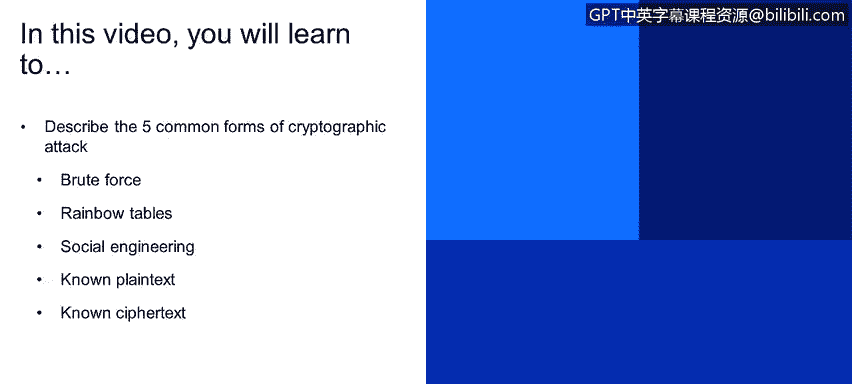
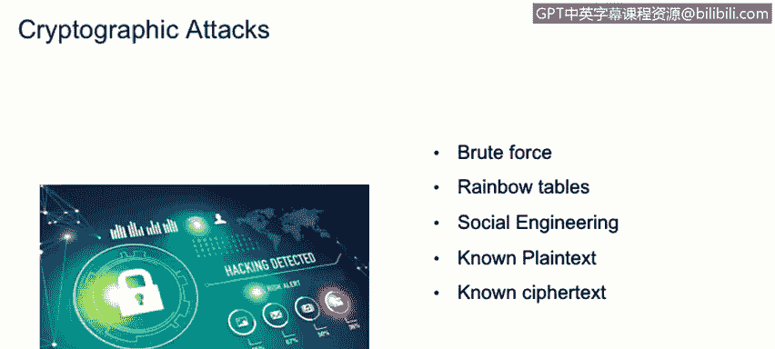

# 课程1：《网络安全工具与网络攻击简介》：67：密码攻击 🔐

在本节课程中，我们将学习并描述五种常见的密码攻击形式。

上一节我们介绍了网络攻击的多种类型，本节中我们来看看针对密码学系统的具体攻击方法。密码攻击旨在破解加密信息，获取未经授权的访问权限。

以下是五种常见的密码攻击形式：

*   **暴力破解**：这是一种基于试错法的攻击。攻击者会提交大量密码或密钥组合，期望最终能猜中正确的那个。
*   **彩虹表攻击**：这种攻击与暴力破解类似，但利用了预先计算好的哈希值表。这些表包含了大量明文及其对应的哈希值，可以快速与获取到的密码哈希进行比对，从而显著加快攻击速度。
*   **社会工程学攻击**：这种攻击不依赖技术手段，而是通过影响和操纵终端用户，诱使他们自己泄露密码等敏感信息。
*   **已知明文攻击**：这种攻击基于攻击者已经掌握部分**明文**（原始信息）和对应的**密文**（加密后的信息）。通过分析这两者之间的关系，试图理解加密算法的工作原理并推断出所使用的**密钥**。一旦获得密钥，攻击者就能解密或加密任何信息。
*   **唯密文攻击**：这种攻击与已知明文攻击类似，但区别在于攻击者**只拥有密文**，而没有对应的明文。攻击者需要仅基于这些密文本，尝试推导出加密时使用的密钥，从而获得解密信息的能力。

本节课中，我们一起学习了五种主要的密码攻击方法：暴力破解、彩虹表攻击、社会工程学攻击、已知明文攻击和唯密文攻击。理解这些攻击的原理有助于我们更好地设计和评估加密系统的安全性。